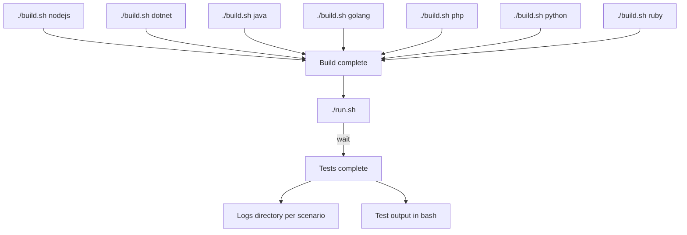

## System tests

Workbench designed to run advanced tests (integration, smoke, functionnal, fuzzing and performance)

## Requirements

`bash`, `docker` and `python3.9`. More infos in the [documentation](https://github.com/DataDog/system-tests/blob/main/docs/execute/requirements.md)

## How to use

Add a valid staging `DD_API_KEY` environment variable (you can set it in a `.env` file). Then:

Understand the parts of the tests at the [architectural overview](https://github.com/DataDog/system-tests/blob/main/docs/architecture/overview.md).

More details in [build documentation](https://github.com/DataDog/system-tests/blob/main/docs/execute/build.md) and [run documentation](https://github.com/DataDog/system-tests/blob/main/docs/execute/run.md).

**[Complete documentation](https://github.com/DataDog/system-tests/blob/main/docs)**
