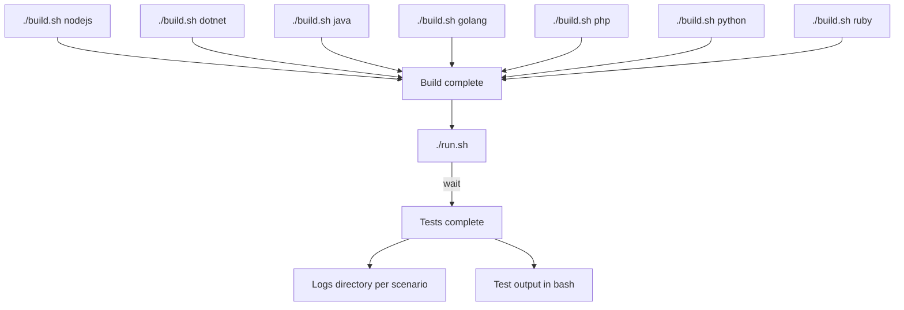

## What is system-tests?

A workbench designed to run advanced tests (integration, smoke, functional, fuzzing and performance) against our suite of dd-trace libraries.

## Requirements

`bash`, `docker` and `python3.12`.

We recommend to install python3.12 via pyenv: [pyenv](https://github.com/pyenv/pyenv#getting-pyenv). Pyenv is a tool for managing multiple python versions and keeping system tests dependencies isolated to their virtual environment. If you don't wish to install pyenv, instructions for downloading python 3.12 on your machine can be found below:

#### Ubuntu

```
sudo add-apt-repository ppa:deadsnakes/ppa
sudo apt update
sudo apt install python3.12 python3.12-distutils python3.12-venv python3.12-dev
curl https://bootstrap.pypa.io/get-pip.py -o get-pip.py
python3.12 get-pip.py
./build.sh -i runner
```

#### Windows

TODO

#### Mac

For Homebrew users :

```
brew install python@3.12
```

## Getting started

### Run a test

Run a test according to the [run documentation](docs/execute/run.md); note that if you're running an [end to end test](docs/scenarios/README.md#end-to-end-scenarios), you will need to build the test infrastructure according to the [build documentation](docs/execute/build.md) before you can run the test.

Tests will only run if they are not disabled; see how tests are disabled in [skip-tests.md](docs/edit/skip-tests.md) and how tests are enabled in [enable-test.md](docs/edit/enable-test.md). Alternatively, you can force a disabled test to execute according to the [force-execute documentation](docs/execute/force-execute.md).


### Edit a test

Refer to the [edit docs](docs/edit/README.md).

### Understand the tests

**[Complete documentation](https://github.com/DataDog/system-tests/blob/main/docs)**

System-tests supports various scenarios for running tests; read more about the different kinds of tests that this repo covers in [scenarios/README.md](docs/scenarios/README.md).

Understand the test architecture at the [architectural overview](https://github.com/DataDog/system-tests/blob/main/docs/architecture/overview.md).


