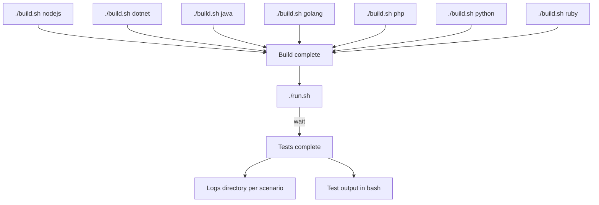

## What is system-tests?

A workbench designed to run advanced tests (integration, smoke, functional, fuzzing and performance) against our suite of dd-trace libraries.

When making changes to dd-trace, you'll commonly need to run the unmerged changes against the system tests (to ensure the feature is up to spec). But because system tests are outside of dd-trace-xx repos, testing against unmerged changes is not so straightforward. Various approaches  to this "chicken or the egg" problem are detailed [here](https://github.com/DataDog/system-tests/blob/main/docs/execute/how-to-approach-changes.md).

## Requirements

`bash`, `docker` and `python3.12`. More infos in the [documentation](https://github.com/DataDog/system-tests/blob/main/docs/execute/requirements.md)

## Weblog vs Parametric

System-tests contains two types of tests: "weblog" and "parametric." Weblog tests came first, parametric tests were developed later. Most of the docs in this repo refer to weblog tests, and many of the instructions apply to both weblog and parametric, but not all. You can find dedicated parametric instructions in the [parametric.md](https://github.com/DataDog/system-tests/blob/main/docs/scenarios/parametric.md).

## How to use

Understand the parts of the tests at the [architectural overview](https://github.com/DataDog/system-tests/blob/main/docs/architecture/overview.md).

More details in [build documentation](https://github.com/DataDog/system-tests/blob/main/docs/execute/build.md) and [run documentation](https://github.com/DataDog/system-tests/blob/main/docs/execute/run.md).

**[Complete documentation](https://github.com/DataDog/system-tests/blob/main/docs)**

