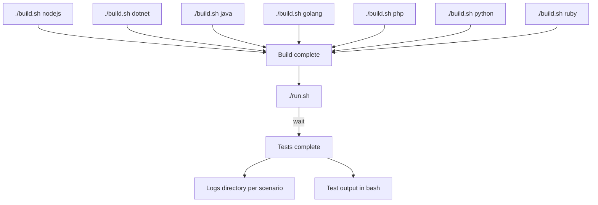

## What is system-tests?

A workbench designed to run advanced tests (integration, smoke, functional, fuzzing and performance) against our suite of dd-trace libraries.

## Repository Structure

```
system-tests/
|-- binaries/           # Folder to store binary tracer files for testing specific versions of libraries
|-- docs/               # Documentation files
|-- lib-injection/      # Weblog for testing library injection
|-- manifests/          # YAML config files for tests activation (ie. a test will be activated after specific version of the tracer).
|-- tests/              # Test implementations
|-- utils/              # Utility code and shared libraries
|   |-- _context/       # Test context and scenario definitions
|   |   |-- _scenarios/ # Scenario implementations
|   |   |   |-- appsec_low_waf_timeout.py # AppSec WAF timeout scenario
|   |   |   |-- auto_injection.py # Auto-injection scenario
|   |   |   |-- default.py       # Default scenario implementation
|   |   |   |-- docker_ssi.py    # Docker SSI scenario
|   |   |   |-- endtoend.py      # End to end testing framework
|   |   |   |-- parametric.py    # Parametric scenario
|   |   |   |-- k8s_lib_injection.py # K8s lib injection scenario
|   |-- assets/         # Images and other static assets
|   |-- build/          # Build utilities and scripts
|   |   |-- docker/     # Docker templates for weblogs used on end to end testing.
|   |   |-- ssi/        # Docker SSI build utilities (includes weblogs)
|   |   |-- virtual_machine/ # AWS SSI scenarios and weblog provisions
|   |   |   |-- provisions/ # AWS SSI scenarios provision definitions
|   |   |   |-- weblogs/    # AWS SSI weblog provision
|   |-- docker_ssi/     # Docker SSI utilities
|   |-- grpc/           # gRPC related utilities
|   |-- interfaces/     # Interface definitions for components
|   |-- k8s_lib_injection/ # Kubernetes lib injection utilities
|   |-- onboarding/     # AWS SSI/Onboarding utilities
|   |-- parametric/     # Parametric testing utilities
|   |-- proxy/          # Proxy server implementation
|   |-- scripts/        # Helper and utility scripts
|   |   |-- ci_orchestrators/ # CI pipeline scripts
|   |   |-- parametric/ # Scripts for parametric tests
|   |   |-- slack/      # Slack notification utilities
|   |   |-- ssi_wizards/ # SSI wizard scripts
|   |-- telemetry/      # Telemetry utilities
|   |-- virtual_machine/ # VM configuration and management
|
|-- build.sh            # Script to build test environment
|-- run.sh              # Script to run tests and scenarios
```

## Technologies Powering System-Tests

System-tests leverages a variety of tools and frameworks to create a comprehensive testing environment:

- **Python**: Our primary programming language for test implementation and orchestration
- **pytest**: The core testing framework that provides structure, fixtures, and assertions
- **Docker & Docker API**: Used to create isolated environments for reproducible tests across different language tracers
- **Kubernetes API**: For testing library injection in containerized environments
- **Kind/Minikube**: Local Kubernetes clusters for K8s library injection tests
- **Pulumi**: Infrastructure as Code tool used for AWS-based SSI tests
- **AWS API**: For tests that require cloud infrastructure (primarily used in SSI tests)

These technologies work together to enable testing across different deployment patterns, languages, and infrastructure configurations.

## Minimal Requirements (End-to-End Testing)

To run system-tests, you'll need the following core components:

- **`bash`** - For running scripts and commands
- **`docker`** - For containerization (version 20.10+ recommended)
- **`python3.12`** - For test implementation and orchestration

### Python 3.12 Installation

We strongly recommend installing Python 3.12 via [pyenv](https://github.com/pyenv/pyenv#getting-pyenv), a tool that manages multiple Python versions while keeping system-tests dependencies isolated in their virtual environment.

If you prefer not to use pyenv, here are platform-specific installation instructions:

#### Ubuntu/Debian

```bash
sudo add-apt-repository ppa:deadsnakes/ppa
sudo apt update
sudo apt install python3.12 python3.12-distutils python3.12-venv python3.12-dev
curl https://bootstrap.pypa.io/get-pip.py -o get-pip.py
python3.12 get-pip.py
./build.sh -i runner
```

#### macOS

For Homebrew users:

```bash
brew install python@3.12
```

#### Windows

Support coming soon.

### Additional Requirements

Specific scenarios may require additional tools:

- **Kubernetes Tests**: require Kind/Minikube for local K8s clusters
- **AWS SSI Tests**: require AWS credentials and Pulumi setup

## Getting started

### Run a test/scenario

Running system-tests involves a few key steps:

1. **Set up the Python environment**:
   ```bash
   # Install Python requirements and create a virtual environment
   ./build.sh -i runner

   # Activate the virtual environment
   source venv/bin/activate
   ```

2. **Build necessary images** for the language you want to test:
   ```bash
   # Replace <library_name> with: java, nodejs, python, ruby, php, dotnet, cpp, or golang
   ./build.sh <library_name>

   # Example for testing Python tracer
   ./build.sh python
   ```

3. **Run the tests** using one of these approaches:
   ```bash
   # Run all default tests
   ./run.sh

   # Run a specific scenario
   ./run.sh <SCENARIO_NAME>

   # Run a specific test file
   ./run.sh tests/test_smoke.py

   # Run a specific test class or method
   ./run.sh tests/parametric/test_waf.py::Test_WAFAddresses::test_post_json_value
   ```

For more advanced options:
- See the [run documentation](docs/execute/run.md) for test selection details
- Check the [build documentation](docs/execute/build.md) for customizing images and weblog variants
- Learn how disabled tests are managed in [skip-tests.md](docs/edit/skip-tests.md) and [enable-test.md](docs/edit/enable-test.md)
- Force execution of disabled tests using options in the [force-execute documentation](docs/execute/force-execute.md)


### Edit a test

Refer to the [edit docs](docs/edit/README.md).

### Understand the tests

**[Complete documentation](https://github.com/DataDog/system-tests/blob/main/docs)**

System-tests supports various scenarios for running tests; read more about the different kinds of tests that this repo covers in [scenarios/README.md](docs/scenarios/README.md).

Understand the test architecture at the [architectural overview](https://github.com/DataDog/system-tests/blob/main/docs/architecture/overview.md).


