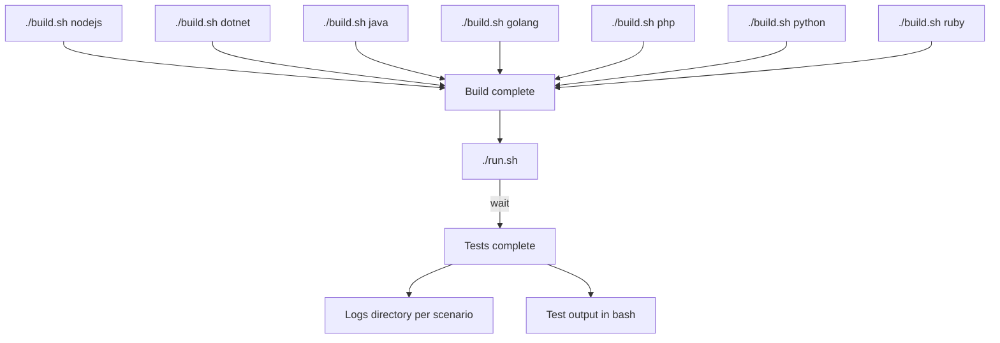

## What is system-tests?

A workbench designed to run advanced tests (integration, smoke, functional, fuzzing and performance) against our suite of dd-trace libraries.

## Requirements

`bash`, `docker` and `python3.12`. More infos in the [documentation](https://github.com/DataDog/system-tests/blob/main/docs/execute/requirements.md)

## End-To-End vs Parametric

System-tests contains various testing scenarios; the two most commonly used are called "End-To-End" and "Parametric." Most of the docs in this repo refer to End-To-End tests, which were developed earlier and support a wider range of scenarios. Some of the instructions apply to both end-to-end and parametric (e.g. the [edit docs](./docs/edit/)), but not all. You can find dedicated parametric instructions in the [parametric.md](https://github.com/DataDog/system-tests/blob/main/docs/scenarios/parametric.md).

**End-To-End**

End-To-End tests are good for testing real-world scenarios — they incorporate "weblog" servers designed to mimick customer applications with automatic instrumentation, a "test-agent" to mimick the Datadog Agent, and communication with the Datadog backend. They support the full lifecycle of a trace (hence the name, "End-To-End"). Use End-To-End scenarios to test tracing integrations, security products, profiling, dynamic instrumentation, and more. When in doubt, use end-to-end.

**Parametric**

Parametric tests are designed to validate tracer and span interfaces. They are more lightweight and support testing features with many input parameters. They should be used to test operations such as creating spans, setting tags, setting links, injecting/extracting http headers, getting tracer configurations, etc. 

## How to use

Understand the parts of the tests at the [architectural overview](https://github.com/DataDog/system-tests/blob/main/docs/architecture/overview.md).

More details in [build documentation](https://github.com/DataDog/system-tests/blob/main/docs/execute/build.md) and [run documentation](https://github.com/DataDog/system-tests/blob/main/docs/execute/run.md).

**[Complete documentation](https://github.com/DataDog/system-tests/blob/main/docs)**

