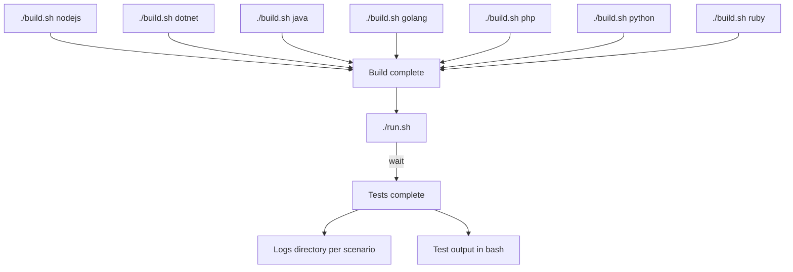

## What is system-tests?

Slack: [#apm-shared-testing](https://dd.enterprise.slack.com/archives/C025TJ4RZ8X)

System-tests is a black-box testing workbench for Datadog tracer libraries. It runs the **same tests** against every tracer implementation -- Java, Node.js, Python, PHP, Ruby, C++, .NET, Go, and Rust -- so shared features stay consistent across languages.

Key principles:

* **Black-box testing** -- only component interfaces are checked, no assumptions about internals. "Check that the car moves, regardless of the engine."
* **Cross-language** -- one test validates all tracer libraries.

## Quick start

You need **bash**, **Docker** (20.10+), and **Python 3.12** ([installation guide](#python-312-installation)).

```bash
# 1. Set up the Python environment
./build.sh -i runner
source venv/bin/activate

# 2. Build images for the language you want to test
./build.sh python          # or: java, nodejs, ruby, php, dotnet, cpp, golang

# 3. Run the tests
./run.sh                   # run all default tests
./run.sh SCENARIO_NAME     # run a specific scenario
./run.sh tests/test_smoke.py::Test_Class::test_method   # run a single test
```

> **macOS note:** if `build.sh` fails with a missing `timeout` command, run:
> ```bash
> brew install coreutils
> export PATH="$(brew --prefix)/opt/coreutils/libexec/gnubin:$PATH"
> ```


### Reading the output

System-tests uses [pytest](https://docs.pytest.org/) under the hood. The test output follows standard pytest conventions (see the [pytest documentation on test outcomes](https://docs.pytest.org/en/stable/how-to/output.html)). Each test is represented by a symbol:

| Symbol | Meaning | Description |
|--------|---------|-------------|
| 🟢 `.` | **pass** | Test is enabled and successful |
| 🔴 `F` | **fail** | Test is enabled but unsuccessful -- needs investigation |
| 🟡 `x` | **xfail** | Test is disabled and unsuccessful (expected behavior) |
| 🟡 `X` | **xpass** | Test is disabled but successful -- easy win, time to [enable it](docs/write/enable-test.md) |
| 🟡 `s` | **skipped** | Test was not executed (irrelevant or flaky) |

For a full explanation of test outcomes and how declarations (like `bug`, `missing_feature`, `flaky`) affect them, see [test outcomes](docs/run/test-outcomes.md) and the [glossary](docs/glossary.md).

If a test fails, check the standard output first -- it usually contains enough info. For deeper investigation, look at the [logs folder](docs/run/logs.md).

## Documentation

All detailed documentation lives in the [`docs/`](docs/README.md) folder. Here is a guided reading order:

### Understand system-tests

| Topic | Description |
|-------|-------------|
| [Architecture overview](docs/understand/architecture.md) | Components, containers, data flow |
| [Scenarios](docs/understand/scenarios/README.md) | End-to-end, parametric, SSI, K8s -- what each one tests |
| [Weblogs](docs/understand/weblogs/README.md) | The test applications instrumented by tracers |
| [Glossary](docs/glossary.md) | Definitions of pass, fail, xpass, xfail, etc. |

### Run tests

| Topic | Description |
|-------|-------------|
| [Build](docs/run/build.md) | Build options, weblog variants, image names |
| [Run](docs/run/run.md) | Run options, selecting tests, scenarios, timeouts |
| [Logs](docs/run/logs.md) | Understanding the logs folder structure |
| [Test outcomes](docs/run/test-outcomes.md) | Reading test results |
| [Replay mode](docs/run/replay.md) | Re-run tests without rebuilding |
| [Custom tracer versions](docs/run/binaries.md) | Testing with local tracer builds |
| [Troubleshooting](docs/run/troubleshooting.md) | Common issues and how to fix them |

### Write and edit tests

| Topic | Description |
|-------|-------------|
| [Add a new test](docs/write/add-new-test.md) | Step-by-step guide to adding tests |
| [Add a new scenario](docs/write/scenarios.md) | Creating new test scenarios |
| [Enable / disable tests](docs/write/enable-test.md) | Activating tests for a library version |
| [Manifests](docs/write/manifest.md) | How test activation is declared per library |
| [Skip tests](docs/write/skip-tests.md) | Decorators for conditional skipping |
| [Features](docs/write/features.md) | Linking tests to the feature parity dashboard |
| [Formatting](docs/write/format.md) | Linter and code style |
| [Troubleshooting](docs/write/troubleshooting.md) | Debugging tips for test development |

### CI integration

| Topic | Description |
|-------|-------------|
| [CI overview](docs/ci/README.md) | Adding system-tests to your CI pipeline |
| [GitHub Actions](docs/ci/github-actions.md) | GitHub Actions workflow details |
| [System-tests CI](docs/ci/system-tests-ci.md) | How the system-tests own CI works |

### Internals

| Topic | Description |
|-------|-------------|
| [Internals overview](docs/internals/README.md) | Deep-dive index for maintainers |
| [End-to-end lifecycle](docs/internals/end-to-end-life-cycle.md) | How e2e scenarios execute step by step |
| [Parametric lifecycle](docs/internals/parametric-life-cycle.md) | How parametric scenarios execute |
| [Interface validation](docs/write/library-interface-validation-methods.md) | API reference for validating intercepted traces |

### AI tooling

| Topic | Description |
|-------|-------------|
| [AI integration guide](docs/ai/ai-tools-integration-guide.md) | Built-in rules for AI-assisted development |

## Python 3.12 installation

We recommend [pyenv](https://github.com/pyenv/pyenv#getting-pyenv) to manage Python versions.

<details>
<summary>Platform-specific instructions</summary>

#### Ubuntu/Debian

```bash
sudo add-apt-repository ppa:deadsnakes/ppa
sudo apt update
sudo apt install python3.12 python3.12-distutils python3.12-venv python3.12-dev
curl https://bootstrap.pypa.io/get-pip.py -o get-pip.py
python3.12 get-pip.py
./build.sh -i runner
```

#### macOS (Homebrew)

```bash
brew install python@3.12
```

#### Windows

Support coming soon.

</details>

### Additional requirements

Specific scenarios may require additional tools:

- **Kubernetes tests** -- require Kind/Minikube for local K8s clusters. See [K8s docs](docs/understand/scenarios/k8s_library_injection_overview.md).
- **AWS SSI tests** -- require AWS credentials and Pulumi setup. See [AWS SSI docs](docs/understand/scenarios/onboarding.md).

## Contributing

Before submitting a PR, always run the [linter](docs/write/format.md) (`./format.sh`). Here are the most common types of contributions, ordered by frequency:

| What you want to do | Guide |
|----------------------|-------|
| Activate or deactivate a test for a library | [Manifests](docs/write/manifest.md), [enable a test](docs/write/enable-test.md), [skip tests](docs/write/skip-tests.md) |
| Add or edit a test | [Add a new test](docs/write/add-new-test.md), [editing overview](docs/write/README.md) |
| Add or edit a scenario | [Scenarios guide](docs/write/scenarios.md), [scenarios overview](docs/understand/scenarios/README.md) |
| Add or edit a weblog | [Weblog spec](docs/understand/weblogs/end-to-end_weblog.md), [build options](docs/run/build.md) |
| Other changes | [Full editing docs](docs/write/README.md), [internals](docs/internals/README.md) |

For testing against unmerged tracer changes, see [enable-test.md](docs/write/enable-test.md) and [binaries](docs/run/binaries.md).

## Technologies

System-tests is built on **Python** and **pytest**, using **Docker** for isolated environments. Depending on the scenario, it also leverages **Kubernetes** (Kind/Minikube), **Pulumi**, and the **AWS API**. See the [architecture overview](docs/understand/architecture.md) for details.

<details>
<summary>Repository structure</summary>

```
system-tests/
|-- binaries/           # Folder to store binary tracer files for testing specific versions
|-- docs/               # Documentation files
|-- lib-injection/      # Weblogs for testing library injection
|-- manifests/          # YAML config files for test activation per library version
|-- tests/              # Test implementations
|-- utils/              # Utility code and shared libraries
|   |-- _context/       # Test context and scenario definitions
|   |   |-- _scenarios/ # Scenario implementations
|   |-- assets/         # Images and other static assets
|   |-- build/          # Build utilities and scripts
|   |   |-- docker/     # Docker templates for e2e weblogs
|   |   |-- ssi/        # Docker SSI build utilities
|   |   |-- virtual_machine/ # AWS SSI scenarios and weblog provisions
|   |-- interfaces/     # Interface definitions for components
|   |-- parametric/     # Parametric testing utilities
|   |-- scripts/        # Helper and utility scripts
|
|-- build.sh            # Script to build test environment
|-- run.sh              # Script to run tests and scenarios
```

</details>

<details>
<summary>Build and run flow</summary>



</details>

## Ownership

See [who-is-the-owner.md](docs/who-is-the-owner.md) for code ownership details.

## Need help?

Drop a message in [#apm-shared-testing](https://dd.enterprise.slack.com/archives/C025TJ4RZ8X) -- we're happy to help!
