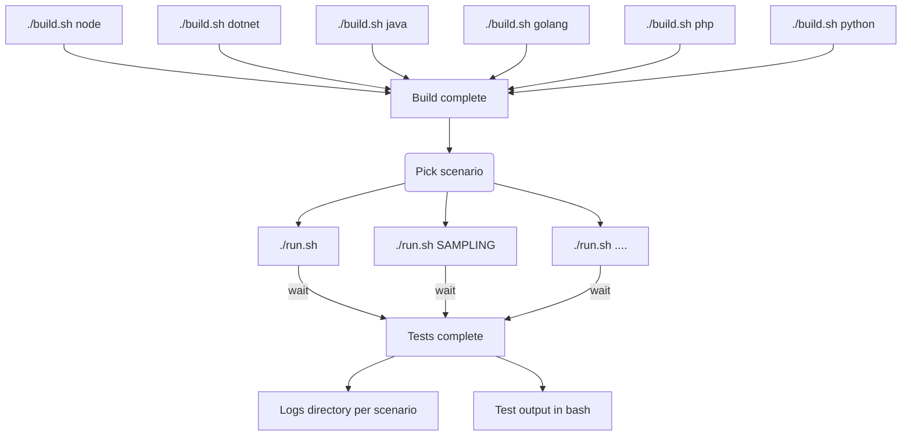

## System tests

Workbench designed to run advanced tests (integration, smoke, functionnal, fuzzing and performance)

## Requirement

`bash`, `docker-compose`

## How to use ? 

Add a valid staging `DD_API_KEY` environment variable (you can set it in a `.env` file). Then:

More details in [build documentation](https://github.com/DataDog/system-tests/blob/master/docs/execute/build.md) and [run documentation](https://github.com/DataDog/system-tests/blob/master/docs/execute/run.md).

**[Complete documentation](https://github.com/DataDog/system-tests/blob/master/docs)**

