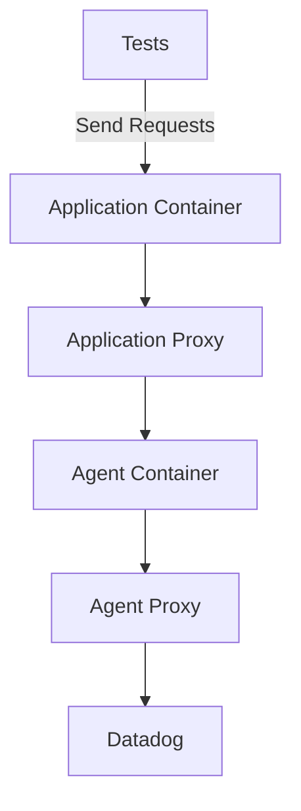

# Overview

The components that make up a running test are simple from the outside.
The idea behind system tests is that we can share the tests for a given feature across implementations.

To enable a typical feature within system tests might go like this:
 - Add the enabling environment variable to the shared docker-compose
 - Add a test asserting the environment variable affected traces as expected
 - Build and run for each language to verify the tests run and behave as expected
 - Create the pull request in system-tests

 However, there are many scenarios where a test may not be so simple to implement.
 This document aims to give a working understanding of the parts of system-tests, and how to troubleshoot them.

## What are the components of a running test?

When the system tests are executing, there are four main containers of concern.
The [Application Container](TODO) is the swappable web app language module that must meet an interface.
The [Application Proxy](TODO) is what we use to inspect payloads from the datadog libraries.
The [Agent](TODO) is the basic Datadog agent image.
The [Agent Proxy](TODO) is what is used to inspect payloads from the Agent to the Backend.

