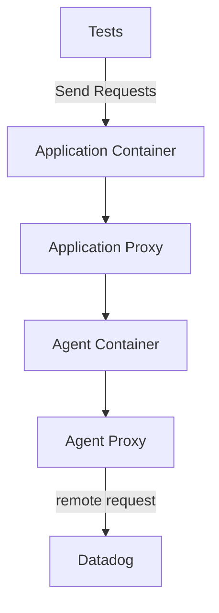
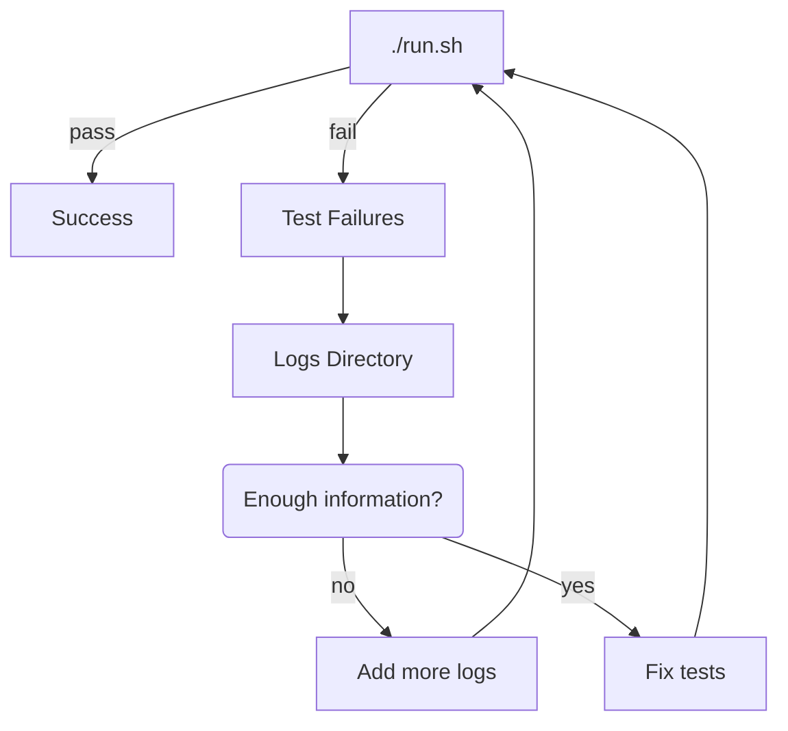

# Overview

The components that make up a running test are simple from the outside.
The idea behind system tests is that we can share the tests for a given feature across implementations.

To enable a typical feature within system tests might go like this:
 - Add the enabling environment variable to the shared docker-compose
 - Add a test asserting the environment variable affected traces as expected
 - Build and run for each language to verify the tests run and behave as expected
 - Create the pull request in system-tests

 However, there are many scenarios where a test may not be so simple to implement.
 This document aims to give a working understanding of the parts of system-tests, and how to troubleshoot them.

## What is system-tests bad for?

 - Combinatorial style tests
 - Tests that require specific versions of runtimes, libraries, or operating systems
 - Cloud deployments, kubernetes, distributed deployments
 - Immediately knowing the reason a feature fails
 - Problems or features which are not shared across tracers
 - Performance or throughput testing

 *Examples of bad candidates:*
  - The .NET tracer must not write invalid IL for it's earliest supported runtime
  - The startup overhead of the Java tracer is less than 3s for a given sample application
  - The python tracer must not fail to retrieve traces for a version range of the mongodb library

## What is system-tests good for?

 - Catching regressions on shared features
 - Wide coverage in a short time frame
 - Shared test coverage across all tracer libraries
 - Ensuring requirements for shared features are met across tracer libraries

*Examples of good candidates:*
  - `DD_TAGS` must be parsed correctly and carried as tags on all traces
  - Tracer libraries must be able to communicate with the agent through Unix Domain Sockets
  - Sampling rates from the agent are respected when not explicitly configured
  - All tracer libraries log consistent diagnostic information at startup

## What are the components of a running test?

When the system tests are executing, there are four main containers of concern.
The [Application Container](TODO) is the swappable web app language module that must meet an interface.
The [Application Proxy](TODO) is what we use to inspect payloads from the datadog libraries.
The [Agent](TODO) is the basic Datadog agent image.
The [Agent Proxy](TODO) is what is used to inspect payloads from the Agent to the Backend.

The tests send requests directly to the application.
The tests then wait on the results, which are available as the logs are collected from [mitmproxy](TODO) dumps.

## How do I troubleshoot a failing test?

The first method of troubleshooting should be to inspect the logs folder.
The logs folder is set on the `SYSTEMTESTS_LOG_FOLDER` variable in in the `./run.sh` file, but you should be able to notice an aptly named folder created after your tests run.

## How do I troubleshoot a container?

The `./run.sh` script starts the containers in the background.
Often, knowing how a container fails to start is as simple as running `docker-compose up {container}` and observing the output.

If there are more in depth problems within a container you may need to adjust the Dockerfile.
 - re-run `./build.sh`
 - start the container via `docker-compose up`
 - `docker exec -it {container-id} bash` to diagnose from within the container

## What is the structure of the code base?

The entry points of system-tests are observable from `./.github/workflows/ci.yml`.

The `./build.sh` script calls into a nested `./utils/build/build.sh` script.
[Click here for more details about the `./build.sh` script and options available](#building-the-system-tests).

The first argument to the `./build.sh` script is the language which is built: `./utils/build/docker/{language}`.
    e.g., `./build.sh dotnet`

The `./run.sh` script runs the tests and relies 1-to-1 on what is built in the `./build.sh` step.
[Click here for more details about the `./run.sh` script and options available](TODO).

The run script ultimately calls the `./docker-compose.yml` file and whichever image is built with the `weblog` tag is tested. 
[Click here for more detail about how the images interact with eachother](#what-are-the-components-of-a-running-test)

## Building the System Tests

