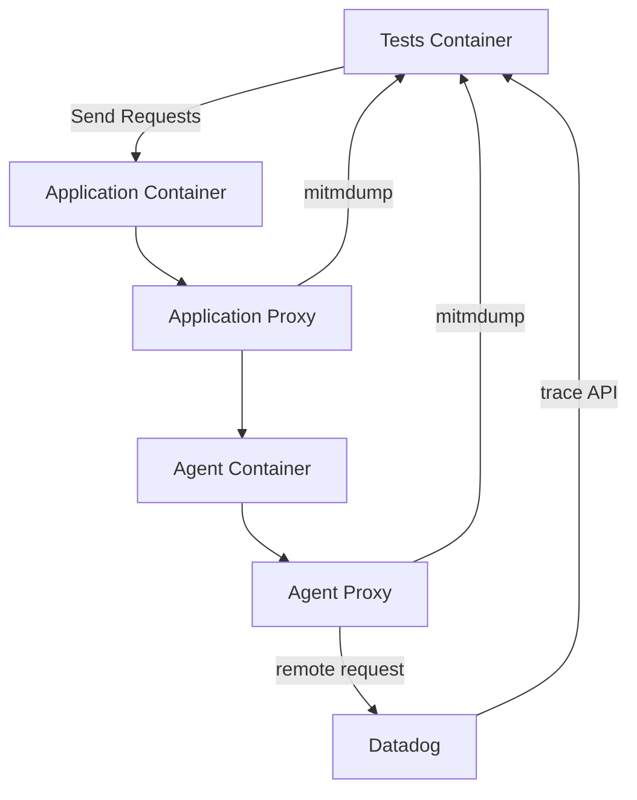
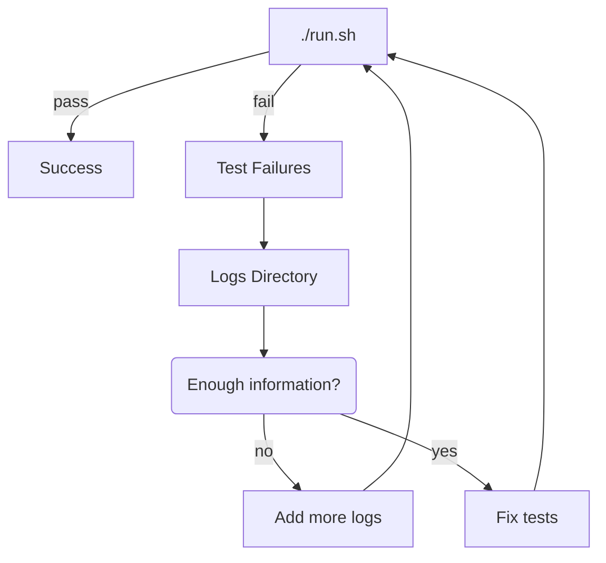

# Overview

The components that make up a running test are simple from the outside.

The idea behind system tests is that we can share the tests for a given feature across implementations.

Enabling a feature within system tests might go like this:

1. [Run the system test suite](#running-the-system-tests)
1. Inspect `./logs/interfaces` folders to see if the data you want to validate is present
1. If the feature you want to validate isn't enabled, enable it.
   - Probably the correct option: Change the weblog/application image
   - Enable it through run.sh
   - Enable it through an environment variable
1. [Add a test to verify your data, sending any requests as needed](#how-do-i-add-a-new-test).
1. Disable the test for languages which don't yet implement it
1. Submit a pull request, ask for review

However, there are many scenarios where a test may not be so simple to implement.

This document aims to give a working understanding of the parts of system-tests, and how to troubleshoot them.

## What are the components of a running test?

When the system tests are executing, there are several main containers of concern.

- [Tests Container](#tests-container) (aka "runner")
  - Responsible for running the actual tests, sending traffic, and asserting results
- [Application Container](#application-container) (aka "weblog")
  - Swappable webapp language module that must meet an interface
- [Application Proxy Container](#application-proxy-container)
  - Mechanism to inspect payloads from the datadog libraries
- [Agent Container](#agent-container)
  - Basic Datadog agent image
- [Agent Proxy Container](#agent-proxy-container)
  - Mechanism to inspect payloads from the Agent to the Backend

The tests send requests directly to the application.

The tests then wait on the results, which are available as the logs are collected from proxies.

## What are system-tests bad for?

- Combinatorial-style tests (Permutations of framework runtimes, 3rd libraries versions, operating systems)
- Cloud deployments, kubernetes, distributed deployments
- Immediately knowing the reason a feature fails
- Problems or features which are not shared across tracers
- Performance or throughput testing

*Examples of bad candidates:*

- The .NET tracer must not write invalid [IL](https://en.wikipedia.org/wiki/Common_Intermediate_Language) for it's earliest supported runtime
- The startup overhead of the Java tracer is less than 3s for a given sample application
- The python tracer must not fail to retrieve traces for a version range of the mongodb library

## What are system-tests good for?

- Catching regressions on shared features
- Wide coverage in a short time frame
- Shared test coverage across all tracer libraries
- Ensuring requirements for shared features are met across tracer libraries
- testing a set of version of any datadog component

*Examples of good candidates:*

- `DD_TAGS` must be parsed correctly and carried as tags on all traces
- Tracer libraries must be able to communicate with the agent through Unix Domain Sockets
- Sampling rates from the agent are respected when not explicitly configured
- All tracer libraries log consistent diagnostic information at startup

## How do I add a new test?

The default folder to add new tests is `./tests`.

The framework used for running tests is [pytest](https://docs.pytest.org/).

For a test to be run, it must have the filename prefix `test_`.

Follow the [example and instructions provided within `./docs/architecture/test_template.py`](/docs/architecture/test_template.py).

## How do I troubleshoot a failing test?

As system tests is blackbox testing, there will likely be very little information about your failing test in output.

The first method of troubleshooting should be to inspect the logs folder.

The folder is `./logs/` for the default scenario, or `./logs_<scenario_name>` for other scenatrios

## How do I troubleshoot a container?

The `./run.sh` script starts the containers in the background.

Often, knowing how a container fails to start is as simple as running `docker-compose up {container}` and observing the output.

If there are more in depth problems within a container you may need to adjust the Dockerfile.

- re-run `./build.sh`
- start the container via `docker-compose up`
- `docker exec -it {container-id} bash` to diagnose from within the container

## What is the structure of the code base?

The entry points of system-tests are observable from `./.github/workflows/ci.yml`.

The `./build.sh` script calls into a nested `./utils/build/build.sh` script.

- [Click for details about the `./build.sh` script and options available](#building-the-system-tests).

The first argument to the `./build.sh` script is the language which is built: `./utils/build/docker/{language}`.

- e.g., `./build.sh dotnet`

The `./run.sh` script runs the tests and relies 1-to-1 on what is built in the `./build.sh` step.

- [Click for details about the `./run.sh` script and options available](#running-the-system-tests).

The run script ultimately calls the `./docker-compose.yml` file and whichever image is built with the `weblog` tag is tested.

- [Click for detail about how the images interact with eachother](#what-are-the-components-of-a-running-test)

## Building the System Tests

The first argument to the `./build.sh` script is the language (`$TEST_LIBRARY`) which is built: `./utils/build/docker/{language}`.

- `./build.sh cpp`
- `./build.sh ruby`
- `./build.sh python`
- `./build.sh php`
- `./build.sh nodejs`
- `./build.sh java`
- `./build.sh golang`
- `./build.sh dotnet`

There are explicit arguments available for more specific configuration of the build.

- i.e., `./build.sh {language} --weblog-variant {dockerfile-prefix}`
- e.g., `./build.sh python --weblog-variant flask-poc`
- shorter version: ./build.sh python -w flask-poc

These arguments determine which Dockerfile is ultimately used in the format of: `./utils/build/docker/{language}/{dockerfile-prefix}.Dockerfile`

## Running the System Tests

The build script must be successful before running the tests.

The first argument to the `./run.sh` script is the scenario (`$SCENARIO`) which defaults to `DEFAULT`.

- `./run.sh`
- `./run.sh DEFAULT`
- `./run.sh SAMPLING`
- `./run.sh PROFILING`

You can see all available scenarios within the `./run.sh` script.

The run script sets necessary variables for each scenario, which are then used within the `docker-compose.yml` file.

When debugging tests, it may be useful to only run individual tests, following this example:

- `./run.sh tests/appsec/test_conf.py::Test_StaticRuleSet::test_basic_hardcoded_ruleset`
- `./run.sh tests/test_traces.py::Test_Misc::test_main`

## Tests Container

This container shares mounted volumes with the proxy containers.
It executes the tests via pytest.
These tests generate traffic against the Application Container and then inspect the dumps from the proxy containers.

## Application Container

The application container (aka weblog) is the pluggable component for each language.
It is a web application that exposes consistent endpoints across all implementations.

If you are introducing a new Dockerfile, or looking to modify an existing one, remember that they are built using this convention in arguments: `./utils/build/docker/{language}/{dockerfile-prefix}.Dockerfile`.

All application containers share final layers applied via this file: `./utils/build/docker/set-system-tests-weblog-env.Dockerfile`

The shared application docker file is a good place to add any configuration needed across languages and variants.

## Application Proxy Container

All application container traffic is sent to this container.
This container uses mitmproxy to inspect and dump the traffic and then forwards to the Agent Container.

## Agent Container

All agent containers share final layers applied via this file: `./utils/build/docker/set-system-tests-agent-env.Dockerfile`

The shared agent docker file is a good place to add any configuration needed across languages and variants.

## Agent Proxy Container

All agent container traffic egress is sent to this container.

This container uses mitmproxy to inspect and dump the traffic and then forwards to the backend.

## Testing a local version of the tracer

Read the instructions in [the binaries documentation](/docs/execute/binaries.md).

In short, copy your tracer version to the `./binaries` folder, and build and run as usual.
