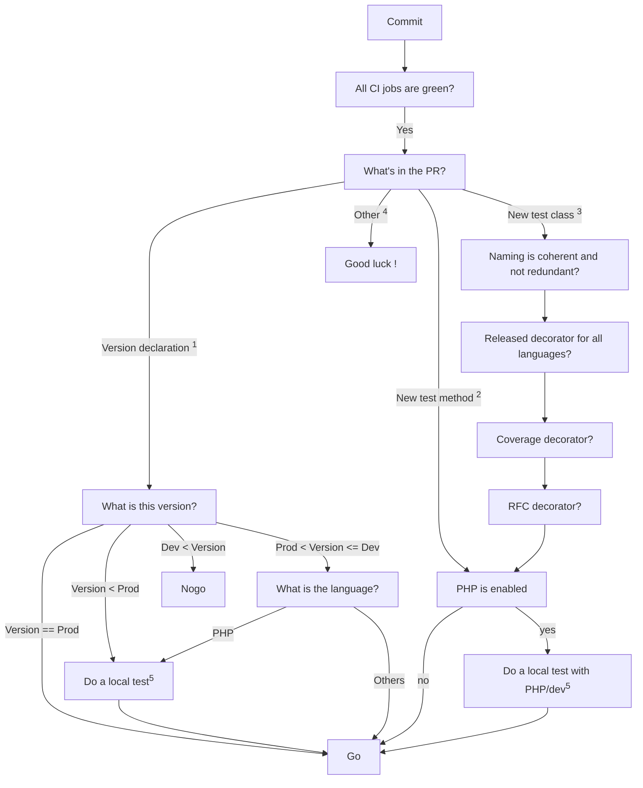

Here is the workflow to review pull requests:

## Notes

1. Manifest files allows to declare at which version of a component a feature is supposed to be working. In consequence, it enable the underlying tests. We must ensure that this change is correctly tested, otherwise it may break some CIs. [Example](https://github.com/DataDog/system-tests/commit/a1970be4ffb3176fa71135a2feb302311be88baa)
1. A new test method is added in an existing test class.
1. A new test class is added.
1. Any other change, it'll require a more complete review that can't be sumerize in a simple workflow
1. PHP CI is not public (ie, it require authentication to get artifacts). As system-tests repo is public, we cannot ship autnentication token in our CI. In consequences, any change that implies the dev version of the PHP library must be tested locally.
