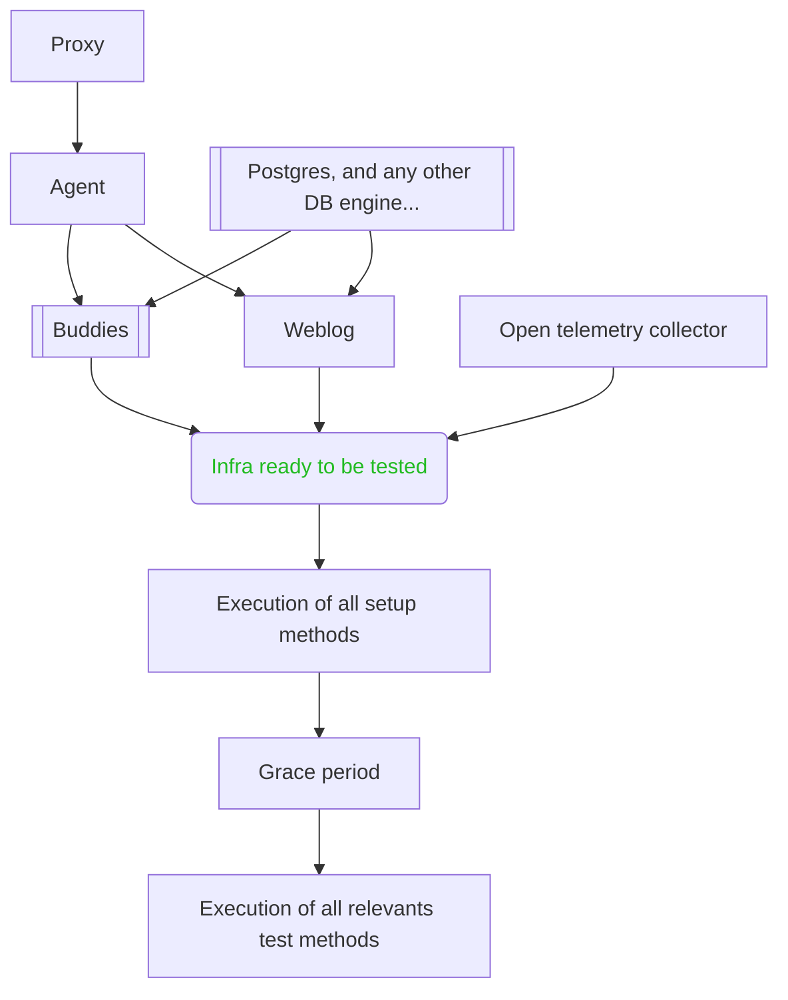

The majority of scenario in system tests are based on `EndToEndScenario` class, itself based on `_DockerScenario` class. One of the major constraints of those scenario is to precisely control the startup sequence, to ensure that no flakyness is induced by a service not healthy when a depending one is rely on it.

Once the infra is ready to be tested, the test execution is divided in three sequential steps : setup, wait, then test.

Here is the life cycle map : 

Two important note : 

1. each container must satisfy to an healtcheck command to be consider as started
2. depending on the scenario, some container may not be started (Buddies, DB engines, OTM collector ...)
3. on `replay` mode, only the very last step (`Execution of all relevants test methods`) is executed.
