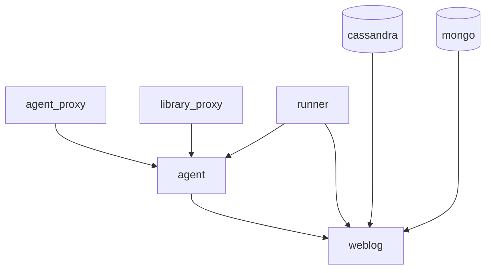

## Docker compose

The docker compose file includes several dependancies between each services. Here is the startup diagram of all services:

## Warmup

Once the runner is started, it waits for several signals (defined in `execute_warmups` function) before starting the test session: 

1. A successful request on `agent` service
2. A successful request on `library_proxy` service
3. A successful request on `weblog` service
4. A successful communication between `weblog` and `agent` (observed thnaks to `library_proxy`)
5. A successful communication between `agent` and datadog backend (observed thnaks to `agent_proxy`)
