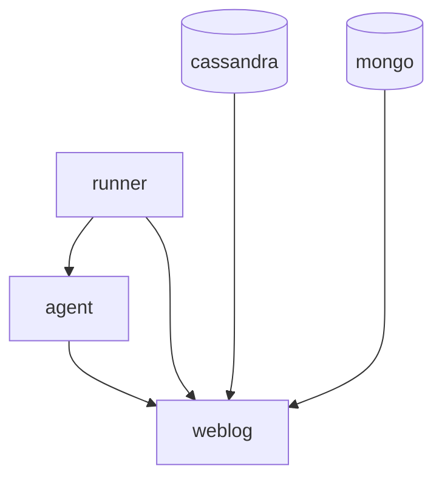

## Docker compose

The docker compose file includes several dependancies between each services. Here is the startup diagram of all services:

## Warmup

Once the runner is started, it waits for several signals (defined in `execute_warmups` function) before starting the test session:

1. A successful request on `agent` service
1. A successful request on `weblog` service
1. A successful communication between `weblog` and `agent`
1. A successful communication between `agent` and datadog backend
