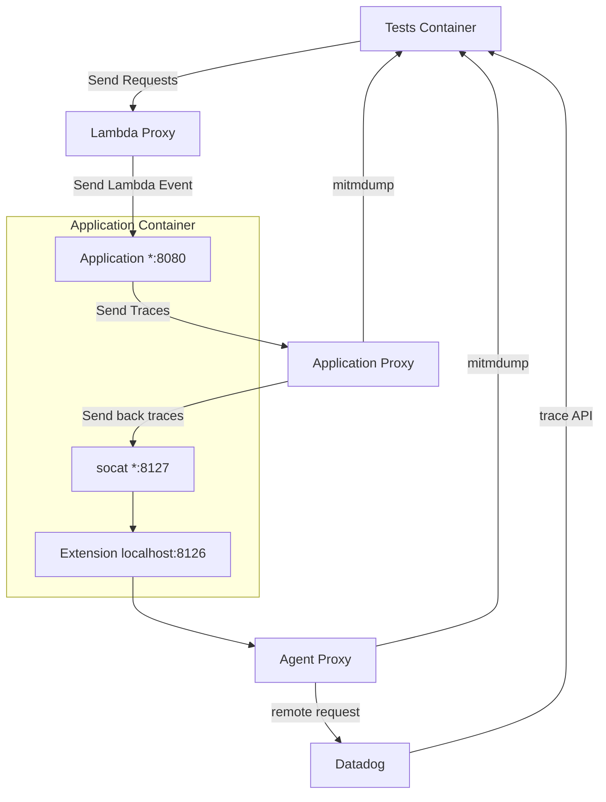

# Lambda Testing scenario

The Lambda scenario is a variation on the [classical architecture](../architecture/overview.md#what-are-the-components-of-a-running-test) of the system-tests tailored to evaluate the `AWS Lambda` variants of the tracers when used to serve HTTP requests.

To achieve this we simulate the following AWS deployment architecture inside the system-tests using AWS provided tools :


The AWS Managed Load Balancer could be any of the following ones:
- API Gateway
- Application Load Balancer
- Lambda function url service

To do this, we rely on two tools from AWS to emulate Lambda and Load Balancers:
- [AWS Lambda Runtime Interface Emulator](https://github.com/aws/aws-lambda-runtime-interface-emulator)
- [AWS SAM cli](https://github.com/aws/aws-sam-cli)

>Note: for now only the python variant ([`datadog_lambda`](https://github.com/DataDog/datadog-lambda-python)) is being tested simulating an `API Gateway`

## Key differences with end to end scenarios

To replace the **AWS Managed Load Balancer**, we run a dedicated container in front of the weblog named **Lambda Proxy**. It is responsible for converting the incoming request to a *lambda event* representation, invoking the lambda function running inside the weblog and converting back the return value of function to an http response.

The **Lambda Function** runs inside the **Weblog Container** thanks to the *AWS Lambda Runtime Interface Emumlator*.


There is no **Agent Container**, the **Datadog Extension** (equivalent to the  **Datadog Agent** in the context of lambda) needs to run inside the **Weblog Container**, the [**Application Proxy Container**](../architecture/overview.md#application-proxy-container) therefore needs to send traces back to the **Weblog Container**.




## Specific considerations for the weblogs

On top of responding to the regular [`/healthcheck`](../weblog/README.md#get-healthcheck) endpoint.

Lambda Weblogs should respond the same JSON dict response to the non HTTP event:
```json
{
    "healthcheck": true
}
```

This is because the healthcheck is sent by the Lambda Weblog container itself which has no knowledge of how to serialize it as the event type expected by the weblog.