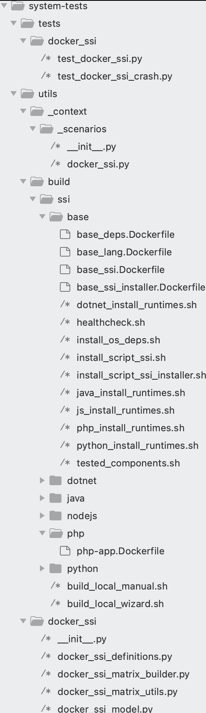

1. [Overall](#Overall)
2. [Run the tests](#Run-the-tests)
   * [Prerequisites](#Prerequisites)
     - [System-tests requirements](#System-tests-requirements)
   * [Run the scenario](#run-the-scenario)
3. [How to develop tests](#How-to-develop-a-test-case)
   * [Folders and Files structure](#Folders-and-Files-structure)
   * [Docker SSI definitions](#Docker-SSI-definitions)
   * [Create a new weblog](#Create-a-new-weblog)
     - [Create a new weblog using a prebuilt docker image](#Create-a-new-weblog-using-a-prebuilt-docker-image)
     - [Create a new weblog deployable on different containers or operating systems](#Create-a-new-weblog-deployable-on-different-containers-or-operating-systems)
   * [Create a new test case](#Create-a-new-test-case)

# Overall

The Docker SSI tests are an easy and fast tests to check the SSI instrumentation.
The Docker SSI tests don't pretend to replace the current AWS tests, they only try to complement them, providing a quick checks and verification for some features included in the SSI.

The main differences between the AWS/Onboarding tests and the Docker SSI tests are:

* In Docker SSI, the SSI is installed inside a docker container, instead of using virtual machines.
* The AWS/Onboarding tests better represent real customer scenarios, while Docker SSI does not.
* Docker SSI relies on APM Test Agent, instead of relying on the Datadog's production backend.

The main Docker SSI properties are:

* Install the SSI host injection on the docker container that runs the weblog application.
* Uses APM Test Agent to make the assertions.
* The weblog applications are containerized applications.
* The weblog application container is built by the system-tests scenarios in separate steps.
* The base image of the weblog application container should be parametrizable (detailed in the next sections)

The Docker SSI are good for:

* Test the instrumentation against different runtime versions.
* Test the guardrail features (unsupported versions of the language).
* Test the service naming features on SSI.
* Test the crash tracking features.
* Test other features like profiling, asm...

# Run the tests

## Prerequisites

There are no special requirements to run the Docker SSI tests, you only need the docker engine and have the access to GHCR.

### System-tests requirements

All system-tests assertions and utilities are based on python and pytests. You need to prepare this environment before running the tests:

- Python and pytests environment as described: [configure python and pytests for system-tests](../../README.md#requirements).
- Ensure that requirements.txt is loaded (you can run "`./build.sh -i runner`")

## Run the scenario

To help us to run a concrete case of the matrix variants, execute this script locally:

* `utils/scripts/ssi_wizards/docker_ssi_wizard.sh`: Interactive shell wizard that allow you to execute the Docker SSI scenario with the correct combination of arguments.

Here is the command line and the mandatory parameters:

```bash
  ./run.sh DOCKER_SSI --ssi-weblog "$weblog" --ssi-library "$TEST_LIBRARY" --ssi-base-image "$base_image" --ssi-arch "$arch" --ssi-installable-runtime "$installable_runtime"

```

The easy way to execute this scenario is to use the wizard script. For example:

```bash
(venv) system-tests % utils/build/ssi/build_local_wizard.sh
Welcome to the SSI Wizard!
Please select the library you want to test:
1) dotnet
2) java
3) nodejs
4) php
5) python
#? 2
You selected: java
Please select the weblog you want to use:
1) java7-app      3) jetty-app      5) websphere-app
2) jboss-app      4) tomcat-app
#? 3
You selected: jetty-app
Please select the base image you want to use:
1) almalinux:8.10    3) oraclelinux:8.10  5) ubuntu:16.04
2) almalinux:9.4     4) oraclelinux:9     6) ubuntu:22.04
#? 6
You selected: ubuntu:22.04
Please select the architecture you want to use:
1) linux/amd64
2) linux/arm64
#? 2
You selected: linux/arm64
Please select the installable runtime you want to use:
1) 11.0.24-zulu
2) 17.0.12-zulu
3) 21.0.4-zulu
4) 22.0.2-zulu
#? 3
You selected: 21.0.4-zulu
Enter any extra arguments (or leave blank):
Executing: ./run.sh DOCKER_SSI --ssi-weblog jetty-app --ssi-library java --ssi-base-image ubuntu:22.04 --ssi-arch linux/arm64 --ssi-installable-runtime 21.0.4-zulu
```

# How to develop tests

## Folders and Files structure

To develop a new test case in the Docker SSI Library injection tests, you need to know about the project folder structure.
The following picture shows the main directories for the Docker SSI tests:



* **tests/docker_ssi:** All tests cases are stored on this folder.
* **utils/_context/scenarios/**: In this folder you can find the Docker SSI Lib injection scenario definition.
* **utils/build/ssi/base/:** The base templates for the Docker SSI images, and the base utilities used to build the images, for example the language runtime installers.
* **utils/build/ssi/[lang]/:** The weblog applications docker definitios.
* **utils/build/ssi/build_local_manual.sh:** The helper script to run the Docker SSI scenarios.
* **utils/build/ssi/build_local_wizard.sh:** The wizard script to run the Docker SSI scenarios.
* **utils/docker_ssi:** The core implementation of this test framework.

## Docker SSI definitions

The key of the matrix of OSes (docker base image), architectures, language versions and weblogs resides on the file: `utils/docker_ssi/docker_ssi_definitions.py`. This file is the glue for all the components of this large matrix.

The first component is the Supported Images definition:

```python
class SupportedImages:
    """All supported images"""

    def __init__(self) -> None:
        # Try to set the same name as utils/_context/virtual_machines.py
        self.UBUNTU_22_AMD64 = DockerImage("Ubuntu_22", "ubuntu:22.04", LINUX_AMD64)
        self.UBUNTU_22_ARM64 = DockerImage("Ubuntu_22", "ubuntu:22.04", LINUX_ARM64)
        self.UBUNTU_16_AMD64 = DockerImage("Ubuntu_16", "ubuntu:16.04", LINUX_AMD64)
        self.UBUNTU_16_ARM64 = DockerImage("Ubuntu_16", "ubuntu:16.04", LINUX_ARM64)
        self.CENTOS_7_AMD64 = DockerImage("CentOS_7", "centos:7", LINUX_AMD64)
```

Other component to be defined is the installable runtime versions of the languages that are supported:

```python
class JavaRuntimeInstallableVersions:
    """Java runtime versions that can be installed automatically"""

    JAVA_24 = RuntimeInstallableVersion("JAVA_24", "24.0.1-zulu")
    JAVA_21 = RuntimeInstallableVersion("JAVA_21", "21.0.7-zulu")
    JAVA_17 = RuntimeInstallableVersion("JAVA_17", "17.0.15-zulu")
    JAVA_11 = RuntimeInstallableVersion("JAVA_11", "11.0.27-zulu")

class PHPRuntimeInstallableVersions:
    """PHP runtime versions that can be installed automatically"""

    PHP56 = RuntimeInstallableVersion("PHP56", "5.6")
    PHP70 = RuntimeInstallableVersion("PHP70", "7.0")
    PHP71 = RuntimeInstallableVersion("PHP71", "7.1")

```

Finally, there is a place to define the weblogs and specify on which OSs/docker base images can be deployed and whether it supports the installation of different language versions.

```python
JS_APP = WeblogDescriptor(
    "js-app",
    "nodejs",
    [
        SupportedImages().UBUNTU_22_AMD64.with_allowed_runtime_versions(
            JSRuntimeInstallableVersions.get_all_versions()
        ),
        SupportedImages().UBUNTU_22_ARM64.with_allowed_runtime_versions(
            JSRuntimeInstallableVersions.get_all_versions()
        ),
    ],
)
```

Might be that your weblog only supports one base image and it requires a runtime version to be installed, for example:

```python
TOMCAT_APP = WeblogDescriptor("tomcat-app", "java", [SupportedImages().TOMCAT_9_ARM64])
JAVA7_APP = WeblogDescriptor("java7-app", "java", [SupportedImages().UBUNTU_22_ARM64])
WEBSPHERE_APP = WeblogDescriptor("websphere-app", "java", [SupportedImages().WEBSPHERE_AMD64])
JBOSS_APP = WeblogDescriptor("jboss-app", "java", [SupportedImages().JBOSS_AMD64])
```

## Create a new weblog

We can differentiate between two types of applications:

- Applications that come already prepared/wrapped with a base image. For example, tomcat or jboss.
- "Normal” applications that we encapsulate in a docker container and that in theory could be executed in more than one base image. For example, my HelloWorld application could run on Ubuntu22, Debian 12, RedHat.... images.

The two previous points will be better understood by following examplesThe previous.

### Create a new weblog using a prebuilt docker image

For example, the Tomcat Java Web Server is distributed by prebuilt docker images. If we want to test the tomcat 9, but we don't need to test Tomcat 9 installed on different Operating Systems, we could use the tomcat prebuilt images.

If we want to test the tomcat 9 image deploying a web application we'd do this:

```yaml
#Build the web app
FROM maven:3.5.3-jdk-8-alpine as build
WORKDIR /app
COPY lib-injection/build/docker/java/enterprise/ ./
RUN mvn clean package

#Deploy/Run the built app on a tomcat 9
FROM tomcat:9
COPY --from=build app/payment-service/target/payment-service*.war /usr/local/tomcat/webapps/
```

We can convert this standard image into "Docker SSI" image. We only need to parametrize the "From" clause, and store the dockerfile as `utils/build/ssi/java/tomcat-app.Dockerfile`:

```yaml
ARG BASE_IMAGE

FROM maven:3.5.3-jdk-8-alpine as build
WORKDIR /app
COPY lib-injection/build/docker/java/enterprise/ ./
RUN mvn clean package

FROM ${BASE_IMAGE}
COPY --from=build app/payment-service/target/payment-service*.war /usr/local/tomcat/webapps/
#This is the endpoint to be used by the tests to make a request to the weblog. If your app it's listenning on "http://localhost:18080" you don't need to use the "WEBLOG_URL"
ENV WEBLOG_URL=http://localhost:8080/payment-service/
ENV DD_INSTRUMENT_SERVICE_WITH_APM=true
```

As final step, we should register the new weblog in the docker ssi definitions file (`utils/docker_ssi/docker_ssi_definitions.py`):

```python
class SupportedImages:
    """All supported images"""

    def __init__(self) -> None:
        self.TOMCAT_9_AMD64 = DockerImage("Tomcat_9", "tomcat:9", LINUX_AMD64)
        self.TOMCAT_9_ARM64 = DockerImage("Tomcat_9", "tomcat:9", LINUX_ARM64)
...
TOMCAT_APP = WeblogDescriptor("tomcat-app", "java", [SupportedImages().TOMCAT_9_ARM64, SupportedImages().TOMCAT_9_AMD64])
...
# HERE ADD YOUR WEBLOG DEFINITION TO THE LIST
ALL_WEBLOGS = [
    ...,
    TOMCAT_APP,
    ...
]

```

---

**NOTE:**

When system-tests builds the docker images it is going to install the SSI software inside of the container.

---

If we want to run the "DOCKER_SSI" test cases for this new weblog:

```bash
./run.sh DOCKER_SSI --ssi-weblog tomcat-app --ssi-library java --ssi-base-image tomcat:9 --ssi-arch linux/arm64
```

### Create a new weblog deployable on different containers or operating systems

We will use these types of weblogs to run an application against different operating systems and distinct language runtime versions.

For example, we can define a PHP application that runs on different OS and PHP runtime versions (`utils/build/ssi/php/php-app.Dockerfile`):

```yaml
ARG BASE_IMAGE

FROM ${BASE_IMAGE}
WORKDIR /app

RUN printf "<?php\necho 'hi';\n" > index.php

# Without the sleep, the docker network has issues
CMD ["sh", "-c", "sleep 2; php -S 0.0.0.0:18080"]
```

As final step, we should register the new weblog in the docker ssi definitions file (`utils/docker_ssi/docker_ssi_definitions.py`):

```python
class SupportedImages:
    """All supported images"""

    def __init__(self) -> None:
        # Try to set the same name as utils/_context/virtual_machines.py
        self.UBUNTU_22_AMD64 = DockerImage("Ubuntu_22", "ubuntu:22.04", LINUX_AMD64)
        self.UBUNTU_24_ARM64 = DockerImage("Ubuntu_24", "ubuntu:24.04", LINUX_ARM64)

class PHPRuntimeInstallableVersions:
    """PHP runtime versions that can be installed automatically"""

    PHP56 = RuntimeInstallableVersion("PHP56", "5.6")  # Not supported (EOL runtime)
    PHP70 = RuntimeInstallableVersion("PHP70", "7.0")
    PHP71 = RuntimeInstallableVersion("PHP71", "7.1")
    PHP72 = RuntimeInstallableVersion("PHP72", "7.2")
    PHP73 = RuntimeInstallableVersion("PHP73", "7.3")
    PHP74 = RuntimeInstallableVersion("PHP74", "7.4")
    PHP80 = RuntimeInstallableVersion("PHP80", "8.0")
    PHP81 = RuntimeInstallableVersion("PHP81", "8.1")
    PHP82 = RuntimeInstallableVersion("PHP82", "8.2")
    PHP83 = RuntimeInstallableVersion("PHP83", "8.3")

...

PHP_APP = WeblogDescriptor(
    "php-app",
    "php",
    [
        SupportedImages().UBUNTU_22_AMD64.with_allowed_runtime_versions(
            PHPRuntimeInstallableVersions.get_all_versions()
        ),
        SupportedImages().UBUNTU_24_ARM64.with_allowed_runtime_versions(
            PHPRuntimeInstallableVersions.get_all_versions()
        ),
    ],
)

...
# HERE ADD YOUR WEBLOG DEFINITION TO THE LIST
ALL_WEBLOGS = [
    ...,
    PHP_APP,
    ...
]
```

---

**NOTE:**

When system-tests builds the docker images it is going to install the SSI software inside of the container and the required runtime version.

---

If we want to run a "DOCKER_SSI" test case for this new weblog:

```bash
./run.sh DOCKER_SSI --ssi-weblog php-app --ssi-library php --ssi-base-image ubuntu:22.04 --ssi-arch linux/amd64 --ssi-installable-runtime PHP70
```

## Create a new test case

The creation of test methods for the “Docker SSI” scenarios does not require anything special, we will do it as it is done for the rest of the system-tests scenarios.
We can make a request to the deployed weblog and make assertions through the "test agent" interface:

```python
@scenarios.docker_ssi
class TestDockerSSIFeatures:
    """Test the ssi in a simulated host injection environment (docker container + test agent)
    We test that the injection is performed and traces and telemetry are generated.
    If the language version is not supported, we only check that we don't break the app and telemetry is generated."""


    def setup_install_supported_runtime(self):

       parsed_url = urlparse(context.scenario.weblog_url)
       logger.info(f"Setting up Docker SSI installation WEBLOG_URL {context.scenario.weblog_url}")
       self.r = weblog.request(
                "GET", parsed_url.path, domain=parsed_url.hostname, port=parsed_url.port
       )
       logger.info(f"Setup Docker SSI installation {TestDockerSSIFeatures._r}")


    def setup_install_supported_runtime(self):
        self._setup_all()

    @features.ssi_guardrails
    def test_install_supported_runtime(self):
        logger.info(f"Testing Docker SSI installation on supported lang runtime: {context.scenario.library.name}")
        assert self.r.status_code == 200, f"Failed to get response from {context.scenario.weblog_url}"

        # If the language version is supported there are traces related with the request
        traces_for_request = interfaces.test_agent.get_traces(request=self.r)
        assert traces_for_request, f"No traces found for request {self.r.get_rid()}"
        assert "runtime-id" in traces_for_request["meta"], "No runtime-id found in traces"

        # There is telemetry data related with the runtime-id
        telemetry_data = interfaces.test_agent.get_telemetry_for_runtime(traces_for_request["meta"]["runtime-id"])
        assert telemetry_data, "No telemetry data found"

```

You could use the system-tests decorator to skip the tests or mark them as bug. For example:

```python
    @bug(condition=context.library == "python", reason="INPLAT-11")
    @irrelevant(context.library == "java" and context.installed_language_runtime < "1.8.0_0")
    @irrelevant(context.library == "php" and context.installed_language_runtime < "7.0")
    @irrelevant(context.library == "nodejs" and context.installed_language_runtime < "17.0")
    def test_install_supported_runtime(self):
```

