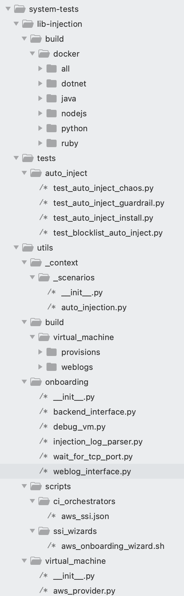
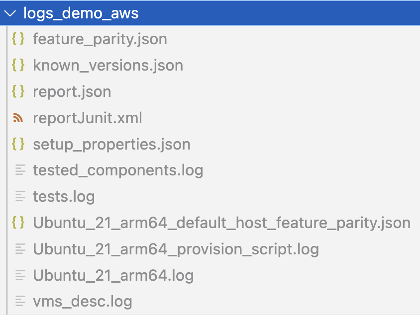

1. [Overall](#Overall)
2. [Run the tests](#Run-the-tests)
   * [Prerequisites](#Prerequisites)
     - [System-tests requirements](#System-tests-requirements)
   * [Run the scenario](#run-the-scenario)
3. [How to develop tests](#How-to-develop-a-test-case)
   * [Folders and Files structure](#Folders-and-Files-structure)
   * [Create a new provision](#Create-a-new-provision)
   * [Create a new weblog](#Create-a-new-weblog)
   * [Create a new test case](#Create-a-new-test-case)
4. [How to debug your environment and tests results](#How-to-debug-your-environment-and-tests-results)
5. [How to debug a virtual machine at runtime](#How-to-debug-a-virtual-machine-at-runtime)

# Overall

The Docker SSI tests are an easy and fast tests to check the SSI instrumentation.
The Docker SSI tests don't pretend to reemplace the current AWS tests, there only try to complement them, providing a quick checks and verification for some features included in the SSI.

The main differences between the AWS/Onboarding tests and the Docker SSI tests are:

* In Docker SSI, the SSI is installed inside a docker container, instead of using virtual machines.
* The AWS/Onboarding tests represent better a real customer scenarios, but Docker SSI it doesn't.
* Docker SSI relies on APM Test Agent, instead of rely on the backend.

The main Docker SSI properties are:

* Install the SSI host injection on the docker container that runs the weblog application.
* Uses a APM Test Agent to make the assertions.
* The weblog applications are containerized applications.
* The weblog application container is built by the system-tests scenarios in separate steps.
* The base image of the weblog application container should be parametrizable (it will detailed in the next sections)

The Docker SSI are good for:

* Test the instrumentation agains different runtime version.
* Test the guardrail features (unsupported versions of the language).
* Test the service naming features on SSI.
* Test the crash tracking features.
* Test other features like profiling, asm...

# Run the tests

## Prerequisites

There are not special requirements to run the Docker SSI tests, you only need the docker engine and have the access to GHCR.

### System-tests requirements

All system-tests assertions and utilities are based on python and pytests. You need to prepare this environment before run the tests:

- Python and pytests environment as described: [configure python and pytests for system-tests](../../README.md#requirements).
- Ensure that requirements.txt is loaded (you can run "`./build.sh -i runner`")

## Run the scenario

There is only one scenario declared: "`DOCKER_SSI`". But this unique scenario can run agains multiple variants of weblogs, conteinerized OS and architectures and therefore the matrix combinations might be very big.

To help us to run a concrete case of the matrix variants, there are two scripts to be executed locally:

* `utils/build/ssi/build_local_manual.sh`: Runs the Docker SSI scenario using the arguments: library, weblog, docker base image, architecture and installable runtime. To run this command you need to know the correct combination of these arguments.
* `utils/build/ssi/build_local_wizard.sh`: Interactive shell wizard that allow you to execute the Docker SSI scenario with the correct combination of arguments.

Here is the command line and the mandatory parameters:

```bash
  ./run.sh DOCKER_SSI --ssi-weblog "$weblog" --ssi-library "$TEST_LIBRARY" --ssi-base-image "$base_image" --ssi-arch "$arch" --ssi-installable-runtime "$installable_runtime"

```

The easy way to execute this scenario is to use the wizard script. For example:

```bash
(venv) system-tests % utils/build/ssi/build_local_wizard.sh
Welcome to the SSI Wizard!
Please select the library you want to test:
1) dotnet
2) java
3) nodejs
4) php
5) python
#? 2
You selected: java
Please select the weblog you want to use:
1) java7-app      3) jetty-app      5) websphere-app
2) jboss-app      4) tomcat-app
#? 3
You selected: jetty-app
Please select the base image you want to use:
1) almalinux:8.10    3) oraclelinux:8.10  5) ubuntu:16.04
2) almalinux:9.4     4) oraclelinux:9     6) ubuntu:22.04
#? 6
You selected: ubuntu:22.04
Please select the architecture you want to use:
1) linux/amd64
2) linux/arm64
#? 2
You selected: linux/arm64
Please select the installable runtime you want to use:
1) 11.0.24-zulu
2) 17.0.12-zulu
3) 21.0.4-zulu
4) 22.0.2-zulu
#? 3
You selected: 21.0.4-zulu
Enter any extra arguments (or leave blank):
Executing: ./run.sh DOCKER_SSI --ssi-weblog jetty-app --ssi-library java --ssi-base-image ubuntu:22.04 --ssi-arch linux/arm64 --ssi-installable-runtime 21.0.4-zulu
```

# How to develop tests

Developing new tests might involve one or several operations:

* **Implement a new provision/scenario:** You need a custom provision or extra steps. For example, in addition to the SSI software you want to install a  several linux services to check if these services can interfere on the weblog auto injection.
* **Add a new weblog:** You want to add a new weblog to be tested in the previously existing scenario.
* **Add a new test case:** You want to add new assertions against the existing scenarios and weblogs.

## Folders and Files structure

To develop a new test case in the SSI Library injection tests, you need to know about the project folder structure.
The following picture shows the main directories for the SSI tests:



* **lib-injection/build/docker:** This folder contains the sample applications source code.
* **tests/auto_inject:** All tests cases are stored on this folder.
* **utils/_context/scenarios/**: In this folder you can find the SSI Lib injection scenario definition.
* **utils/_context/virtual_machines.py:** The virtual machine definition file.
* **utils/build/virtual_machine/provisions/:** Provisions associated to the scenario.
* **utils/build/virtual_machine/weblogs/:** Provisions associated to the weblogs.
* **utils/onboarding:** Utilities that are used from the test cases. For example, make a request to the weblog or make queries to the backend in order to find the generated instrumentation traces.
* **utils/virtual_machine/:** The core implementation of this test framework. For example, the provider implementation, the pulumi wrapper or the provision files parser.
* **.gitlab-ci.yml:** These tests are launched on GitLab.

## Create a new provision

If you want to create a new machine provision, first you need to define a new scenario and associate it with a new provision. For example (`utils/_context/_scenarios/__init__.py`):

```python
    my_custom_scenario= InstallerAutoInjectionScenario(
        "MY_CUSTOM_SCENARIO",
        "A very simple example",
        vm_provision="my_provision"
    )
```
We should define the provision. Let's create a folder named: `utils/build/virtual_machine/provisions/my_provision` and add the file `provision.yml`:

```yaml

# Optional: Load the environment variables
init-environment:
  #This variables will be populated as env variables in all commands for each provision installation
  - env: dev
    MY_VAR: DEV_VAR
  - env: prod
    MY_VAR: PROD_VAR
    agent_dist_channel: stable
    agent_major_version: "7"

# Mandatory: Scripts to extract the installed/tested components
tested_components:
  install:
    - os_type: linux
      remote-command: |
          echo "{'test_component':'1.0.0'}"


# Mandatory: Steps to provision VM
provision_steps:
  - my-custom-step

my-custom-step:
  cache: false
  install:
    - os_type: linux
      remote-command: echo "Hey! Hello $MY_VAR!"
```
This scenario provision will be installed when you run the scenario:

```bash
export ONBOARDING_AWS_INFRA_SUBNET_ID=subnet-xyz
export ONBOARDING_AWS_INFRA_SECURITY_GROUPS_ID=sg-xyz
./run.sh MY_CUSTOM_SCENARIO --vm-weblog test-app-nodejs --vm-env dev --vm-library nodejs --vm-provider aws --vm-only Ubuntu_22_amd64
```
## Create a new weblog

You can add more weblogs to the existing scenarios. You must follow some rules:

* The weblog provision is located in the folder: `utils/build/virtual_machine/weblogs/LANG`
* The weblog provision is defined in the file: `provision_WEBLOG_NAME.yml`
* There are two types of weblogs, host based apps and containerized apps.
* The weblog provision contains two main sections:
  * lang_variant: Optional. If you are creating a host based app, you must install the language runtime before.
  * weblog: The weblog provision. Copy files and configuration, compile and run as service.
* If you ar creating a host based app, you should run the app as system service called: *test-app-service*.

This is an example of Java app running on host. We called the weblog as `my_custom_app`, we define the file `provision_my_custom_app.yml` in `utils/build/virtual_machine/weblogs/java` folder:

```yaml
lang_variant:
    name: DefaultJDK
    version: default
    cache: true
    install:

      - os_type: linux
        os_distro: deb
        remote-command: sudo apt-get -y update && sudo apt-get -y install default-jdk

      - os_type: linux
        os_distro: rpm
        remote-command: sudo sudo dnf -y install java-devel || sudo yum -y install java-devel

weblog:
    name: my_custom_app
    install:
      - os_type: linux

        copy_files:
          - name: copy-service
            local_path: utils/build/virtual_machine/weblogs/common/test-app.service

          - name: copy-service-run-script
            local_path: utils/build/virtual_machine/weblogs/common/create_and_run_app_service.sh

          - name: copy-compile-weblog-script
            local_path: utils/build/virtual_machine/weblogs/java/test-app-java/compile_app.sh

          - name: copy-run-weblog-script
            local_path: utils/build/virtual_machine/weblogs/java/test-app-java/test-app-java_run.sh

          - name: copy-java-app
            local_path: lib-injection/build/docker/java/jetty-app

        remote-command: sh test-app-java_run.sh
```
You can run this weblog:

```bash
export ONBOARDING_AWS_INFRA_SUBNET_ID=subnet-xyz
export ONBOARDING_AWS_INFRA_SECURITY_GROUPS_ID=sg-xyz
./run.sh MY_CUSTOM_SCENARIO --vm-weblog my_custom_app --vm-env dev --vm-library java --vm-provider aws --vm-only Ubuntu_22_amd64
```
## Create a new test case

Implement a new test case is as simple as the rest of the existing test cases in system-tests. There is only one particularity to consider. The test methods must be parametrized. In this parameter, you can find all the data/description related with the virtual machine that we are testing. With this data, you will be able to execute remote command using SSH and retrieve the results. You can also access to the sample application Http endpoints.

```python
@features.installer_auto_instrumentation
@scenarios.simple_installer_auto_injection
class TestSimpleInstallerAutoInjectManual():
    def test_install(self, virtual_machine):
        pass
```
You can use the `virtual_machine` parameter to execute commands remotely:

```python
@features.installer_auto_instrumentation
@scenarios.simple_installer_auto_injection
class TestSimpleInstallerAutoInjectManual():
    def test_install(self, virtual_machine):
      assert self.execute_command(virtual_machine, "echo 'Hello'") == "Hello", "Cannot execute command on the remote machine"

    def execute_command(self, virtual_machine, command) -> str:
        # Env for the command
        prefix_env = ""
        for key, value in virtual_machine.get_command_environment().items():
            prefix_env += f"export {key}={value} \n"

        command_with_env = f"{prefix_env} {command}"

        with virtual_machine.ssh_config.get_ssh_connection() as ssh:
            timeout = 120

            _, stdout, _ = ssh.exec_command(command_with_env, timeout=timeout + 5)
            stdout.channel.set_combine_stderr(True)

            # Enforce that even if we reach the 2min mark we can still have a partial output of the command
            # and thus see where it is stuck.
            Timer(timeout, self.close_channel, (stdout.channel,)).start()

            # Read the output line by line
            command_output = ""
            for line in stdout.readlines():
                if not line.startswith("export"):
                    command_output += line

            return command_output
```
You can use the `virtual_machine` parameter to make request to the deployed weblog:

```python
@features.installer_auto_instrumentation
@scenarios.simple_installer_auto_injection
class TestSimpleInstallerAutoInjectManual():
    def test_install(self, virtual_machine):
        vm_ip = virtual_machine.get_ip()
        vm_port = virtual_machine.deffault_open_port
        vm_context_url = f"http://{vm_ip}:{vm_port}{virtual_machine.get_deployed_weblog().app_context_url}"

        #Waits for app gets ready
        wait_for_port(vm_port, vm_ip, 80.0)

        #Make a http request
        res = requests.get(vm_context_url)
        assert res.status == 200, "Weblog is not working"
```
# How to debug your environment and tests results

In the virtual machine scenarios, multiple components are involved and sometimes can be painfull to debug a failure. You can find a folder named "logs_[scenario name]" with all the logs associated with the execution In the following image you can see the log folder content:



These are the main important log/data files:

* **test.log:** General log generated by system-tests. Here you will see the Pulumi outputs of the remote provisions.
* **report.json:** Pytest results report.
* **feature_parity.json:** Report to push the results to Feature Parity Dashboard.
* **report.json:** Pytest results report.
* **[vm name].log:** Logs related with the remote commands executed on the machine.
* **vms_desc.log:** Contains the IP assigned to the remote machine.
* **tested_components.log:** Contains a JSON with the versions of the components that are being tested in this scenario.
* **[machine name]/var/log/datadog/:** In this folder you will see the outputs of the datadog agent and all related deployed components.
* **[machine name]/var/log/datadog_weblog/app.log:** Logs produced by the weblog application.

# How to debug a virtual machine at runtime

Locally you can debug the remote machine by SSH. To do that you only need:

* Keep alive the machine after the test execution.
* Use your own AWS key-pair to configure the SSH connection and connect to the machine ([Create a key pair for your Amazon EC2 instance](https://docs.aws.amazon.com/AWSEC2/latest/UserGuide/create-key-pairs.html)).

You can do that using the environment variables. For example:

```bash
#Mandatory env variables
export ONBOARDING_AWS_INFRA_SUBNET_ID=subnet-xyz
export ONBOARDING_AWS_INFRA_SECURITY_GROUPS_ID=sg-xyz
export DD_API_KEY_ONBOARDING=apikey
export DD_APP_KEY_ONBOARDING=appkey

#The key pair configuration
export ONBOARDING_AWS_INFRA_KEYPAIR_NAME="my_key_pair"
export ONBOARDING_AWS_INFRA_KEY_PATH="/home/my_user/key_pairs/my_key_pair.pem"

#Variables to keep alive the machine after run the tests
export ONBOARDING_KEEP_VMS="true"
export ONBOARDING_LOCAL_TEST="true"

#Run the tests
./run.sh SIMPLE_INSTALLER_AUTO_INJECTION --vm-weblog test-app-nodejs --vm-env dev --vm-library nodejs --vm-provider aws --vm-only Ubuntu_22_amd64

```
After the test execution, you will need to open the log file "logs_folder/vms_desc.log" to get the remote machine IP, after that, you should be able to access to the machine in a interactive shell:

```bash
ssh -i "/home/my_user/key_pairs/my_key_pair.pem" ec2-user@99.99.99.99
```
You can also use SCP to upload and download files to/from the remote machine:

```bash
scp -i "/home/my_user/key_pairs/my_key_pair.pem" ubuntu@99.99.99.99:/home/ubuntu/javaagent-example/hola.txt .
```
Remember destroy the pulumi stack to shutdown and remove the ec2 instance:

```bash
pulumi destroy
```
