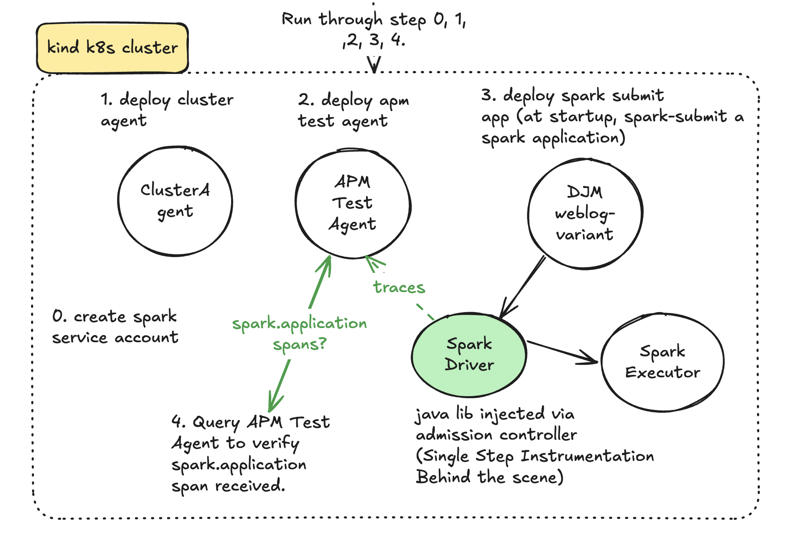
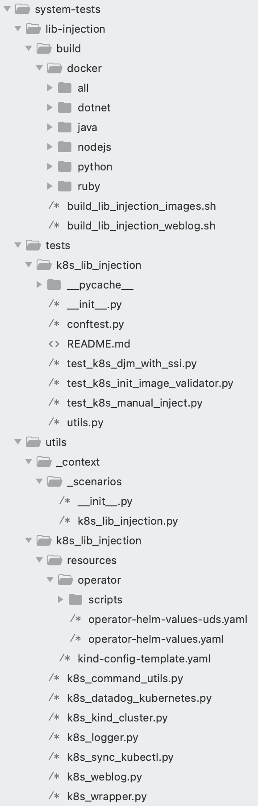
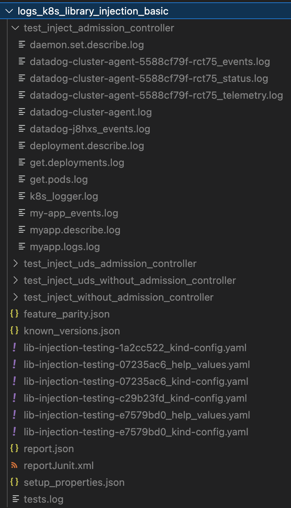

# Testing K8s library injection feature

1. [Overall](#Overall)
   * [What is the library injection feature?](#What-is-the-k8s-library-injection-feature?)
   * [What’s the Datadog Cluster Agent and why?](#What’s-the-Datadog-Cluster-Agent-and-why?)
2. [K8s tested components](#K8s-tested-components)
3. [Run the tests](#K8s-tested-components)
   * [Run K8s library image validation](#Run-K8s-library-image-validation)
   * [Run K8s library injection tests](#Run-K8s-library-injection-tests)
     - [Prerequisites](#Prerequisites)
     - [Configure tested components versions](#Configure-tested-components-versions)
     - [Execute a test scenario](#Execute-a-test-scenario)
4. [How to use a MiniKube implementation](#How-to-use-a-MiniKube-implementation)
5. [How to develop a test case](#How-to-develop-a-test-case)
   * [Folders and Files structure](#Folders-and-Files-structure)
   * [Implement a new test case](#Implement-a-new-test-case)
6. [How to debug your kubernetes environment and tests results](#How-to-debug-your-kubernetes-environment-and-tests-results)
7. [How to debug your kubernetes environment at runtime](#How-to-debug-your-kubernetes-environment-at-runtime)

## Overall

### What is the k8s library injection feature?

The lib-injection project is a feature to allow injection of the Datadog library
into a customer's application container without requiring them to modify their
application images.

This feature enables applications written in Java, Node.js, Python, .NET or Ruby running
in Kubernetes to be automatically instrumented with the corresponding Datadog
APM libraries.

Currently, there are two different ways to have the Datadog library injected
into the application container:

1) **Manually via Kubernetes annotations**:
   * Using Datadog Admission Controller: [Injecting Libraries Kubernetes](https://docs.datadoghq.com/tracing/trace_collection/admission_controller/).
   * Adding library injection specific annotations (without Datadog Admission Controller): [Application Instrumentation](https://docs.datadoghq.com/tracing/trace_collection/), [Add the Datadog Tracing Library](https://docs.datadoghq.com/tracing/trace_collection/)
2) **Automatically with Remote Config via the Datadog UI.**

### What’s the Datadog Cluster Agent and why?

The Cluster Agent is a different binary (vs the regular Agent), written in Go in the same DataDog/datadog-agent repo and is installed as a Deployment in Kubernetes, not a DaemonSet. It’s an essential component for cluster-level monitoring.

In addition to the local API (Kubelet) leveraged by the Datadog Agent on each node, Kubernetes has a centralized and powerful API called API Server.
The Datadog Cluster Agent provides a streamlined, centralized approach to collecting cluster level monitoring data from the Kubernetes API Server. The Cluster Agent also leverages the Kubernetes API Server for advanced features like the Admission Controller.

Kubernetes admission controllers are plugins that govern and enforce how the cluster is used. They can intercept API requests and may change the request object or deny the request altogether. Read more in A Guide to Kubernetes Admission Controllers and Dynamic Admission Control

The Datadog admission controller is a component of the Datadog Cluster Agent. It leverages the Kubernetes mutatingwebhookconfigurations.admissionregistration.k8s.io API.

## K8s tested components

K8s Library injection testing is part of the "system-tests" test suite.

As a final purpose we want to check the correct operation of all Datadog components involved in the auto instrumentation of the applications deployed in a kubernetes cluster.

In the auto-instrumentation proccess there are several software components involved:

- **Cluster agent:** Software component, written in Go, that resides on the DataDog/datadog-agent repository and is installed as a Deployment in Kubernetes.
- **Injector image:** Directly involved in auto-instrumentation. Resides on Datadog/auto_inject repository.
- **Library image (lib-init):** Contains the tracer library to be injected in the pods.

These test components are also involved through the testing process:

- **System-tests runner:** The core of the system-tests is the reponsible for orchestrate the tests execution and manage the tests results.
- **Dev test agent:**  The APM Test Agent container help us to perform the validations ([APM Test Agent](https://github.com/DataDog/dd-apm-test-agent)).
- **Sample app/weblog:** Containerized sample application implemented on Java, Node.js, .NET, Ruby or Python.

The following image represents, in general terms, the necessary and dependent architecture to be able to run the K8s library injection tests:


## Run the tests

### Run K8s library image validation

We have created some simple tests, able to auto inject the tracer library in any application running in a docker container.
On the test application container (weblog), the lib-init image will be added as a docker volume and the environment variables, necessary for auto injection, will be attached.
The weblog application only requires to be listening on port 18080.
The weblog will be deployed together with the APM Test Agent container, which will help us to perform the validations ([APM Test Agent](https://github.com/DataDog/dd-apm-test-agent)).

Now we can test the auto instrumentation on any image in two simple steps:

1. **Build your app image and tag locally as "weblog-injection:latest"** :

``` docker build  -t weblog-injection:latest .```

You could use the existing weblog apps under __lib-injection/build/docker__ folder. Use the existing script to build them:

```lib-injection/build/build_lib_injection_weblog.sh -w [existing weblog] -l [java,nodejs,dotnet,ruby,python] ```

ie:

```
lib-injection/build/build_lib_injection_weblog.sh -w dd-lib-dotnet-init-test-app -l dotnet
```

2. **Run the scenario that checks if weblog app is auto instrumented and sending traces to the _Dev Test Agent_**:

```
TEST_LIBRARY=dotnet
LIB_INIT_IMAGE=ghcr.io/datadog/dd-trace-dotnet/dd-lib-dotnet-init:latest_snapshot
./run.sh LIB_INJECTION_VALIDATION
```

#### Validating lib-injection images under not supported language runtime version

You can also validate weblog applications implemented with a language version that is not supported by the tracer. The scenario will check that the app is running although the app is not instrumented:

```
lib-injection/build/build_lib_injection_weblog.sh -w jdk7-app -l java
TEST_LIBRARY=java
LIB_INIT_IMAGE=ghcr.io/datadog/dd-trace-java/dd-lib-java-init:latest_snapshot
./run.sh LIB_INJECTION_VALIDATION_UNSUPPORTED_LANG
```

### Run K8s library injection tests

These tests can run locally easily. You only have to install the environment and configure it as follow sections detail.

#### Prerequisites:

- Docker environment
- Kubernetes environment

##### Docker enviroment

You should install the docker desktop on your laptop.
You need to access to GHCR.
Usually you only need to access to GHCR to pull the images, but you can also push your custom images to your Docker Hub account. To do that you need login to Docker Hub account:

```cat ~/my_password.txt | docker login --username my_personal_user --password-stdin ```

##### Kubernetes environment

You should install the kind and Helm Chart tool.
Kind is a tool for running local Kubernetes clusters using Docker container.
Helm uses a packaging format called charts. A chart is a collection of files that describe a related set of Kubernetes resources.

In order to install the kind kubernetes tool you should execute this script:

```
KIND_VERSION='v0.17.0'
KUBECTL_VERSION='v1.25.3'

# Download appropriate version (Mac M1 arm64 arch or linux amd64)
echo "[build] Download installable artifacts"
ARCH=$(uname -m | sed 's/x86_//;s/i[3-6]86/32/')
if [ "$ARCH" = "arm64" ]; then
    curl -Lo ./kind https://github.com/kubernetes-sigs/kind/releases/download/$KIND_VERSION/kind-darwin-amd64
    KUBECTL_DOWNLOAD="darwin/arm64/kubectl"
else
    curl -Lo ./kind https://kind.sigs.k8s.io/dl/$KIND_VERSION/kind-linux-amd64
    KUBECTL_DOWNLOAD="linux/amd64/kubectl"
fi
curl -LO "https://dl.k8s.io/release/${KUBECTL_VERSION}/bin/${KUBECTL_DOWNLOAD}"

echo "[build] Installing kind"
chmod +x ./kind
sudo mv ./kind /usr/local/bin/kind
echo "[build] kind install complete"

echo "[build] Installing kubectl..."
sudo install -o root -g root -m 0755 kubectl /usr/local/bin/kubectl
echo "[build] kubectl install complete"
```

You also need the Helm Chart utility:

```
echo "[build] Installing helm"
curl -fsSL -o get_helm.sh https://raw.githubusercontent.com/helm/helm/main/scripts/get-helm-3
chmod 700 get_helm.sh
./get_helm.sh
```

#### Configure tested components versions

All the software components to be tested can be configured using environment variables and using command line parameters to run the test scenarios. This is an example of env vars configuration for Java:

```sh
export TEST_LIBRARY=java
export WEBLOG_VARIANT=dd-lib-java-init-test-app #Which variant do we want to use?
export LIBRARY_INJECTION_TEST_APP_IMAGE=ghcr.io/datadog/system-tests/dd-lib-java-init-test-app:latest #weblog variant in the registry
export LIB_INIT_IMAGE=gcr.io/datadoghq/dd-lib-java-init:latest # What is the lib init image that we want to test?
export CLUSTER_AGENT_VERSION=7.56.2
export INJECTOR_IMAGE=TODO
```

---

**NOTE: Injector image**

Currently the tests do not allow selection of the injector image. The image used will be the one pointed by the cluster agent by default.

---

##### Weblog image

The images of sample applications are automatically uploaded to the GHCR registry by the CI.

But in case you want to build your own custom version of the application, you can do the following (the weblog images must be allwasys on a docker registry):

```sh
  export LIBRARY_INJECTION_TEST_APP_IMAGE=ghcr.io/datadog/system-tests/dd-lib-java-init-test-app:my_custom_tag #weblog variant in the registry
  lib-injection/build/build_lib_injection_weblog.sh -w $WEBLOG_VARIANT -l $TEST_LIBRARY --push-tag $LIBRARY_INJECTION_TEST_APP_IMAGE
```

or if you don't have the permission to push the image to GHCR, you can use your docker hub account (after loging into it):

```sh
  export LIBRARY_INJECTION_TEST_APP_IMAGE=registry.hub.docker.com/<user>/dd-lib-java-init:my_custom_tag #weblog variant in the registry
  lib-injection/build/build_lib_injection_weblog.sh -w $WEBLOG_VARIANT -l $TEST_LIBRARY --push-tag $LIBRARY_INJECTION_TEST_APP_IMAGE
```

The sample applications currently available in GHCR are:

| LANG    | WEBLOG IMAGE                                                                                 |
| ------- | -------------------------------------------------------------------------------------------- |
| Java    | ghcr.io/datadog/system-tests/dd-lib-java-init-test-app:latest                                |
| Java    | ghcr.io/datadog/system-tests/dd-djm-spark-test-app:latest                                    |
| .NET    | ghcr.io/datadog/system-tests/dd-lib-dotnet-init-test-app:latest                              |
| Node.js | ghcr.io/datadog/system-tests/sample-app:latest                                               |
| Python  | ghcr.io/datadog/system-tests/dd-lib-python-init-test-django:latest                           |
| Python  | ghcr.io/datadog/system-tests/dd-lib-python-init-test-django-gunicorn:latest                  |
| Python  | ghcr.io/datadog/system-tests/dd-lib-python-init-test-django-gunicorn-alpine:latest           |
| Python  | ghcr.io/datadog/system-tests/dd-lib-python-init-test-django-preinstalled:latest              |
| Python  | ghcr.io/datadog/system-tests/dd-lib-python-init-test-django-unsupported-package-force:latest |
| Python  | ghcr.io/datadog/system-tests/dd-lib-python-init-test-django-uvicorn:latest                   |
| Python  | ghcr.io/datadog/system-tests/dd-lib-python-init-test-protobuf-old:latest                     |
| Ruby    | ghcr.io/datadog/system-tests/dd-lib-ruby-init-test-rails:latest                              |
| Ruby    | ghcr.io/datadog/system-tests/dd-lib-ruby-init-test-rails-explicit":latest                    |
| Ruby    | ghcr.io/datadog/system-tests/dd-lib-ruby-init-test-rails-gemsrb:latest                       |

##### Library init image

The library init images are created by each tracer library and these images will be pushed to the registry using two tags:

* **latest:** The latest release of the image.
* **latest_snapshot:** The image created when we build the main branch of the tracer library.

The list of available images is:

| LANG    | LIB INIT IMAGE                                                     |
| ------- | ------------------------------------------------------------------ |
| Java    | gcr.io/datadoghq/dd-lib-java-init:latest                           |
| Java    | ghcr.io/datadog/dd-trace-java/dd-lib-java-init:latest_snapshot     |
| .NET    | gcr.io/datadoghq/dd-lib-dotnet-init:latest                         |
| .NET    | ghcr.io/datadog/dd-trace-dotnet/dd-lib-dotnet-init:latest_snapshot |
| Node.js | gcr.io/datadoghq/dd-lib-js-init:latest                             |
| Node.js | ghcr.io/datadog/dd-trace-js/dd-lib-js-init:latest_snapshot         |
| Python  | gcr.io/datadoghq/dd-lib-python-init:latest                         |
| Python  | ghcr.io/datadog/dd-trace-py/dd-lib-python-init:latest_snapshot     |
| Ruby    | gcr.io/datadoghq/dd-lib-ruby-init:latest                           |
| Ruby    | ghcr.io/datadog/dd-trace-rb/dd-lib-ruby-init:latest_snapshot       |

##### Datadog Cluster Agent

The Datadog Cluster Agent versions available for tests are:

- 7.56.2
- 7.57.0
- 7.59.0

##### Injector image

TODO

#### Execute a test scenario

If we have followed the previous steps, we already have the environment configured and we only need to run any of the available scenarios:

- **K8S_LIB_INJECTION:** Minimal test scenario that run a Kubernetes cluster and test that the application is being instrumented automatically.
- **K8S_LIB_INJECTION_UDS:** Similar to previous scenario, but the comunication between the agent and libraries is configured to use UDS.
- **K8S_LIB_INJECTION_NO_AC:** Configures the auto-injection adding annotations to the weblog pod, without using the admission controller.
- **K8S_LIB_INJECTION_NO_AC_UDS:** Similar to previous scenario, but the comunication between the agent and libraries is configured to use UDS.
- **K8S_LIB_INJECTION_PROFILING_DISABLED:** Scenario that validates the profiling is not performing if it's not activated.
- **K8S_LIB_INJECTION_PROFILING_ENABLED:** Test profiling feature activation inside of Kubernetes cluster.
- **K8S_LIB_INJECTION_PROFILING_OVERRIDE:** Test profiling feature activation overriding the cluster configuration.
- **K8S_LIB_INJECTION_DJM:** Allow us to verify the k8s injection works for Data Jobs Monitoring as new Java tracer, new auto_inject, and new cluster_agent are being released

Run the minimal test scenario:

```sh
./run.sh K8S_LIB_INJECTION --k8s-library $TEST_LIBRARY --k8s-weblog $WEBLOG_VARIANT --k8s-weblog-img $LIBRARY_INJECTION_TEST_APP_IMAGE --k8s-lib-init-img $LIB_INIT_IMAGE  --k8s-cluster-version $CLUSTER_AGENT_VERSION
```

The allowed pameters are:

* **k8s-library:** Libray to be tested.
* **k8s-weblog:** The sample application.
* **k8s-weblog-img:** The image of the sample application.
* **k8s-lib-init-img:** Libray init image to be tested.
* **k8s-cluster-version:** Datadog cluster version to be tested.
* **k8s-provider:** K8s cluster provider. This parameter is optional. By default uses the kind k8s cluster.

##### DJM Scenario

The following image ilustrates the DJM scenario:



## How to use a MiniKube implementation

The K8s lib injection tests use the Kind cluster by default, but you can change this behaviour in order to use a MiniKube implementation. To do that you only need:

* Install Minikube locally: [Install MiniKube](https://minikube.sigs.k8s.io/docs/start/?arch=%2Fmacos%2Farm64%2Fstable%2Fbinary+download)
* Run the scenario adding the parameter "*--k8s-provider minikube*"

```sh
./run.sh K8S_LIB_INJECTION --k8s-library nodejs --k8s-weblog sample-app --k8s-weblog-img ghcr.io/datadog/system-tests/sample-app:latest --k8s-lib-init-img gcr.io/datadoghq/dd-lib-js-init:latest  --k8s-cluster-version 7.57.0 --k8s-provider minikube
```

## How to develop a test case

To develop a new test case in the K8s Library injection tests, you need to know about the project folder structure.

### Folders and Files structure

The following picture shows the main directories for the k8s lib injection tests:



The folders and files shown in the figure above are as follows:

* **lib-injection/build/docker:** This folder contains the sample applications with the source code and scripts that allow us to build and push docker weblog images.
* **tests/k8s_lib_injection:** All tests cases are stored on this folder. Conftests.py file manages the kubernetes cluster lifecycle.
* **utils/_context/scenarios:**: In this folder you can find the K8s Lib injection scenario definition.
* **utils/k8s_lib_injection:** Here we can find the main utilities for the control and deployment of the components to be tested. For example:
  * **k8s_cluster_provider.py:** Implementation of the k8s cluster management. By default the provider is Kind, but you can use the MiniKube implementation or AWS EKS remote implementation.
  * **k8s_datadog_kubernetes.py:** Utils for:
    - Deploy Datadog Cluster Agent
    - Deploy Datadog Admission Controller
    - Extract Datadog Components debug information.
  * **k8s_weblog.py:**  Manages the weblog application lifecycle.
    - Deploy weblog as pod configured to perform library injection manually/without the Datadog admission controller.
    - Deploy weblog as pod configured to automatically perform the library injection using the Datadog admission controler.
    - Extract weblog debug information.
  * **k8s_command_utils.py:** Command line utils to lauch the Helm Chart commands and others shell commands.

### Implement a new test case

All test cases associated to a scenario, will run on an isolated Kubernetes environment. The Kubernetes cluster will start up when the scenario is started (for local managed k8s providers).

All test cases can access to the K8s cluster infomation, using the "k8s_cluster_info" object stored in the scenario context. You can use this object to know about the open ports in the cluster (test agent port and weblog port) or to access to the Kubernetes Python API to interact with the cluster.
An example of a Kubernetes test:

```python

from tests.k8s_lib_injection.utils import get_dev_agent_traces, get_cluster_info

@features.k8s_admission_controller
@scenarios.k8s_lib_injection
class TestExample:
    def test_example(self):
        logger.info(
            f"Test config: Weblog - [{get_cluster_info().get_weblog_port()}] Agent - [{get_cluster_info().get_agent_port()}]"
        )
        #This test will be executed after the k8s starts and after deploy all the tested components on the cluster

        #Check that app was auto instrumented
        traces_json = get_dev_agent_traces(get_cluster_info())
        assert len(traces_json) > 0, "No traces found"
```

## How to debug your kubernetes environment and tests results

In the testing kubernetes scenarios, multiple components are involved and sometimes can be painfull to debug a failure.
You can find a folder named "logs_[scenario name]" with all the logs associated with the execution
In the following image you can see the log folder content:



These are the main important log/data files:

* **test.log:** General log generated by system-tests.
* **report.json:** Pytest results report.
* **feature_parity.json:** Report to push the results to Feature Parity Dashboard.
* **lib-injection-testing-xyz-config.yaml:** The kind cluster configuration. In this file you can check the open ports for each cluster and test case.
* **lib-injection-testing-xyz_help_values:** Helm chart operator values for each test case.
* **daemon.set.describe.log:** Datadog Cluster daemon set logs.
* **datadog-XYZ_events.log:** Kubernetes events for Datadog Agent.
* **datadog-cluster-agent-XYZ_status.log:** Datadog Cluster Agent current status.
* **datadog-cluster-agent-XYZ_telemetry.log:** Telemetry for Datadog Cluster Agent.
* **datadog-cluster-agent.log:** Logs generated by Datadog Cluster Agent.
* **datadog-cluster-agent-XYZ_event.log:** Kubernetes events for Datadog Cluster Agent.
* **deployment.describe.log:** Describe all deployment in the Kubernetes cluster.
* **deployment.logs.log:** All deployments logs.
* **get.deployments.log:** Deployments list.
* **get.pods.log:** Current started pod list.
* **myapp.describe.log:** Describe weblog pod.
* **myapp.logs.log:** Current weblog pod logs. It could be empty if we are deploying the weblog as Kubernetes deployment.
* **test-LANG-deployment-XYZ_events.log:** Current weblog deployment events. Here you can see the events generated by auto instrumention process. It could be empty if we are deploying the weblog application as Pod.

## How to debug your kubernetes environment at runtime

You can use the *--sleep* parameter in the run command line of the scenario to keep the K8s cluster alive with all the tested components deployed.

[Check the sleep parameter documentation](https://github.com/DataDog/system-tests/blob/main/docs/execute/run.md#spawn-components-but-do-nothing)
