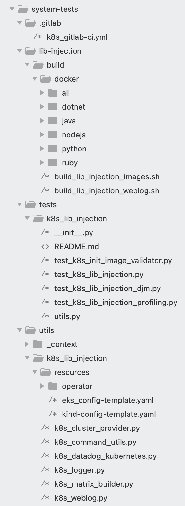

# lib-injection feature

## What is the lib-injection feature?

The lib-injection project is a feature to allow injection of the Datadog library
into a customer's application container without requiring them to modify their
application images.

This feature enables applications written in Java, Node, Python, DotNet or Ruby running
in Kubernetes to be automatically instrumented with the corresponding Datadog
APM libraries.

Currently, there are two different ways to have the Datadog library injected
into the application container:

1) Manually via Kubernetes annotations: 
  * Using Datadog Admission Controller: [Injecting Libraries Kubernetes](https://docs.datadoghq.com/tracing/trace_collection/admission_controller/).
  * Adding library injection specific annotations (without Datadog Admission Controller): [Application Instrumentation](https://docs.datadoghq.com/tracing/trace_collection/), [Add the Datadog Tracing Library](https://docs.datadoghq.com/tracing/trace_collection/)
2) Automatically with Remote Config via the Datadog UI. 

`Remote config is tricky to test in a isolated environment. K8s Lib Injection tests use Kubernetes ConfigMap to emulate the configuration applied through Datadog Remote Config utility. Kubernetes ConfigMaps allows the injection of configuration into an application. ConfigMap can be injected as environment variables or mounted files.`

[Read more about the Kubernetes ConfigMaps](https://kubernetes.io/docs/concepts/configuration/configmap/)


## What’s the Datadog Cluster Agent and why?

The Cluster Agent is a different binary (vs the regular Agent), written in Go in the same DataDog/datadog-agent repo and is installed as a Deployment in Kubernetes, not a DaemonSet. It’s an essential component for cluster-level monitoring.

In addition to the local API (Kubelet) leveraged by the Datadog Agent on each node, Kubernetes has a centralized and powerful API called API Server.
The Datadog Cluster Agent provides a streamlined, centralized approach to collecting cluster level monitoring data from the Kubernetes API Server. The Cluster Agent also leverages the Kubernetes API Server for advanced features like the Admission Controller.

Kubernetes admission controllers are plugins that govern and enforce how the cluster is used. They can intercept API requests and may change the request object or deny the request altogether. Read more in A Guide to Kubernetes Admission Controllers and Dynamic Admission Control

The Datadog admission controller is a component of the Datadog Cluster Agent. It leverages the Kubernetes mutatingwebhookconfigurations.admissionregistration.k8s.io API.

# K8s lib-injection feature testing

Lib injection testing is part of the "system-tests" test suite. 

To test lib-injection/autoinstrumentation feature, we run a Kubernetes cluster with the Datadog Cluster Agent and we check that the instrumentation runs smoothly using different sample applications (weblog) in different languages (currently Java, Python, Node, DotNet and Ruby).

The following image represents, in general terms, the necessary and dependent architecture to be able to run lib-injection tests:


##  Kubernetes management to automate deployments

In order to build a simple and automated integration test suite, the "K8s Lib Injection" tests are based on Kubernetes Python Client.
[Read more about Kubernetes Python Client](https://github.com/kubernetes-client/python)

## Folders and Files structure

The following picture shows the main directories for the k8s lib injection tests:



* **lib-injection/build/docker:** This folder contains the sample applications with the source code and scripts that allow us to build and push docker weblog images.
* **tests/k8s_lib_injection:** All tests cases are stored on this folder. Conftests.py file manages the kubernetes cluster lifecycle.
* **utils/k8s_lib_injection:** Here we can find the main utilities for the control and deployment of the components to be tested. For example:
  * **k8s_kind_cluster.py:** Tools for creating and destroying the Kubernetes cluster.
  * **k8s_datadog_cluster_agent.py:** Utils for:
    - Deploy Datadog Cluster Agent
    - Deploy Datadog Admission Controller
    - Apply Kubernetes ConfigMap
    - Extract Datadog Components debug information.
  * **k8s_weblog.py:**  Manages the weblog application lifecycle. 
    - Deploy weblog as pod configured to perform library injection manually/without the Datadog admission controller.
    - Deploy weblog as pod configured to automatically perform the library injection using the Datadog admission controler.
    - Deploy weblog as Kubernetes deployment and prepare the library injection using Kubernetes ConfigMaps and Datadog Admission Controller. 
    - Extract weblog debug information.
  * **k8s_command_utils.py:** Command line utils to lauch the Helm Chart commands and others shell commands.

# Run the K8s Lib Injection tests in your Local

These tests can run locally easily. You only have to install the environment and configure it as follow sections detail.

## Prerequisites:
- Docker environment
- Kubernetes environment
- Configure the tests (Configure the container images references)

### Docker enviroment

You should install the docker desktop on your computer and **be loged into a personal Docker Hub account**

```cat ~/my_password.txt | docker login --username my_personal_user --password-stdin ```

### Kubernetes environment

You should install the kind and Helm Chart tool.
Kind is a tool for running local Kubernetes clusters using Docker container.
Helm uses a packaging format called charts. A chart is a collection of files that describe a related set of Kubernetes resources. 

In order to install the kind kubernetes tool you should execute this script:

``` 
KIND_VERSION='v0.17.0'
KUBECTL_VERSION='v1.25.3'

# Download appropriate version (Mac M1 arm64 arch or linux amd64)
echo "[build] Download installable artifacts"
ARCH=$(uname -m | sed 's/x86_//;s/i[3-6]86/32/')
if [ "$ARCH" = "arm64" ]; then
    curl -Lo ./kind https://github.com/kubernetes-sigs/kind/releases/download/$KIND_VERSION/kind-darwin-amd64
    KUBECTL_DOWNLOAD="darwin/arm64/kubectl"
else
    curl -Lo ./kind https://kind.sigs.k8s.io/dl/$KIND_VERSION/kind-linux-amd64
    KUBECTL_DOWNLOAD="linux/amd64/kubectl"
fi
curl -LO "https://dl.k8s.io/release/${KUBECTL_VERSION}/bin/${KUBECTL_DOWNLOAD}"

echo "[build] Installing kind"
chmod +x ./kind
sudo mv ./kind /usr/local/bin/kind
echo "[build] kind install complete"

echo "[build] Installing kubectl..."
sudo install -o root -g root -m 0755 kubectl /usr/local/bin/kubectl
echo "[build] kubectl install complete"
```

You also need the Helm Chart utility:

```
echo "[build] Installing helm"
curl -fsSL -o get_helm.sh https://raw.githubusercontent.com/helm/helm/main/scripts/get-helm-3
chmod 700 get_helm.sh
./get_helm.sh
```

### Environment variables

The next step is define the environment variables. This is an example of env vars configuration for Java:

```sh
export TEST_LIBRARY=java
export WEBLOG_VARIANT=dd-lib-java-init-test-app #Which variant do we want to use?
export DOCKER_REGISTRY_IMAGES_PATH=docker.io/MY_DOCKERHUB_USERNAME #Use your docker hub account as registry
export BUILDX_PLATFORMS=linux/arm64 #Set your CPU arch. In this sample, we are using a Mac M1
export DOCKER_IMAGE_TAG=local #Tag for dd-lib-java-init. Use tag 'latest' to test latest release
export DOCKER_IMAGE_WEBLOG_TAG=local #Tag for current weblog image
```

## Build and Push weblog image

You need to build and push weblog application to docker registry. You can use this script:

```sh
  cd lib-injection/build/docker/$TEST_LIBRARY/$WEBLOG_VARIANT 
  export APP_DOCKER_IMAGE_REPO=$DOCKER_REGISTRY_IMAGES_PATH/$WEBLOG_VARIANT
  LIBRARY_INJECTION_TEST_APP_IMAGE="$APP_DOCKER_IMAGE_REPO:$DOCKER_IMAGE_WEBLOG_TAG" ./build.sh
```
## Build and Push init image

If you want to test the latest dd-lib-<lang>-init image, you can skip this step.
If you want to test your own dd-lib-<lang>-init image, you can build by yourself from source code or you can use a existing one:

```sh
docker pull ghcr.io/datadog/dd-trace-java/dd-lib-java-init:latest_snapshot
docker tag ghcr.io/datadog/dd-trace-java/dd-lib-java-init:latest_snapshot ${DOCKER_REGISTRY_IMAGES_PATH}/dd-lib-java-init:local
docker push ${DOCKER_REGISTRY_IMAGES_PATH}/dd-lib-java-init:local
```

## Run the tests

These K8s Lib Injection tests are fully integrated into system-tests life cycle. If we followed the previous steps, we only have to execute this command:

```sh
  ./run.sh K8S_LIB_INJECTION
```

# Run the K8s Lib Injection tests in your CI

If you are going to run the K8s lib injection tests on your CI pipeline, check this example:

```yml
  jobs:
  k8s-lib-injection-tests:
    runs-on: ubuntu-latest
    permissions:
      contents: read
      packages: write
    strategy:
      matrix:
        variant:
        - library: java
          weblog-variant: dd-lib-java-init-test-app

        - library: nodejs
          weblog-variant: sample-app

        - library: python
          weblog-variant: dd-lib-python-init-test-django
        
        - library: ruby
          weblog-variant: dd-lib-ruby-init-test-rails
          
        - library: ruby
          weblog-variant: dd-lib-ruby-init-test-rails-explicit
        
        - library: ruby
          weblog-variant: dd-lib-ruby-init-test-rails-gemsrb

        - library: dotnet
          weblog-variant: dd-lib-dotnet-init-test-app

        version: 
          - latest #Production tag
          - latest_snapshot

      fail-fast: false
    env:
      TEST_LIBRARY: ${{ matrix.variant.library }}
      WEBLOG_VARIANT: ${{ matrix.variant.weblog-variant }}
      DOCKER_REGISTRY_IMAGES_PATH: ghcr.io/datadog
      DOCKER_IMAGE_TAG: ${{ matrix.version }}
      BUILDX_PLATFORMS: linux/amd64

    steps:
      - name: Checkout
        uses: actions/checkout@v4
        with:
          repository: 'DataDog/system-tests'

      - name: Set up QEMU
        uses: docker/setup-qemu-action@v2
    
      - name: Set up Docker Buildx
        id: buildx
        uses: docker/setup-buildx-action@v2
        with:
          install: true
          config-inline: |
            [worker.oci]
              max-parallelism = 1

      - name: Log in to the Container registry
        uses: docker/login-action@343f7c4344506bcbf9b4de18042ae17996df046d # 3.0.0
        with:
          registry: ghcr.io/datadog
          username: ${{ github.actor }}
          password: ${{ secrets.GITHUB_TOKEN }}

      - name: Build weblog latest base images
        env:
          DOCKER_IMAGE_WEBLOG_TAG: latest
          APP_DOCKER_IMAGE_REPO: ghcr.io/datadog/system-tests/${{ matrix.variant.weblog-variant }}
        run: |
          cd lib-injection/build/docker/$TEST_LIBRARY/$WEBLOG_VARIANT 
          LIBRARY_INJECTION_TEST_APP_IMAGE=$APP_DOCKER_IMAGE_REPO:latest ./build.sh
          cd ..

      - name: Install runner
        uses: ./.github/actions/install_runner       

      - name: Kubernetes lib-injection tests
        id: k8s-lib-injection-tests
        run: ./run.sh K8S_LIB_INJECTION 

      - name: Compress logs
        id: compress_logs
        if: always()
        run: tar -czvf artifact.tar.gz $(ls | grep logs)

      - name: Upload artifact
        if: always() && steps.compress_logs.outcome == 'success'
        uses: actions/upload-artifact@v4
        with:
          name: logs_k8s_lib_injection_${{ matrix.variant.library}}_${{matrix.variant.weblog-variant}}_${{ matrix.version }}
          path: artifact.tar.gz
```

# Test development

All test cases for K8S_LIB_INJECTION will run on an isolated Kubernetes environment. For each test case we are going to start up a Kubernetes Cluster. In this way we can run the tests in parallel.
Each test case will receive a "test_k8s_instance" object with these main properties laoded:
* **library:** Current testing library (java, python...)
* **weblog_variant:** Current sample application name (weblog name)
* **weblog_variant_image:** Reference to the weblog image in the registry
* **library_init_image:** Reference to the library init image in the registry
* **library_init_image_tag:** Library init image tag to be used
* **prefix_library_init_image:** Tricky part. If we inject the library using configmap and cluster agent, we need to use the prefix_library_init_image only for snapshot images. The agent builds image names like “gcr.io/datadoghq/dd-lib-python-init:latest_snapshot” but we need gcr.io/datadoghq/dd-trace-py/dd-lib-python-init:latest_snapshot. We use this prefix with the env prop "DD_ADMISSION_CONTROLLER_AUTO_INSTRUMENTATION_CONTAINER_REGISTRY"
* **output_folder:** Path to log folder for the current test.
* **test_name:** Name of the current test.
* **test_agent:** = Instance of the object that contains the main methods to access to Datadog Cluster Agent (Deploy agent, deploy operator, apply configmaps...). See utils/k8s_lib_injection/k8s_datadog_cluster_agent.py.
* **test_weblog:** = Instance of the object that contains the main methods to access to weblog variant funtionalities (Deploy pod, deployments...). See utils/k8s_lib_injection/k8s_weblog.py.
* **k8s_kind_cluster:** Contains the information of the Kubernetes cluster associated to the test.
  - cluster_name: Random name associated to the cluster.
  - context_name: Kind cluster name
  - agent_port: Agent port
  - weblog_port: Weblog port

The "test_k8s_instance" also contains some basic methods, that you can use directly instead of working with either "k8s_datadog_cluster_agent" or "k8s_weblog":
* start_instance
* destroy_instance
* deploy_test_agent
* deploy_weblog_as_pod
* deploy_weblog_as_deployment
* apply_config_auto_inject
* export_debug_info

Feel free to use the methods listed above or use the methods encapsulated in both "k8s_datadog_cluster_agent" and "k8s_weblog" or directly use the Kubernates Python Client to manipulate the Kunernates cluster components.

An example of a Kubernetes test that uses all the APIs:

```python
@features.k8s_admission_controller
@scenarios.k8s_lib_injection
class TestExample:
    def test_example(self, test_k8s_instance):
        #Deploy test agent
        test_agent = test_k8s_instance.deploy_test_agent()
        #Deploy admission controller
        test_agent.deploy_operator_manual()
        #Deploy weblog
        test_k8s_instance.deploy_weblog_as_pod()
        #Check that app was auto instrumented
        response = requests.get(f"http://localhost:{test_k8s_instance.k8s_kind_cluster.agent_port}/test/traces")
        traces_json = response.json()
        assert len(traces_json) > 0, "No traces found"
        #Use Kubernetes python client to check how many pods have been created
        v1 = client.CoreV1Api(api_client=config.new_client_from_config(context=self.k8s_kind_cluster.context_name))
        ret = v1.list_namespaced_pod(namespace="default", watch=False)
        assert len(ret.items) > 2, "Incorrect number of pods"
```

# How to debug your kubernetes environment and tests results

dfafsadf


You need to build and push weblog application to docker registry. You can use this script:

You can also run the tests locally, but in this case we will create the docker init image using the corresponding tracer library.

The first step is to login in docker hub, either with Docker Desktop app or with CLI (you may need to generate an access token [here](https://hub.docker.com/settings/security)):
``` docker login --username MY_DOCKERHUB_USERNAME ```

The second step is define the environment variables. This is an example of env vars configuration for Java:

```sh
export TEST_LIBRARY=java
export WEBLOG_VARIANT=dd-lib-java-init-test-app #Which variant do we want to use?
export DOCKER_REGISTRY_IMAGES_PATH=docker.io/MY_DOCKERHUB_USERNAME #Use your docker hub account as registry
export BUILDX_PLATFORMS=linux/arm64 #Set your CPU arch. In this sample, we are using a Mac M1
export DOCKER_IMAGE_TAG=local #Tag for dd-lib-java-init 
```

The next is to download or compile the tracer libray that you want to test. You have to locate binary libary in the system-tests/binaries folder.
When we have the environment ready, we have to execute this logic:

* Build and push the init image

  To use an existing image, you need to push it to your dockerhub account, for example:
```sh
docker pull ghcr.io/datadog/dd-trace-js/dd-lib-js-init:latest_snapshot
docker tag ghcr.io/datadog/dd-trace-js/dd-lib-js-init:latest_snapshot ${DOCKER_REGISTRY_IMAGES_PATH}/dd-lib-js-init:local
docker push ${DOCKER_REGISTRY_IMAGES_PATH}/dd-lib-js-init:local
```

* Build and push the app image
* Create the Kubernetes cluster

```sh
./lib-injection/execFunction.sh build-and-push-init-image
./lib-injection/execFunction.sh build-and-push-test-app-image
./lib-injection/build.sh
```

* Execute the manual tests

  * Make sure that init and app images are public on your dockerhub account.
  * Comment name, tag and repository in `clusterAgent.image` section of `operator-helm-values*.yaml`

```sh
./lib-injection/run-manual-lib-injection.sh
```

* Execute the auto tests

```sh
TEST_CASE=<TestCaseN>  # define the test case
./lib-injection/run-auto-lib-injection.sh
```


## lib-injections tests functions

`functions.sh` contains the "logic" of these tests. 
We can find some environment variables that we need to define previously:

* **TEST_LIBRARY:** Language that we want to test. Possible values: java, python, nodejs
* **WEBLOG_VARIANT:** Sample application that we want to use. We could have more that one application for each language. The sample applications are stored in build/docker folder.
* **DOCKER_REGISTRY_IMAGES_PATH:** Docker Registry with which we are going to operate. In GitHub CI environment we are going to work with GHCR, but if we run tests in local laptop probably we will use Docker Hub registry. 
* **DOCKER_IMAGE_TAG:** Tag for init image we want to tests.
* **DOCKER_IMAGE_WEBLOG_TAG:** Tag for weblog image we want to test.
* **BUILDX_PLATFORMS:** Architectures/Platforms for which we will generate the docker images for the example applications
* **LIBRARY_INJECTION_CONNECTION:** Test with or without UDS.
* **LIBRARY_INJECTION_ADMISSION_CONTROLLER:** Test autoinstrumentation with or without admission controller.

`functions.sh` contains some remarkable functions:

* **ensure-cluster:** It creates a Kubernetes cluster using configuration file: test/resources/kind-config.yaml.
* **deploy-operator:** Deploys Datadog operator in the case that we are using Admission Controller. It uses common/operator-helm-values.yaml or common/operator-helm-values-uds.yaml to configure Admission Controller.
* **deploy-test-agent:** Deploys Datadog Agent in Kubernetes cluster, using configuration file: test/resources/dd-apm-test-agent-config.yaml.
* **deploy-app:** Deploys sample application/weblog in Kubernetes cluster, using template file: lib-injection/build/docker/$TEST_LIBRARY/values-override.yaml.
* **print-debug-info:** prints and log debug information for kubernertes cluster and library injection tests

## How to run the lib-injection tests in CI

To run lib-injection tests in your CI you need:

- Configure environment variables
- Use "runner" shared action

```
  test:
    needs:
      - build-and-publish-init-image
    runs-on: ubuntu-latest
    permissions:
      contents: read
      packages: write
    strategy:
      matrix:
        lib-injection-connection: ['network','uds']
        lib-injection-use-admission-controller: ['', 'use-admission-controller']
        weblog-variant: ['dd-lib-python-init-test-django','dd-lib-python-init-test-django-gunicorn','dd-lib-python-init-test-django-uvicorn']
      fail-fast: false
    env:
      TEST_LIBRARY: python
      WEBLOG_VARIANT: ${{ matrix.weblog-variant }}
      LIBRARY_INJECTION_CONNECTION: ${{ matrix.lib-injection-connection }}
      LIBRARY_INJECTION_ADMISSION_CONTROLLER: ${{ matrix.lib-injection-use-admission-controller }}
      DOCKER_REGISTRY_IMAGES_PATH: ghcr.io/datadog
      DOCKER_IMAGE_TAG: ${{ github.sha }}
    steps:    
      - name: lib-injection test runner
        id: lib-injection-test-runner
        uses: DataDog/system-tests/lib-injection/runner@main
        with:
          docker-registry: ghcr.io
          docker-registry-username: ${{ github.repository_owner }}
          docker-registry-password: ${{ secrets.GITHUB_TOKEN }}
```

## How to run the manual lib-injection tests in Local

You can also run the tests locally, but in this case we will create the docker init image using the corresponding tracer library.

The first step is to login in docker hub, either with Docker Desktop app or with CLI (you may need to generate an access token [here](https://hub.docker.com/settings/security)):
``` docker login --username MY_DOCKERHUB_USERNAME ```

The second step is define the environment variables:

```sh
export TEST_LIBRARY=java
export WEBLOG_VARIANT=dd-lib-java-init-test-app
export DOCKER_REGISTRY_IMAGES_PATH=docker.io/MY_DOCKERHUB_USERNAME
export LIBRARY_INJECTION_CONNECTION=‘network’
export LIBRARY_INJECTION_ADMISSION_CONTROLLER='use-admission-controller'
export BUILDX_PLATFORMS=linux/arm64
```

The next is to download or compile the tracer libray that you want to test. You have to locate binary libary in the system-tests/binaries folder.
When we have the environment ready, we have to execute this logic:

* Build and push the init image

  To use an existing image, you need to push it to your dockerhub account, for example:
```sh
docker pull ghcr.io/datadog/dd-trace-js/dd-lib-js-init:latest_snapshot
docker tag ghcr.io/datadog/dd-trace-js/dd-lib-js-init:latest_snapshot ${DOCKER_REGISTRY_IMAGES_PATH}/dd-lib-js-init:local
docker push ${DOCKER_REGISTRY_IMAGES_PATH}/dd-lib-js-init:local
```

* Build and push the app image
* Create the Kubernetes cluster

```sh
./lib-injection/execFunction.sh build-and-push-init-image
./lib-injection/execFunction.sh build-and-push-test-app-image
./lib-injection/build.sh
```

* Execute the manual tests

  * Make sure that init and app images are public on your dockerhub account.
  * Comment name, tag and repository in `clusterAgent.image` section of `operator-helm-values*.yaml`

```sh
./lib-injection/run-manual-lib-injection.sh
```

* Execute the auto tests

```sh
TEST_CASE=<TestCaseN>  # define the test case
./lib-injection/run-auto-lib-injection.sh
```

## How to debug your kubernetes environment

After running the tests you can always run the following command to export all the information from the kubernetes cluster to the logs folder:

```sh
./lib-injection/execFunction.sh $LIBRARY_INJECTION_ADMISSION_CONTROLLER print-debug-info
```

## How to create init images in your tracer repository

The construction of the images init docker the lib-injection is not the responsibility of the system-test, although for the tests to be launched, we will need the docker images to be correctly tagged in a docker registry, that is why the system-tests offer a shared github action that can be used in the tracer repositories to extract the tags with which the images will be generated.

```
    - name: lib-injection-tags
      id: lib-injection-tags
      uses: DataDog/system-tests/lib-injection/docker-tags@robertomonteromiguel/lib_injection_integration_v2
      with:
        init-image-name: 'dd-lib-python-init'
        main-branch-name: 'robertomonteromiguel-lib_injection_system_tests_integration'
    ...
    - name: Docker Build
      ...    
      with:
        ...
        tags: ${{ steps.lib-injection-tags.outputs.tag-names }}
...
```

In the generation of the labels for the docker init images there are three cases:


> **_NOTE:_**  When we run the lib-injection tests from the system-tests repository we will test the latest release and the latest snapshot of each tracer repository, i.e. we will use the tags latest and latest-snapshot. When we run the lib-injection tests from the repository of a tracer repository, for example dd-trace-java, we will only launch the lib-injection tests for the current build, we will use the github-sha as the init image tag.

Although, as we have mentioned above, it is not the responsibility of the system-tests to generate the init images of the tracer, but we encourage the different teams to use the Github actions plugins for the generation of these images. For example:

```
jobs:

  build-and-publish-init-image:
    runs-on: ubuntu-latest
    steps:
    
    - name: Checkout repository
      uses: actions/checkout@5a4ac9002d0be2fb38bd78e4b4dbde5606d7042f # 2.3.4

    - name: Set up QEMU
      uses: docker/setup-qemu-action@8b122486cedac8393e77aa9734c3528886e4a1a8 # 2.0.0

    - name: Set up Docker Buildx
      id: buildx
      uses: docker/setup-buildx-action@dc7b9719a96d48369863986a06765841d7ea23f6 # 2.0.0

    - name: Set up Docker platforms
      id: buildx-platforms
      run:  |
        BUILDX_PLATFORMS=`docker buildx imagetools inspect --raw busybox:latest | jq -r 'reduce (.manifests[] | [ .platform.os, .platform.architecture, .platform.variant ] | join("/") | sub("\\/$"; "")) as $item (""; . + "," + $item)' | sed 's/,//'`
        echo "$BUILDX_PLATFORMS"
        echo "platforms=$BUILDX_PLATFORMS" >> $GITHUB_OUTPUT

    - name: lib-injection-tags
      id: lib-injection-tags
      uses: DataDog/system-tests/lib-injection/docker-tags@main
      with:
        init-image-name: 'dd-lib-java-init'
        main-branch-name: 'robertomonteromiguel-lib_injection_system_tests_integration'

    - name: Build dd-java-agent.jar
      run:  ./lib-injection/build_java_agent.sh

    - name: Login to Docker
      run: docker login -u publisher -p ${{ secrets.GITHUB_TOKEN }} ghcr.io

    - name: Docker Build
      uses: docker/build-push-action@c56af957549030174b10d6867f20e78cfd7debc5 # 3.2.0
      with:
        push: true
        tags: ${{ steps.lib-injection-tags.outputs.tag-names }}
        platforms: ${{ steps.buildx-platforms.outputs.platforms }}
        context: ./lib-injection
```
