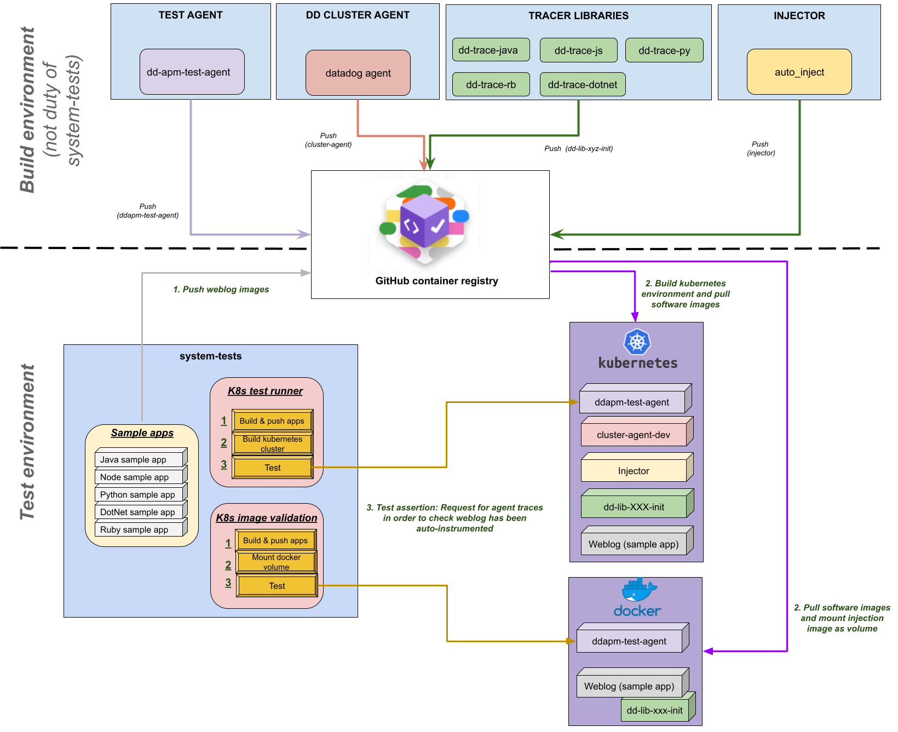

# lib-injection feature

## What is the lib-injection feature?

The lib-injection project is a feature to allow injection of the Datadog library
into a customer's application container without requiring them to modify their
application images.

This feature enables applications written in Java, Node, Python, DotNet or Ruby running
in Kubernetes to be automatically instrumented with the corresponding Datadog
APM libraries.

Currently, there are two different ways to have the Datadog library injected
into the application container:

1. Manually via Kubernetes annotations:

- Using Datadog Admission Controller: [Injecting Libraries Kubernetes](https://docs.datadoghq.com/tracing/trace_collection/admission_controller/).
- Adding library injection specific annotations (without Datadog Admission Controller): [Application Instrumentation](https://docs.datadoghq.com/tracing/trace_collection/), [Add the Datadog Tracing Library](https://docs.datadoghq.com/tracing/trace_collection/)

2. Automatically with Remote Config via the Datadog UI.

`Remote config is tricky to test in a isolated environment. K8s Lib Injection tests use Kubernetes ConfigMap to emulate the configuration applied through Datadog Remote Config utility. Kubernetes ConfigMaps allows the injection of configuration into an application. ConfigMap can be injected as environment variables or mounted files.`

[Read more about the Kubernetes ConfigMaps](https://kubernetes.io/docs/concepts/configuration/configmap/)

## What’s the Datadog Cluster Agent and why?

The Cluster Agent is a different binary (vs the regular Agent), written in Go in the same DataDog/datadog-agent repo and is installed as a Deployment in Kubernetes, not a DaemonSet. It’s an essential component for cluster-level monitoring.

In addition to the local API (Kubelet) leveraged by the Datadog Agent on each node, Kubernetes has a centralized and powerful API called API Server.
The Datadog Cluster Agent provides a streamlined, centralized approach to collecting cluster level monitoring data from the Kubernetes API Server. The Cluster Agent also leverages the Kubernetes API Server for advanced features like the Admission Controller.

Kubernetes admission controllers are plugins that govern and enforce how the cluster is used. They can intercept API requests and may change the request object or deny the request altogether. Read more in A Guide to Kubernetes Admission Controllers and Dynamic Admission Control

The Datadog admission controller is a component of the Datadog Cluster Agent. It leverages the Kubernetes mutatingwebhookconfigurations.admissionregistration.k8s.io API.

# Validating lib-injection images

We have created some simple tests, able to auto inject the tracer library in any application running in a docker container.
On the test application container (weblog) the lib-init image will be attached as a docker volume and the environment variables, necessary for auto injection, will be attached.
The only requirement of the weblog application is that it is listening on port 18080.
The weblog will be deployed next to the APM Test Agent container, which will help us to perform the validations ([APM Test Agent](https://github.com/DataDog/dd-apm-test-agent)).

Now we can test the auto instrumentation on any image in two simple steps:

1. Build your app image and tag locally as "weblog-injection:latest". :
   ` docker build  -t weblog-injection:latest .`
   b. You could use the existing weblog apps under _lib-injection/build/docker_ folder. Use the existing script to build them:
   `lib-injection/build/build_lib_injection_weblog.sh -w [existing weblog] -l [java,nodejs,dotnet,ruby,python] `

1. Run the scenario that checks if weblog app is auto instrumented and sending traces to the _Dev Test Agent_:

```
TEST_LIBRARY=dotnet
LIB_INIT_IMAGE=ghcr.io/datadog/dd-trace-dotnet/dd-lib-dotnet-init:latest_snapshot
./run.sh LIB_INJECTION_VALIDATION
```

You can also validate weblog applications that the language version is not supported by the tracer. The scenario will check that the app is running although the app is not instrumented:

```
lib-injection/build/build_lib_injection_weblog.sh -w jdk7-app -l java
TEST_LIBRARY=java
LIB_INIT_IMAGE=ghcr.io/datadog/dd-trace-java/dd-lib-java-init:latest_snapshot
./run.sh LIB_INJECTION_VALIDATION_UNSUPPORTED_LANG
```

# K8s lib-injection feature testing

Lib injection testing is part of the "system-tests" test suite.

To test lib-injection/autoinstrumentation feature, we run a Kubernetes cluster with the Datadog Cluster Agent and we check that the instrumentation runs smoothly using different sample applications (weblog) in different languages (currently Java, Python, Node, DotNet and Ruby).

The following image represents, in general terms, the necessary and dependent architecture to be able to run lib-injection tests:



## Kubernetes management to automate deployments

In order to build a simple and automated integration test suite, the "K8s Lib Injection" tests are based on Kubernetes Python Client.
[Read more about Kubernetes Python Client](https://github.com/kubernetes-client/python)

## Folders and Files structure

The following picture shows the main directories for the k8s lib injection tests:


- **lib-injection/build/docker:** This folder contains the sample applications with the source code and scripts that allow us to build and push docker weblog images.
- **tests/k8s_lib_injection:** All tests cases are stored on this folder. Conftests.py file manages the kubernetes cluster lifecycle.
- **utils/k8s_lib_injection:** Here we can find the main utilities for the control and deployment of the components to be tested. For example:
  - **k8s_kind_cluster.py:** Tools for creating and destroying the Kubernetes cluster.
  - **k8s_datadog_cluster_agent.py:** Utils for:
    - Deploy Datadog Cluster Agent
    - Deploy Datadog Admission Controller
    - Apply Kubernetes ConfigMap
    - Extract Datadog Components debug information.
  - **k8s_weblog.py:**  Manages the weblog application lifecycle.
    - Deploy weblog as pod configured to perform library injection manually/without the Datadog admission controller.
    - Deploy weblog as pod configured to automatically perform the library injection using the Datadog admission controler.
    - Deploy weblog as Kubernetes deployment and prepare the library injection using Kubernetes ConfigMaps and Datadog Admission Controller.
    - Extract weblog debug information.
  - **k8s_command_utils.py:** Command line utils to lauch the Helm Chart commands and others shell commands.

# Run the K8s Lib Injection tests in your Local

These tests can run locally easily. You only have to install the environment and configure it as follow sections detail.

## Prerequisites:

- Docker environment
- Kubernetes environment
- Configure the tests (Configure the container images references)

### Docker enviroment

You should install the docker desktop on your computer and **be loged into a personal Docker Hub account**

`cat ~/my_password.txt | docker login --username my_personal_user --password-stdin `

### Kubernetes environment

You should install the kind and Helm Chart tool.
Kind is a tool for running local Kubernetes clusters using Docker container.
Helm uses a packaging format called charts. A chart is a collection of files that describe a related set of Kubernetes resources.

In order to install the kind kubernetes tool you should execute this script:

```
KIND_VERSION='v0.17.0'
KUBECTL_VERSION='v1.25.3'

# Download appropriate version (Mac M1 arm64 arch or linux amd64)
echo "[build] Download installable artifacts"
ARCH=$(uname -m | sed 's/x86_//;s/i[3-6]86/32/')
if [ "$ARCH" = "arm64" ]; then
    curl -Lo ./kind https://github.com/kubernetes-sigs/kind/releases/download/$KIND_VERSION/kind-darwin-amd64
    KUBECTL_DOWNLOAD="darwin/arm64/kubectl"
else
    curl -Lo ./kind https://kind.sigs.k8s.io/dl/$KIND_VERSION/kind-linux-amd64
    KUBECTL_DOWNLOAD="linux/amd64/kubectl"
fi
curl -LO "https://dl.k8s.io/release/${KUBECTL_VERSION}/bin/${KUBECTL_DOWNLOAD}"

echo "[build] Installing kind"
chmod +x ./kind
sudo mv ./kind /usr/local/bin/kind
echo "[build] kind install complete"

echo "[build] Installing kubectl..."
sudo install -o root -g root -m 0755 kubectl /usr/local/bin/kubectl
echo "[build] kubectl install complete"
```

You also need the Helm Chart utility:

```
echo "[build] Installing helm"
curl -fsSL -o get_helm.sh https://raw.githubusercontent.com/helm/helm/main/scripts/get-helm-3
chmod 700 get_helm.sh
./get_helm.sh
```

### Environment variables

The next step is define the environment variables. This is an example of env vars configuration for Java:

```sh
export TEST_LIBRARY=java
export WEBLOG_VARIANT=dd-lib-java-init-test-app #Which variant do we want to use?
export LIBRARY_INJECTION_TEST_APP_IMAGE=docker.io/MY_DOCKERHUB_USERNAME/dd-lib-java-init-test-app:local #Use your docker hub account as registry
export LIB_INIT_IMAGE=gcr.io/datadoghq/dd-lib-java-init:latest # What is the lib init image that we want to test?
```

## Build and Push weblog image

You need to build and push weblog application to docker registry. You can use this script:

```sh
  lib-injection/build/build_lib_injection_weblog.sh -w $WEBLOG_VARIANT -l $TEST_LIBRARY --push-tag $LIBRARY_INJECTION_TEST_APP_IMAGE
```

## Build and Push init image

If you want to test the latest dd-lib-LANG-init image, you can skip this step.
If you want to test your own dd-lib-LANG-init image, you can build by yourself from source code or you can use a existing one:

```sh
export LIB_INIT_IMAGE=docker.io/MY_DOCKERHUB_USERNAME/dd-lib-java-init:local
docker pull ghcr.io/datadog/dd-trace-java/dd-lib-java-init:latest_snapshot
docker tag ghcr.io/datadog/dd-trace-java/dd-lib-java-init:latest_snapshot $LIB_INIT_IMAGE
docker push $LIB_INIT_IMAGE
```

## Run the tests

These K8s Lib Injection tests are fully integrated into system-tests life cycle. If we followed the previous steps, we only have to execute this command:

```sh
  ./run.sh K8S_LIBRARY_INJECTION_FULL
```

A minimum test scenario is also included. You can run it:

```sh
  ./run.sh K8S_LIBRARY_INJECTION_BASIC
```

# Test development

All test cases for K8S_LIB_INJECTION will run on an isolated Kubernetes environment. For each test case we are going to start up a Kubernetes Cluster. In this way we can run the tests in parallel.
Each test case will receive a "test_k8s_instance" object with these main properties loaded:

- **library:** Current testing library (java, python...)
- **weblog_variant:** Current sample application name (weblog name)
- **weblog_variant_image:** Reference to the weblog image in the registry
- **library_init_image:** Reference to the library init image in the registry
- **output_folder:** Path to log folder for the current test.
- **test_name:** Name of the current test.
- **test_agent:** Instance of the object that contains the main methods to access to Datadog Cluster Agent (Deploy agent, deploy operator, apply configmaps...). See utils/k8s_lib_injection/k8s_datadog_cluster_agent.py.
- **test_weblog:** Instance of the object that contains the main methods to access to weblog variant funtionalities (Deploy pod, deployments...). See utils/k8s_lib_injection/k8s_weblog.py.
- **k8s_kind_cluster:** Contains the information of the Kubernetes cluster associated to the test.
  - cluster_name: Random name associated to the cluster.
  - context_name: Kind cluster name
  - agent_port: Agent port
  - weblog_port: Weblog port

The "test_k8s_instance" also contains some basic methods, that you can use directly instead of working with either "k8s_datadog_cluster_agent" or "k8s_weblog":

- start_instance
- destroy_instance
- deploy_test_agent
- deploy_weblog_as_pod
- deploy_weblog_as_deployment
- apply_config_auto_inject
- export_debug_info

Feel free to use the methods listed above or use the methods encapsulated in both "k8s_datadog_cluster_agent" and "k8s_weblog" or directly use the Kubernates Python Client to manipulate the Kunernates cluster components.

An example of a Kubernetes test that uses all the APIs:

```python
@features.k8s_admission_controller
@scenarios.k8s_lib_injection
class TestExample:
    def test_example(self, test_k8s_instance):
        #Deploy test agent
        test_agent = test_k8s_instance.deploy_test_agent()
        #Deploy admission controller
        test_agent.deploy_operator_manual()
        #Deploy weblog
        test_k8s_instance.deploy_weblog_as_pod()
        #Check that app was auto instrumented
        response = requests.get(f"http://localhost:{test_k8s_instance.k8s_kind_cluster.agent_port}/test/traces")
        traces_json = response.json()
        assert len(traces_json) > 0, "No traces found"
        #Use Kubernetes python client to check how many pods have been created
        v1 = client.CoreV1Api(api_client=config.new_client_from_config(context=self.k8s_kind_cluster.context_name))
        ret = v1.list_namespaced_pod(namespace="default", watch=False)
        assert len(ret.items) > 2, "Incorrect number of pods"
```

# How to debug your kubernetes environment and tests results

In the testing kubernetes scenarios, multiple components are involved and sometimes can be painfull to debug a failure. Even more so when running all tests in parallel.
You can find a folder named "logs_k8s_lib_injection" with separe folder per test case.
In the following image you can see the log folder content:


These are the main important log/data files:

- **test.log:** General log generated by system-tests.
- **report.json:** Pytest results report.
- **feature_parity.json:** Report to push the results to Feature Parity Dashboard.
- **lib-injection-testing-xyz-config.yaml:** The kind cluster configuration. In this file you can check the open ports for each cluster and test case.
- **lib-injection-testing-xyz_help_values:** Helm chart operator values for each test case.
- **\<testcase_folder>/applied_configmaps.log:** ConfigMaps applied in the testcase (it could be empty if there are no configmaps applied).
- **\<testcase_folder>/daemon.set.describe.log:** Datadog Cluster daemon set logs.
- **\<testcase_folder>/datadog-XYZ_events.log:** Kubernetes events for Datadog Agent.
- **\<testcase_folder>/datadog-cluster-agent-XYZ_status.log:** Datadog Cluster Agent current status.
- **\<testcase_folder>/datadog-cluster-agent-XYZ_telemetry.log:** Telemetry for Datadog Cluster Agent.
- **\<testcase_folder>/datadog-cluster-agent.log:** Logs generated by Datadog Cluster Agent.
- **\<testcase_folder>/datadog-cluster-agent-XYZ_event.log:** Kubernetes events for Datadog Cluster Agent.
- **\<testcase_folder>/deployment.describe.log:** Describe all deployment in the Kubernetes cluster.
- **\<testcase_folder>/deployment.logs.log:** All deployments logs.
- **\<testcase_folder>/events_configmaps.log:** Events generated when we apply a configmap.
- **\<testcase_folder>/get.deployments.log:** Deployments list.
- **\<testcase_folder>/get.pods.log:** Current started pod list.
- **\<testcase_folder>/k8s_logger.log:** Specific logs for current test case.
- **\<testcase_folder>/myapp.describe.log:** Describe weblog pod.
- **\<testcase_folder>/myapp.logs.log:** Current weblog pod logs. It could be empty if we are deploying the weblog as Kubernetes deployment.
- **\<testcase_folder>/test-LANG-deployment-XYZ_events.log:** Current weblog deployment events. Here you can see the events generated by auto instrumention process. It could be empty if we are deploying the weblog application as Pod.
