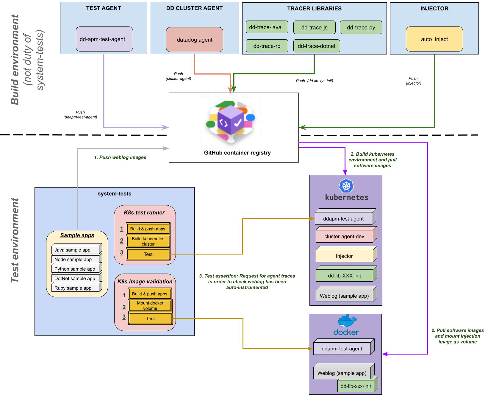

# K8s Library Injection Overview

This document provides a general overview of the K8s library injection feature and its components.

## Overall

### What is the k8s library injection feature?

The lib-injection project is a feature to allow injection of the Datadog library
into a customer's application container without requiring them to modify their
application images.

This feature enables applications written in Java, Node.js, Python, .NET or Ruby running
in Kubernetes to be automatically instrumented with the corresponding Datadog
APM libraries.

Currently, there are two different ways to have the Datadog library injected
into the application container:

1) **Manually via Kubernetes annotations**:
   * Using Datadog Admission Controller: [Injecting Libraries Kubernetes](https://docs.datadoghq.com/tracing/trace_collection/admission_controller/).
   * Adding library injection specific annotations (without Datadog Admission Controller): [Application Instrumentation](https://docs.datadoghq.com/tracing/trace_collection/), [Add the Datadog Tracing Library](https://docs.datadoghq.com/tracing/trace_collection/)
2) **Automatically with Remote Config via the Datadog UI.**

### What's the Datadog Cluster Agent and why?

The Cluster Agent is a different binary (vs the regular Agent), written in Go in the same DataDog/datadog-agent repo and is installed as a Deployment in Kubernetes, not a DaemonSet. It's an essential component for cluster-level monitoring.

In addition to the local API (Kubelet) leveraged by the Datadog Agent on each node, Kubernetes has a centralized and powerful API called API Server.
The Datadog Cluster Agent provides a streamlined, centralized approach to collecting cluster level monitoring data from the Kubernetes API Server. The Cluster Agent also leverages the Kubernetes API Server for advanced features like the Admission Controller.

Kubernetes admission controllers are plugins that govern and enforce how the cluster is used. They can intercept API requests and may change the request object or deny the request altogether. Read more in A Guide to Kubernetes Admission Controllers and Dynamic Admission Control

The Datadog admission controller is a component of the Datadog Cluster Agent. It leverages the Kubernetes mutatingwebhookconfigurations.admissionregistration.k8s.io API.

## K8s tested components

K8s Library injection testing is part of the "system-tests" test suite.

As a final purpose we want to check the correct operation of all Datadog components involved in the auto instrumentation of the applications deployed in a kubernetes cluster.

In the auto-instrumentation proccess there are several software components involved:

- **Cluster agent:** Software component, written in Go, that resides on the DataDog/datadog-agent repository and is installed as a Deployment in Kubernetes.
- **Injector image:** Directly involved in auto-instrumentation. Resides on Datadog/auto_inject repository.
- **Library image (lib-init):** Contains the tracer library to be injected in the pods.

These test components are also involved through the testing process:

- **System-tests runner:** The core of the system-tests is the reponsible for orchestrate the tests execution and manage the tests results.
- **Dev test agent:**  The APM Test Agent container help us to perform the validations ([APM Test Agent](https://github.com/DataDog/dd-apm-test-agent)).
- **Sample app/weblog:** Containerized sample application implemented on Java, Node.js, .NET, Ruby or Python.

The following image represents, in general terms, the necessary and dependent architecture to be able to run the K8s library injection tests:

## K8s library injection scenarios

The system-tests repository includes multiple scenarios for testing K8s library injection:

- **[K8s Library Injection](k8s_lib_injection.md)**: Complete testing suite for K8s library injection with detailed setup instructions, test execution, and development guidelines.
- **[K8s Injector Dev](k8s_injector_dev.md)**: Development and testing scenarios for the K8s based on the internal testing tool injector-dev. 