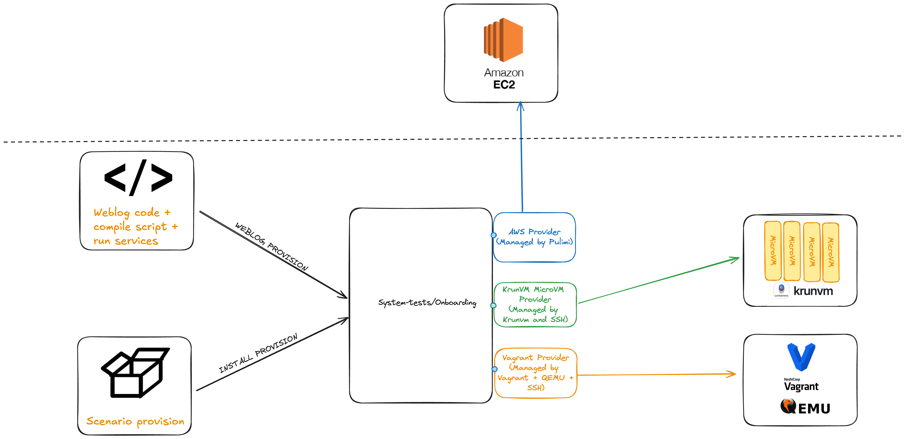
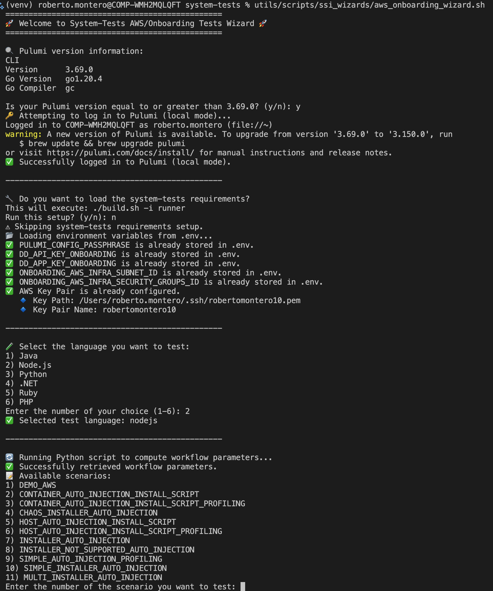
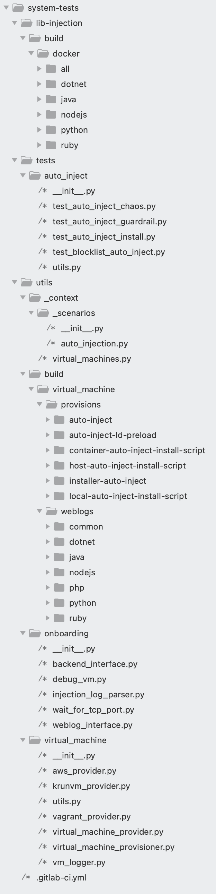
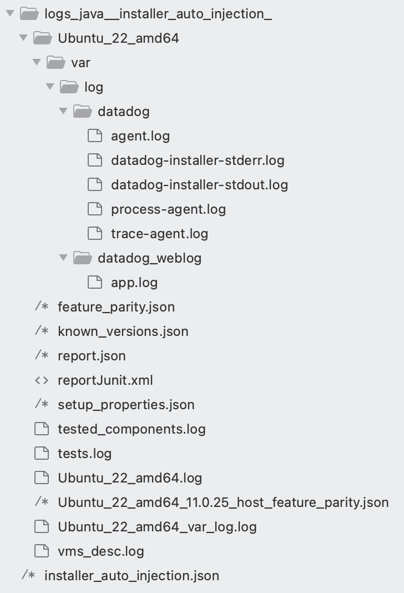

1. [Overall](#Overall)
   * [Library Injection testing scenarios](#Library-Injection-testing-scenarios)
   * [Knowledge concepts](#Knowledge-concepts)
     - [Virtual Machine scenario](#Virtual-Machine-scenario)
     - [Virtual Machine](#Virtual-Machine)
     - [Provision](#Provision)
     - [Provider](#Provider)
2. [Run the tests](#Run-the-tests)
   * [Prerequisites](#Prerequisites)

     - [AWS](#AWS)
     - [Vagrant](#Vagrant)
     - [Pulumi](#Pulumi)
     - [System-tests requirements](#System-tests-requirements)

     * [Configure the environment variables](#Configure-the-environment-variables)
   * [Run the scenario using the wizard](#run-the-scenario-using-the-wizard)
   * [Run the scenario manually](#run-the-scenario-manually)
3. [How to develop tests](#How-to-develop-a-test-case)
   * [Folders and Files structure](#Folders-and-Files-structure)
   * [Define a new virtual machine](#Create-a-new-virtual-machine)
   * [Create a new provision](#Create-a-new-provision)
   * [Create a new weblog](#Create-a-new-weblog)
   * [Create a new test case](#Create-a-new-test-case)
4. [How to debug your environment and tests results](#How-to-debug-your-environment-and-tests-results)
5. [How to debug a virtual machine at runtime](#How-to-debug-a-virtual-machine-at-runtime)
6. [Troubleshooting](#Troubleshooting)

# Overall

Similarly to Library Injection in Kubernetes environments via the admission controller, Library injection simplifies, also called SSI (Single Step Instrumentation) the APM onboarding experience for customers auto-intrumenting Java, Python, Node.js, .NET, PHP or Ruby applications running on host or in docker environments.

The target of this testing feature is to test the distinct injection environments.

> Check Datadog lib injection capabilities [public documentation](https://docs.datadoghq.com/tracing/trace_collection/library_injection).

## Library Injection testing scenarios

The automatic libray injection is tested on three possible scenarios:

* Datadog Agent and your application deployed on the same host ([host injection documentation](https://docs.datadoghq.com/tracing/trace_collection/library_injection_local/?tab=host)).
* Datadog Agent deployed on the host, your application deployed on containers ([agent on host and app in containers documentation](https://docs.datadoghq.com/tracing/trace_collection/library_injection_local/?tab=agentonhostappincontainers)).
* Datadog Agent and your application installed on containers ([containers injection documentation](https://docs.datadoghq.com/tracing/trace_collection/library_injection_local/?tab=agentandappinseparatecontainers)).

> For Kubernetes Datadog library injection capabilities check the [kubernetes injection documentation](https://docs.datadoghq.com/tracing/trace_collection/library_injection_local/?tab=kubernetes) or take a look at the [kubernetes injection testing scenarios](https://github.com/DataDog/system-tests/blob/main/docs/scenarios/k8s_library_injection_overview.md).

## Knowledge concepts

Before start with the onboarding tests, we need to know some terms:

* **Scenario:** In system-tests, a virtual scenario is a set of:

  * a tested architecture, which can be a software installation scripts (provision) to run on a single virtual machine. This VM will be supplied thanks to the integration of system-tests framework with different providers of this technology.
  * a list of setup executed on this tested architecture, we called as a virtual machine provision. Each scenario is associated with a provision.
  * a list of test associated to the scenario
* **Virtual Machine:** A virtual machine (VM) is a replica, in terms of behavior, of a physical computer. There is software capable of emulating these replicas of physical computers running operating systems. In this case, system-tests will be able to handle the integration of the framework itself with the virtual machines, so that we can install our software to be tested on them (provision).
* **Provision:** It will be the list of software and configurations to be installed on the virtual machine. The provisions will be specified by using yaml files. In this case we can consider the provision as the configuration associated to the scenario.
* **Weblog:** Usually It is a web application that exposes consistent endpoints across all implementations and that will be installed on the Virtual Machine. In the case of weblogs associated to the VMs, it does not always have to be a web application that exposes services, it can also be a specific configuration for the machine we want to test.
* **Provider:** It refers to the integration of system-tests with the different technologies that allow interacting with virtual machines. These can be executed locally using software such as vmware, virtual box... or executed in the cloud using services such as Google Cloud or AWS.
* **Tests:** Set of tests to run against a virtual machine. For example, we can make remote HTTP requests to an installed web application during the provisioning process or we can connect to it via SSH to execute different commands to check that the installed software provision is running correctly.

The following picture ilustrates how the system-tests providers can handle the software/provision installations agains different virtual machine types:



### Virtual Machine scenario

You can create your own VirtualMachine scenario, extending or using the common implementation `_VirtualMachineScenario`. A "Virtual Machine Scenario" is always associated with a provision. By default, it's going to use the provision that install the agent + docker + SSI software (injector + tracer), but you can also refer to your own provision.

In the following code (*utils/_context/_scenarios/__init__.py*) you can see the declaration of two new scenarios: a scenario that uses the default provision and a scenario that uses a custom provision:

```Python
   #Use the default provision, but with a custom environment variables (profiling activation)
   simple_auto_injection_profiling = InstallerAutoInjectionScenario(
        "SIMPLE_AUTO_INJECTION_PROFILING",
        "Onboarding Single Step Instrumentation scenario with profiling activated by the app env var",
        app_env={
            "DD_PROFILING_ENABLED": "auto",
            "DD_PROFILING_UPLOAD_PERIOD": "10",
            "DD_INTERNAL_PROFILING_LONG_LIVED_THRESHOLD": "1500",
        },
        scenario_groups=[scenario_groups.onboarding],
        github_workflow="aws_ssi",
    )
    #Create a new scenario with a custom provision
    demo_aws = InstallerAutoInjectionScenario(
        "DEMO_AWS",
        "Demo aws scenario",
        vm_provision="demo",
        scenario_groups=[scenario_groups.onboarding],
        github_workflow="aws_ssi",
    )

```

### Virtual Machine

The Virtual Machines properties:

* There are defined in `utils/virtual_machine/virtual_machines.json`.
* The id/name must be unique.
* There are some fields to configure the machine depends of the selected provider:
* * **aws_config:** Mandatory. AWS configuration: ami ID, instance type, user. The AMI id must exist on your AWS account.
  * **vagrant_config:** Optional. Vagrant image to be used.
  * **krunvm_config:** Optional. Docker image to be used with the Krumvn provider (deprecated).
* There are some fields, that allow us to categorize the machine:
  * **os_type:** Operating System type. Usually set to Linux. But it might be Windows or Mac.
  * **os_distro:** Refers to Linux distribution or package manager type. Usually "deb" or "rpm".
  * **os_branch:** Open field, to categorize the machine.
  * **os_cpu:** Architecture: amd64 or arm64.
  * **default_vm:** Field that allow us to split or group the machine as default or not default. Related with the CI policies.

```Python
        {
            "name": "Ubuntu_24_arm64",
            "aws_config": {
                "ami_id": "ami-0e879a1b306fffb22",
                "ami_instance_type": "t4g.medium",
                "user": "ubuntu"
            },
            "os_type": "linux",
            "os_distro": "deb",
            "os_branch": "ubuntu24",
            "os_cpu": "arm64",
            "default_vm": false,
            "disabled": false
        },
        {
            "name": "Ubuntu_22_arm64",
            "aws_config": {
                "ami_id": "ami-016485166ec7fa705",
                "ami_instance_type": "t4g.medium",
                "user": "ubuntu"
            },
            "vagrant_config": {
                "box_name": "perk/ubuntu-2204-arm64"
            },
            "krunvm_config": {
                "oci_image_name": "docker.io/library/ubuntu_datadog:22"
            },
            "os_type": "linux",
            "os_distro": "deb",
            "os_branch": "ubuntu22_arm64",
            "os_cpu": "arm64",
            "default_vm": true,
            "disabled": false
        },
        {
            "name": "Amazon_Linux_2023_arm64",
            "aws_config": {
                "ami_id": "ami-0a515c154e76934f7",
                "ami_instance_type": "t4g.medium",
                "user": "ec2-user"
            },
            "krunvm_config": {
                "oci_image_name": "docker.io/library/amazonlinux_datadog:2023"
            },
            "os_type": "linux",
            "os_distro": "rpm",
            "os_branch": "amazon_linux2023_arm64",
            "os_cpu": "arm64",
            "default_vm": false,
            "disabled": false
        },

```

### Provision

We call "provision" to the configurations applied or the software installed on the machines included in the scenario.

Some properties of the provisions in system-tests are as follows:

* There are defined in the Yaml files.
* There are two types of provisions:
  * **Scenario provision:** Configuration and installations to prepare the environment. For example, install docker and install the Datadog SSI software.
  * **Weblog provision:** Steps and configurations to deploy the weblog/ sample application.
* In a test execution the both types of provisions are involved (We allways set by the command line the scenario name and the weblog name).
* The scenario provision is a Yaml file and it is located in the folder: `utils/build/virtual_machine/provisions/[provision_name]` , using the file name `provision.yml`
* The installation of the Weblog (weblog provision) is also defined on Yaml files, but is located in a different folder, `utils/build/virtual_machine/weblogs/[lang]/`. It uses the file name `provision_[weblog].yml`.
* Each provision is different, therefore, different installation steps may be defined.
* All provisions may define their own installation steps, but they must contain some mandatory definition steps. For example, all provisions must define a step that extracts the names and versions of installed components we want to test.
* The same provision must be able to be installed on different operating systems and architectures.

For a comprehensive understanding of the provision system, including detailed examples and troubleshooting tips, see the [Provisions Documentation](onboarding_provision_section.md).

This is an example of provision file:

```yaml
#Optional: Load the environment variables
init-environment:
  #This variables will be populated as env variables in all commands for each provision installation
  - env: dev
    agent_repo_url: datad0g.com
    agent_dist_channel: beta
    agent_major_version: "apm"

  - env: prod
    agent_repo_url: datadoghq.com
    agent_dist_channel: stable
    agent_major_version: "7"


#Mandatory: Scripts to extract the installed/tested components (json {component1:version, component2:version})
tested_components:
  install:
    - os_type: linux
      os_distro: rpm
      remote-command: |
          echo "{'agent':'$(rpm -qa --queryformat '%{VERSION}-%{RELEASE}' datadog-agent)'}"
    - os_type: linux
      os_distro: deb
      remote-command: |
          version_agent=$((dpkg -s datadog-agent || true)  | grep Version  | head -n 1 )  && echo "{'agent':'${version_agent//'Version:'/}'}"

#Mandatory: Steps to install provision
provision_steps:
  - init-config #Very first machine action
  - my-cutom-extra-step #secod step
  - install-agent #Install the agent

init-config:
  cache: true
  install:
    - os_type: linux
      remote-command: echo "Hey! Hello!"

my-cutom-extra-step:
  cache: true
  install:
    - os_type: linux
      os_distro: rpm
      copy_files:
        - name: copy-service
          local_path: utils/build/test.service

        - name: copy-script
          local_path: utils/build/rpm-myservice.sh
      remote-command: sh rpm-myservice.sh

    - os_type: linux
      os_distro: deb
      copy_files:
        - name: copy-service
          local_path: utils/build/test.service

        - name: copy-script
          local_path: utils/build/deb-myservice.sh
      remote-command: sh deb-myservice.sh

install-agent:
  install:
    - os_type: linux
      remote-command: |
        REPO_URL=$DD_agent_repo_url DD_AGENT_DIST_CHANNEL=$DD_agent_dist_channel DD_AGENT_MAJOR_VERSION=$DD_agent_major_version bash -c "$(curl -L https://s3.amazonaws.com/dd-agent/scripts/install_script_agent7.sh)"
```

For more details about provisions, including examples for each section, advanced targeting options, and troubleshooting tips, see the [Provisions Documentation](onboarding_provision_section.md).

Some of the sections listed above are detailed as follows:

* **init-environment:** There are variables that will be loaded depending on the execution environment (env=dev or env=prod). **These variables will be populated in all commands executed on the machines**.
* **tested_components:** This is a mandatory field. We should extract the components that we are testing. The result of the command should be a json string. As you can see the install section could be split by “os_type“ and “os_distro“ fields. You could define a command for all the machines or you could define commands by the machine type. The details of the "installation" field are explained later.
* **provision_steps:** In this section you must define the steps for the whole installation. In this case,as example, we have three steps:
  * **init-config**: Represent a step that will run the same command for all types of the linux machines.
  * **my-custom-extra-step**: We divide the command, one specific for debian machines and another specific for rpm machines. Notice that we have added directives that will copy local files to the remote machine. The details of the "installation" and “copy-files” fields are explained later.
  * **install-agent**: It represents the installation of the agent, valid for all Linux machines. Note that we are using the variables defined in the “init-environment“ section.

#### Provision install section

The install section will be part of all main sections of the provision (except the init-environment and provision_steps sections).

The install section provides us:

* The ability to execute remote commands.
* The ability to execute local commands.
* The ability to copy files from the local machine to remote VM.

```yaml
my-step:
  install:
    - os_type: linux
      os_distro: rpm #Run for rpm machines
      local-command: echo "This command will run on local"
      copy_files:
        - name: copy-this-file-to-home-folder-on-remote-machine
          local_path: utils/build/test.service
      remote-command: echo "This command will run on remote machine"
```

You can define a provision that can be installed on a different machine types, architectures or OS:

```yaml
my-step:
  install:
    - os_type: linux
      os_distro: rpm #Run for rpm machines
      local-command: echo "This command will run on local"
      copy_files:
        - name: copy-this-file-to-home-folder-on-remote-machine
          local_path: utils/build/test.service
      remote-command: echo "This command will run on a RPM based remote machine"

    - os_type: linux
      os_distro: deb #Run for deb machines
      local-command: echo "This command will run on local"
      copy_files:
        - name: copy-this-file-to-home-folder-on-remote-machine
          local_path: utils/build/test.service
      remote-command: echo "This command will run on a debian based remote machine"

    - os_type: linux
      os_distro: deb #Run for deb machines
      os_cpu: arm64 #Run only for arm based machines
      local-command: echo "This command will run on local"
      copy_files:
        - name: copy-this-file-to-home-folder-on-remote-machine
          local_path: utils/build/test.service
      remote-command: echo "This command will run on a debian based remote machine (only for arm64 architectures)"
```

### Provider

We currently support two providers:

* **Pulumi AWS:** Using Pulumi AWS we can create and manage EC2 instances.
* **Vagrant:** Vagrant enables users to create and configure lightweight, reproducible, and portable development local environments (Beta feature).

We can find the available providers in the folder: `utils/virtual_machine.`
The common interface that implemets all the existing providers is: `utils/virtual_machine/virtual_machine_provider.py`.

# Run the AWS SSI tests

## Prerequisites

To run the onboarding test scenarios, we will use the following utilities:

* **AWS as the infrastructure provider:** We are testing onboarding installation scenarios on different types of machines and OS. AWS Cli must be configured on your computer in order to launch EC2 instances automatically.
* **Vagrant as the infrastructure local provider**: For local executions, we can use Vagrant instead of AWS EC2 instances.
* **Pulumi as the orchestrator of this test infrastructure:** Pulumi's open source infrastructure as code SDK enables you to create, deploy, and manage infrastructure on any cloud, using your favorite languages.
* Python 3.12 as requirement from system-tests framework.
* **Pytest as testing tool (Python):** System-tests is built on Pytest.

### AWS

Configure your AWS account and AWS CLI. [Check documentation](https://docs.aws.amazon.com/cli/latest/userguide/cli-chap-configure.html)

In order to securely store and access AWS credentials in an our test environment, we are using aws-vault. Please install and configure it. [Check documentation](https://github.com/99designs/aws-vault)

### Vagrant

The Vagrant support is a system-tests beta feature. To run the tests using the Vagrant provider, you should install:

* Install Vagrant Install Vagrant | Vagrant | HashiCorp Developer
* Install QEMU emulator: Download QEMU - QEMU
* Install python Vagrant plugin: python-vagrant
* Install Vagrant-QEMU provider: https://github.com/ppggff/vagrant-qemu

### Pulumi

Pulumi is a universal infrastructure as code platform that allows you to use familiar programming languages and tools to build, deploy, and manage cloud infrastructure.
Please install and configure as described in the [following documentation](https://www.pulumi.com/docs/get-started/aws/)

---

**NOTE:**

if it's the first time you execute the Pulimi, you probably need to run the command: `pulumi login --local`
[Pulumi login](https://www.pulumi.com/docs/reference/cli/pulumi_login/)

---

### System-tests requirements

All system-tests assertions and utilities are based on python and pytests. You need to prepare this environment before run the tests:

- Python and pytests environment as described: [configure python and pytests for system-tests](../../README.md#requirements).
- Ensure that requirements.txt is loaded (you can run "`./build.sh -i runner`")

### Configure the environment variables

*You can skip this step if you are thinking on running the tests using the wizard!!*

Before execute the "onboarding" tests you must configure some environment variables:

- **ONBOARDING_AWS_INFRA_SUBNET_ID:** AWS subnet id.
- **ONBOARDING_AWS_INFRA_SECURITY_GROUPS_ID:** AWS security groups id.
- **DD_API_KEY_ONBOARDING:** Datadog API key.
- **DD_APP_KEY_ONBOARDING:** Datadog APP key.

To debug purposes you can create and use your own EC2 key-pair. You can read this tutorial to do that: [Create a key pair for your Amazon EC2 instance](https://docs.aws.amazon.com/AWSEC2/latest/UserGuide/create-key-pairs.html)
Once the key has been created, you can use it configuring the following environment variables:

- **ONBOARDING_AWS_INFRA_KEYPAIR_NAME:** Set key pair name to ssh connect to the remote machines.
- **ONBOARDING_AWS_INFRA_KEY_PATH:** Local absolute path to your keir-pair file (pem file).

## Run the scenario using the wizard

There is a Wizard script that will help you set up and run a scenario.

This wizard will help you with the following tasks:

* Verify the software requirements (pulumi installation, aws cli, python requirements) to run the tests.
* Configure the environment variables.
* Assistant for debugging virtual machines.
* Easy to select the test case to run. The test case matrix is very large (combination of scenario + weblog + virtual machine).

You just need to run the script `utils/scripts/ssi_wizards/aws_onboarding_wizard.sh `



## Run the scenario manually

The 'onboarding' tests can be executed in the same way as we executed system-tests scenarios.
The currently supported scenarios are the following:

* **SIMPLE_INSTALLER_AUTO_INJECTION:** The onboarding minimal scenario. The test makes a request to deployed weblog application and then check that the instrumentation traces are sending to the backend.
* **INSTALLER_AUTO_INJECTION:** Inlcudes the minimal scenario assertions but adding other assertions like the uninstall process or the block list commands tests.  For the containerized app, the agent will run on host, and the app in a docker container.
* **INSTALLER_NOT_SUPPORTED_AUTO_INJECTION:** Onboarding Single Step Instrumentation scenario for not supported runtime language versions. After install the SSI software this scenario checks that the application is not auto instrumented (because the runtime version is not supported), but continues working.
* **CHAOS_INSTALLER_AUTO_INJECTION:** Checks the SSI after performing actions that are not recommended. For example, delete installation folder and others. The system must be recoverable.
* **SIMPLE_AUTO_INJECTION_PROFILING:** Onboarding Single Step Instrumentation scenario with profiling activated by the environment variables on the sample application.
* **HOST_AUTO_INJECTION_INSTALL_SCRIPT_PROFILING:** Onboarding Host Single Step Instrumentation scenario using agent auto install script with profiling activating by the installation process
* **CONTAINER_AUTO_INJECTION_INSTALL_SCRIPT_PROFILING:** Onboarding Container Single Step Instrumentation profiling scenario using agent auto installation script.
* **HOST_AUTO_INJECTION_INSTALL_SCRIPT:** Onboarding Host Single Step Instrumentation scenario using agent auto installation script.
* **CONTAINER_AUTO_INJECTION_INSTALL_SCRIPT:** Onboarding Container Single Step Instrumentation scenario using agent auto installation script. The agent and the app will run on a separate containers.

The 'onboarding' tests scenarios required these mandatory parameters:

- **--vm-library:** Configure language to test (currently supported languages are: java, python, nodejs, dotnet, php)
- **--vm-env:** Configure origin of the software: dev (beta software) or prod (releases)
- **--vm-weblog:** Configure weblog name to tests. The provision file should exist: `utils/build/virtual_machine/weblogs/LANG/provision_WEBLOG-NAME.yml`
- **--vm-provider:** Default "aws"
- **--vm-only:** The virtual machine name, where we'll install the scenario provision. You can find all the allowed Virtual Machines: `utils/_context/virtual_machines.py`

The following line shows an example of command line to run the tests:

```bash
export ONBOARDING_AWS_INFRA_SUBNET_ID=subnet-xyz
export ONBOARDING_AWS_INFRA_SECURITY_GROUPS_ID=sg-xyz
export DD_API_KEY_ONBOARDING=apikey
export DD_APP_KEY_ONBOARDING=appkey
export ONBOARDING_LOCAL_TEST="true"

./run.sh SIMPLE_INSTALLER_AUTO_INJECTION --vm-weblog test-app-nodejs --vm-env dev --vm-library nodejs --vm-provider aws --vm-only Ubuntu_22_amd64
```

The following line shows an example of command line to run the tests on a secure environment using 'aws-vault':

```bash
 aws-vault exec sso-sandbox-account-admin -- ./run.sh SIMPLE_INSTALLER_AUTO_INJECTION --vm-weblog test-app-nodejs --vm-env dev --vm-library nodejs --vm-provider aws --vm-only Ubuntu_22_amd64
 ```

# How to develop tests

Developing new tests might involve one or several operations:

* **Implement a new provision/scenario:** You need a custom provision or extra steps. For example, in addition to the SSI software you want to install a  several linux services to check if these services can interfere on the weblog auto injection.
* **Add a new weblog:** You want to add a new weblog to be tested in the previously existing scenario.
* **Add a new test case:** You want to add new assertions against the existing scenarios and weblogs.

## Folders and Files structure

To develop a new test case in the SSI Library injection tests, you need to know about the project folder structure.
The following picture shows the main directories for the SSI tests:



* **lib-injection/build/docker:** This folder contains the sample applications source code.
* **tests/auto_inject:** All tests cases are stored on this folder.
* **utils/_context/scenarios/**: In this folder you can find the SSI Lib injection scenario definition.
* **utils/build/virtual_machine/provisions/:** Provisions associated to the scenario.
* **utils/build/virtual_machine/weblogs/:** Provisions associated to the weblogs.
* **utils/onboarding:** Utilities that are used from the test cases. For example, make a request to the weblog or make queries to the backend in order to find the generated instrumentation traces.
* **utils/virtual_machine/:** The core implementation of this test framework. For example, the provider implementation, the pulumi wrapper or the provision files parser.
* **utils/virtual_machine/virtual_machines.json:** Virtual machines definitions file.
* **utils/scripts/ssi_wizards/aws_onboarding_wizard.sh:** Shell wizard to run the tests.
* **utils/scripts/ci_orchestrators/aws_ssi.json**: Tests matrix definition.
* **.gitlab-ci.yml:** These tests are launched on GitLab.

## Define a new virtual machine

Your AWS virtual machines are defined in the `virtual_machines.json` file. To add a new VM:

1. Open the file located at:
   ```
   utils/virtual_machine/virtual_machines.json
   ```

2. Add a new entry following this format:

   - **AMI ID**: Ensure you use a valid AWS AMI ID for your region.
   - **Instance Type**: Choose the correct size based on performance needs.
   - Use `os_type`, `os_distro`, `os_branch`, and `os_cpu` to group/classify the machine.

Example:

```json
{
  "name": "Ubuntu_24_amd64",
  "aws_config": {
    "ami_id": "ami-0e86e20dae9224db8",
    "ami_instance_type": "t3.medium",
    "user": "ubuntu"
  },
  "os_type": "linux",
  "os_distro": "deb",
  "os_branch": "ubuntu24",
  "os_cpu": "amd64",
  "default_vm": true,
  "disabled": false
}
```

---

**NOTE:**

After create a new virtual machine you should define which weblogs are compatible for this new machine.

---

---

## Configuring Weblog Compatibility for a New AWS Virtual Machine

By default, when you add a new machine, the `system-tests` framework tries to use it for all the existing scenarios and weblog combinations.

You can specify weblog incompatibilities by editing the `aws_ssi.json` file located at:
```
utils/script/ci_orchestrators/aws_ssi.json
```

This file contains the mappings between weblogs and VMs through `excluded_os_branches`, `excluded_os_names`, and `exact_os_branches` properties for each weblog:
* excluded_os_branches: Mark as incompatible the VMs with this value in the field `os_branch`
* excluded_os_names: Mark as incompatible the VMs with this value in the field `name`
* exact_os_branches: Mark a weblog to be compatible only with VMS with this value in the field `os_branch`. Note that if you add this field “exact_os_branches”, you will be forcing the weblog to run only for the virtual machines that meet this criterion. You may be overriding other VMs on which this weblog previously ran.
By default if in you don't specify any of these 3 properties (`excluded_os_branches`, `excluded_os_names`, and `exact_os_branches`) for a weblog defined under the field `weblogs_spec`, the weblog is going to be compatible with all the VMs.

The easiest mechanism to configure the weblog compatibility for a new AWS Virtual Machine is using the helper script:
```
utils/scripts/ssi_wizards/tools/vm_compatibility_checker.py <VM NAME>
```

---

**NOTE:**

If you are defining a new weblog you will have to add it to the file `aws_ssi.json`, specifying in which scenarios this new weblog will run.

---

### Scenario and Weblog Relationships

Here’s an example of the relationship between scenarios and weblogs:

```json
{
  "scenarios": [
    "INSTALLER_AUTO_INJECTION"
  ],
  "weblogs": [
    {
      "java": [
        "test-app-java",
        "test-app-java-container"
      ],
      "python": [
        "test-app-python",
        "test-app-python-container"
      ]
    }
  ]
}
```

### Weblog and Virtual Machine Relationships

The relationship between weblogs and virtual machines (`weblogs_spec`) is set as follows:

```json
"weblogs_spec": {
  "nodejs": [
    {
      "name": "demo-app",
      "excluded_os_branches": [
        "windows"
      ]
    },
    {
      "name": "test-app-nodejs",
      "excluded_os_branches": [
        "ubuntu22_amd64",
        "ubuntu22_arm64",
        "ubuntu21",
        "ubuntu20_arm64",
        "ubuntu20_amd64",
        "centos_7_amd64",
        "rhel_7_amd64",
        "amazon_linux2",
        "windows"
      ],
      "excluded_os_names": [
        "Debian_11_amd64",
        "Debian_11_arm64"
      ]
    }
  ]
}


## Create a new provision

If you want to create a new machine provision, first you need to define a new scenario and associate it with a new provision. For example (`utils/_context/_scenarios/__init__.py`):

```python
    my_custom_scenario= InstallerAutoInjectionScenario(
        "MY_CUSTOM_SCENARIO",
        "A very simple example",
        vm_provision="my_provision"
    )
```

We should define the provision. Let's create a folder named: `utils/build/virtual_machine/provisions/my_provision` and add the file `provision.yml`:

```yaml

# Optional: Load the environment variables
init-environment:
  #This variables will be populated as env variables in all commands for each provision installation
  - env: dev
    MY_VAR: DEV_VAR
  - env: prod
    MY_VAR: PROD_VAR
    agent_dist_channel: stable
    agent_major_version: "7"

# Mandatory: Scripts to extract the installed/tested components
tested_components:
  install:
    - os_type: linux
      remote-command: |
          echo "{'test_component':'1.0.0'}"


# Mandatory: Steps to provision VM
provision_steps:
  - my-custom-step

my-custom-step:
  cache: false
  install:
    - os_type: linux
      remote-command: echo "Hey! Hello $MY_VAR!"
```

This scenario provision will be installed when you run the scenario:

```bash
export ONBOARDING_AWS_INFRA_SUBNET_ID=subnet-xyz
export ONBOARDING_AWS_INFRA_SECURITY_GROUPS_ID=sg-xyz
./run.sh MY_CUSTOM_SCENARIO --vm-weblog test-app-nodejs --vm-env dev --vm-library nodejs --vm-provider aws --vm-only Ubuntu_22_amd64
```

Remember to add your new scenario in the matrix definition file. In this file you'll define the capabilities of your new scenario. For example, what are the weblogs compatible with your scenario. Check: **utils/scripts/ci_orchestrators/aws_ssi.json**

## Create a new weblog

You can add more weblogs to the existing scenarios. You must follow some rules:

* The weblog provision is located in the folder: `utils/build/virtual_machine/weblogs/LANG`
* The weblog provision is defined in the file: `provision_WEBLOG_NAME.yml`
* There are two types of weblogs, host based apps and containerized apps.
* The weblog provision contains two main sections:
  * lang_variant: Optional. If you are creating a host based app, you must install the language runtime before.
  * weblog: The weblog provision. Copy files and configuration, compile and run as service.
* If you ar creating a host based app, you should run the app as system service called: *test-app-service*.

This is an example of Java app running on host. We called the weblog as `my_custom_app`, we define the file `provision_my_custom_app.yml` in `utils/build/virtual_machine/weblogs/java` folder:

```yaml
lang_variant:
    name: DefaultJDK
    version: default
    cache: true
    install:

      - os_type: linux
        os_distro: deb
        remote-command: sudo apt-get -y update && sudo apt-get -y install default-jdk

      - os_type: linux
        os_distro: rpm
        remote-command: sudo sudo dnf -y install java-devel || sudo yum -y install java-devel

weblog:
    name: my_custom_app
    install:
      - os_type: linux

        copy_files:
          - name: copy-service
            local_path: utils/build/virtual_machine/weblogs/common/test-app.service

          - name: copy-service-run-script
            local_path: utils/build/virtual_machine/weblogs/common/create_and_run_app_service.sh

          - name: copy-compile-weblog-script
            local_path: utils/build/virtual_machine/weblogs/java/test-app-java/compile_app.sh

          - name: copy-run-weblog-script
            local_path: utils/build/virtual_machine/weblogs/java/test-app-java/test-app-java_run.sh

          - name: copy-java-app
            local_path: lib-injection/build/docker/java/jetty-app

        remote-command: sh test-app-java_run.sh
```

You can run this weblog:

```bash
export ONBOARDING_AWS_INFRA_SUBNET_ID=subnet-xyz
export ONBOARDING_AWS_INFRA_SECURITY_GROUPS_ID=sg-xyz
./run.sh MY_CUSTOM_SCENARIO --vm-weblog my_custom_app --vm-env dev --vm-library java --vm-provider aws --vm-only Ubuntu_22_amd64
```

Remember to add your new weblog in the matrix definition file. In this file you'll define the capabilities of your new weblog. For example, what are the machines compatible with your weblog. Check: **utils/scripts/ci_orchestrators/aws_ssi.json**

## Create a new test case

Implement a new test case is as simple as the rest of the existing test cases in system-tests. There is only one particularity to consider. The virtual machine data is stored in the test context, you can access to it to know the IP of the virtual machine and the port of the weblog endpoint. You can also access to the virtual machine using a SSH connection.

In the next code you can see how to access to the weblog http endpoint and launch commands over the virtual machine:

```python
from utils import scenarios, features, context
from utils.onboarding.weblog_interface import make_get_request
from utils.onboarding.wait_for_tcp_port import wait_for_port


@features.installer_auto_instrumentation
@scenarios.demo_aws
class TestDemoAws:
    """Demo test for AWS scenario"""

    def test_demo_provision_weblog(self):
        """Simple demo test to check if the weblog is running"""
        virtual_machine = context.scenario.virtual_machine
        # http request configuration
        vm_ip = virtual_machine.get_ip()
        vm_port = virtual_machine.deffault_open_port
        weblog_request_timeout = 10
        weblog_url = f"http://{vm_ip}:{vm_port}/"

        # test assertion: the port is listenning and the request is successful
        assert wait_for_port(
            vm_port, vm_ip, weblog_request_timeout
        ), "Weblog port not reachable. Is the weblog running?"
        assert make_get_request(weblog_url) is not None, "Wrong response from weblog"

    def test_run_simple_command(self):
        """Simple demo test to run a command on the virtual machine"""
        virtual_machine = context.scenario.virtual_machine
        ssh_client = virtual_machine.ssh_config.get_ssh_connection()
        check_folder_command = "ls -la /"
        _, stdout, stderr = ssh_client.exec_command(check_folder_command)

        full_output = stdout.read().decode()
        error_output = stderr.read().decode()
        assert error_output == "", f"Error while running the command. The error output is not empty [{error_output}]"
        assert "home" in full_output, f"The command output is not as expected [{full_output}]"

```

# How to debug your environment and tests results

In the virtual machine scenarios, multiple components are involved and sometimes can be painfull to debug a failure. You can find a folder named "logs_[scenario name]" with all the logs associated with the execution In the following image you can see the log folder content:



These are the main important log/data files:

## Root Level Files

* **tests.log:** General log generated by system-tests. Here you will see the Pulumi outputs of the remote provisions.
* **report.json:** Pytest results report in JSON format.
* **reportJunit.xml:** Pytest results report in JUnit XML format.
* **feature_parity.json:** Report to push the results to Feature Parity Dashboard.
* **known_versions.json:** Contains information about the known versions of components used in the test.
* **setup_properties.json:** Contains the setup properties and configuration used for the test execution.
* **tested_components.log:** Contains a JSON with the versions of the components that are being tested in this scenario.
* **vms_desc.log:** Contains the IP assigned to the remote machine and VM description details.

## Virtual Machine Specific Files

Note: These files contain the VM name and will vary for each execution depending on the virtual machine used (e.g., Ubuntu_24_amd64, Amazon_Linux_2023_arm64, etc.).

* **[vm_name].log:** Logs related with the remote commands executed on the machine (e.g., Ubuntu_24_amd64.log).
* **[vm_name]_provision_script.log:** All the provision script for the current machine (e.g., Ubuntu_24_amd64_provision_script.log).
* **[vm_name]_var_log.log:** Contains the var/log directory contents from the virtual machine (e.g., Ubuntu_24_amd64_var_log.log).

## Datadog Agent and Component Logs

Located in: **var/log/datadog/**

* **agent.log:** Main Datadog Agent logs.
* **process-agent.log:** Datadog Process Agent logs.
* **trace-agent.log:** Datadog Trace Agent logs.
* **datadog-installer-stdout.log:** Standard output from the Datadog installer.
* **datadog-installer-stderr.log:** Standard error from the Datadog installer.
* **dotnet/:** Directory containing .NET specific logs (when applicable).

## Weblog Application and System Logs

Located in: **var/log/datadog_weblog/**

* **app.log:** Logs produced by the weblog application (host apps).
* **app.env:** Environment variables used by the weblog application.
* **scenario_app.env:** Scenario-specific environment variables for the application.
* **apt.log:** APT package manager logs (for Debian-based systems).
* **yum.log:** YUM package manager logs (for RPM-based systems).
* **cloud-init.log:** Cloud initialization logs.
* **crontab.log:** Cron job logs.
* **dmesg.log:** Kernel ring buffer logs.
* **syslog.log:** System logs.
* **docker_logs.log:** Docker container logs (app containerized logs).
* **docker_list_dependencies.log:** Docker dependencies listing.
* **docker_proccess.log:** Docker process information.
* **journalctl_docker.log:** Systemd journal logs related to Docker.
* **system.timers.log:** System timer logs.

# How to debug a virtual machine at runtime

Locally you can debug the remote machine by SSH. To do that you only need:

* Keep alive the machine after the test execution.
* Use your own AWS key-pair to configure the SSH connection and connect to the machine ([Create a key pair for your Amazon EC2 instance](https://docs.aws.amazon.com/AWSEC2/latest/UserGuide/create-key-pairs.html)).

You can do that using the environment variables. For example:

```bash
#Mandatory env variables
export ONBOARDING_AWS_INFRA_SUBNET_ID=subnet-xyz
export ONBOARDING_AWS_INFRA_SECURITY_GROUPS_ID=sg-xyz
export DD_API_KEY_ONBOARDING=apikey
export DD_APP_KEY_ONBOARDING=appkey

#The key pair configuration
export ONBOARDING_AWS_INFRA_KEYPAIR_NAME="my_key_pair"
export ONBOARDING_AWS_INFRA_KEY_PATH="/home/my_user/key_pairs/my_key_pair.pem"

#Variables to keep alive the machine after run the tests
export ONBOARDING_KEEP_VMS="true"
export ONBOARDING_LOCAL_TEST="true"

#Run the tests
./run.sh SIMPLE_INSTALLER_AUTO_INJECTION --vm-weblog test-app-nodejs --vm-env dev --vm-library nodejs --vm-provider aws --vm-only Ubuntu_22_amd64

```

After the test execution, you will need to open the log file "logs_folder/vms_desc.log" to get the remote machine IP, after that, you should be able to access to the machine in a interactive shell:

```bash
ssh -i "/home/my_user/key_pairs/my_key_pair.pem" ec2-user@99.99.99.99
```

You can also use SCP to upload and download files to/from the remote machine:

```bash
scp -i "/home/my_user/key_pairs/my_key_pair.pem" ubuntu@99.99.99.99:/home/ubuntu/javaagent-example/hola.txt .
```

Remember destroy the pulumi stack to shutdown and remove the ec2 instance:

```bash
pulumi destroy
```
# Troubleshooting

When running an **AWS SSI** test, failures usually fall into one of the cases below. For each case, check the **Symptoms** first, then follow the **What to do** steps.

> **Tip:** Many errors include a `Diagnostics:` marker in the logs. The real root cause is typically logged **right below** that line.

---

## Case 1 — AWS API interaction failure

**Symptom**

~~~
Exception launching aws provision infrastructure
~~~

**What to do**

1. Open the scenario’s log folder and inspect `tests.log`.
2. Search for the diagnostics marker and read the lines that follow:
   ~~~bash
   grep -n "Diagnostics:" tests.log
   ~~~
3. Use that context as the **root cause** of the failure.

---

## Case 2 — VM provisioning failure (remote command)

**Symptom**

~~~
Exception launching aws provision step remote command
~~~

**What to do**

1. Open the VM log file:
   ~~~
   [vm_name].log
   ~~~
2. Review the remote commands executed on the instance and their outputs.
3. Search for diagnostics:
   ~~~bash
   grep -n "Diagnostics:" [vm_name].log
   ~~~
4. Identify the failing command (package install, Docker/runtime setup, agent install, SSI packages, or test app build) and fix accordingly.

---

## Case 3 — Weblog application not listening on its HTTP port

**Symptom**

~~~
Waited too long for the port 5985 on host [MACHINE_IP] to start accepting connections.
~~~

**What to do**

1. **Build logs:** open `[vm_name].log` and scroll to the end; you should find the application build output there. Fix any build failures first.
2. **Runtime logs:** if the build succeeded, check the app runtime logs.
   - **Host-based apps:**
     ```
     /var/log/datadog_weblog/app.log
     ```
   - **Containerized apps:**
     ```
     /var/log/datadog_weblog/docker_logs.log
     /var/log/datadog_weblog/journalctl_docker.log
     ```
3. Ensure the process/container is up and listening on the expected port.

---

## Case 4 — App is serving and sending traces, but **no traces appear in the Datadog backend**

**Symptom**

~~~
Exception during trace in backend verification
~~~

**Possible causes & what to check**

- **Tracer issue** — review app logs for tracer errors:
/var/log/datadog_weblog/app.log
/var/log/datadog_weblog/docker_logs.log
- **Agent issue** — review Datadog Agent logs:
/var/log/datadog
- **Docker daemon issue** (if containerized) — review:
/var/log/datadog_weblog/journalctl_docker.log
- **Backend intake/processing** — manually locate the trace ID `{request_uuid}` in the Datadog UI (system-tests organization) and verify ingestion.

---

## Case 5 — Traces appear, but **Profiling** data is missing

**Symptom**

~~~
Exception during trace in backend verification: Reached overall timeout of 300 for POST https://dd.datadoghq.com/api/unstable/profiles/list
~~~

**Possible causes & what to check**

- **Tracer issue** — ensure profiling is supported/enabled for your language/runtime; check app logs:
/var/log/datadog_weblog/app.log
/var/log/datadog_weblog/docker_logs.log
- **Agent issue** — verify Agent is healthy and APM/profile intake is enabled; check:
/var/log/datadog
- **Backend processing** — in the Datadog UI (system-tests org), locate the trace ID `{request_uuid}` and verify associated profiling data is present or delayed.

> **Note:** Make sure profiling is actually enabled for the application (per language tracer guidance) before investigating backend intake.

---

## Case 6 — Traces appear, but **AppSec** signals are missing

**Symptom**

~~~
expected '_dd.appsec.enabled' to be 1 in trace span metrics but found ...
~~~

**Possible causes & what to check**

- **Tracer issue** — confirm AppSec is supported/enabled in the tracer; check app logs:
/var/log/datadog_weblog/app.log
/var/log/datadog_weblog/docker_logs.log
- **Agent issue** — verify Agent logs and AppSec configuration:
/var/log/datadog
- **Backend processing** — manually look up the trace ID `{request_uuid}` in the Datadog UI (system-tests organization) and confirm AppSec data.

---

### Useful placeholders

- `[vm_name]` — name of the provisioned VM for the scenario.
- `[MACHINE_IP]` — IP address of the target machine.
- `{request_uuid}` — request/trace identifier printed by the tests.

### Quick commands

```bash
# Find diagnostics markers
grep -n "Diagnostics:" tests.log
grep -n "Diagnostics:" [vm_name].log

# Scan for exceptions in the VM log
grep -n "Exception" [vm_name].log

