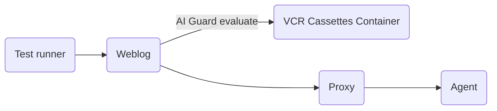

# AI Guard Testing

AI Guard testing validates the [AI Guard SDK](https://docs.datadoghq.com/security/ai_guard/) integration across tracer libraries. Tests verify that the SDK correctly evaluates LLM messages against AI Guard policies and produces the expected traces and span metadata.

## Architecture

The `AI_GUARD` scenario is an [end-to-end scenario](README.md) with an additional VCR cassettes container that replays pre-recorded AI Guard API responses:



The VCR cassettes container acts as a mock for the `https://app.datadoghq.com/api/v2/ai-guard` endpoint, serving pre-recorded responses so tests run without real API calls.

## Running the tests

```bash
./build.sh java
./run.sh AI_GUARD
```

To run a specific test:

```bash
./run.sh AI_GUARD tests/ai_guard/test_ai_guard_sdk.py::Test_Evaluation -vv
```

## VCR cassettes

Tests use pre-recorded HTTP request/response pairs stored in `utils/build/docker/vcr/cassettes/aiguard/`. Each cassette is a JSON file containing the request that the SDK sends to the AI Guard API and the corresponding response.

The cassette filename encodes the HTTP method and a hash of the request body (e.g. `aiguard_evaluate_post_3156697a.json`). The VCR container matches incoming requests to cassettes by method and body hash, then returns the recorded response.

### Upgrading cassettes

Cassettes must be upgraded when:

- The AI Guard API response format changes
- New test scenarios are added that require different API responses
- The request body format changes (e.g. new fields added by the SDK)

To upgrade cassettes, use the helper script:

```bash
DD_API_KEY=<your-key> DD_APP_KEY=<your-key> ./utils/scripts/generate-ai-guard-cassettes.sh
```

This will:

1. Build and run the `AI_GUARD` scenario with real API keys
2. The VCR container proxies requests to the real `https://app.datadoghq.com/api/v2/ai-guard` endpoint and records responses
3. Test assertions are skipped (marked as xfail) since responses may differ from previous recordings
4. Recorded cassettes are written directly to `utils/build/docker/vcr/cassettes/aiguard/`
5. A copy is exported to `logs_ai_guard/recorded_cassettes/aiguard/` for review

After recording, some cassettes may need manual adjustments. The real API responses may not match the exact values expected by the tests — in particular, the `action` and `is_blocking_enabled` fields in the response body may need to be edited to match the test expectations.

After recording, verify the new cassettes work in replay mode:

```bash
./run.sh AI_GUARD -L python -vv
```

Then review the changes with `git diff` and commit.

#### Cassette file format

Each cassette is a JSON file with the following structure:

```json
{
  "request": {
    "method": "POST",
    "url": "https://app.datadoghq.com/api/v2/ai-guard/evaluate",
    "headers": { ... },
    "body": "..."
  },
  "response": {
    "status": { "code": 200, "message": "OK" },
    "headers": { ... },
    "body": "..."
  }
}
```

The filename follows the pattern `aiguard_evaluate_post_<hash>.json`, where `<hash>` is derived from the request body by the VCR container.

## Weblog endpoints

Each language implements a `POST /ai_guard/evaluate` endpoint that:

1. Reads messages from the request JSON body
2. Reads the `X-AI-Guard-Block` header to determine blocking behavior
3. Calls the AI Guard SDK `evaluate` method
4. Returns the evaluation result (action, reason, tags)

See [weblogs](../weblogs/README.md) for details on weblog implementations.

## Environment variables

The scenario sets the following environment variables on the weblog:

| Variable | Value | Description |
|---|---|---|
| `DD_AI_GUARD_ENABLED` | `true` | Enables the AI Guard SDK |
| `DD_AI_GUARD_ENDPOINT` | `http://vcr_cassettes:<port>/vcr/aiguard` | Points to VCR container instead of real API |
| `DD_API_KEY` | `mock_api_key` | Mock key (real key not needed with VCR) |
| `DD_APP_KEY` | `mock_app_key` | Mock key (real key not needed with VCR) |

---

## See also

- [Scenario overview](README.md) -- how scenarios work in system-tests
- [How to run a scenario](../../execute/run.md) -- running tests and selecting scenarios
- [Weblogs](../weblogs/README.md) -- the test applications used across scenarios
- [Back to documentation index](../../README.md)
