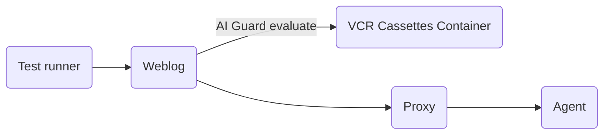

# AI Guard Testing

AI Guard testing validates the [AI Guard SDK](https://docs.datadoghq.com/security/ai_guard/) integration across tracer libraries. Tests verify that the SDK correctly evaluates LLM messages against AI Guard policies and produces the expected traces and span metadata.

## Architecture

The `AI_GUARD` scenario is an [end-to-end scenario](README.md) with an additional VCR cassettes container that replays pre-recorded AI Guard API responses:


```mermaid
flowchart LR
    A("Test runner") --> B("Weblog")
    B -->|"AI Guard evaluate"| C("VCR Cassettes Container")
    B --> D("Proxy")
    D --> E("Agent")
```

The VCR cassettes container acts as a mock for the `https://app.datadoghq.com/api/v2/ai-guard` endpoint, serving pre-recorded responses so tests run without real API calls.

## Running the tests

```bash
./build.sh java
./run.sh AI_GUARD
```

To run a specific test:

```bash
./run.sh AI_GUARD tests/ai_guard/test_ai_guard_sdk.py::Test_Evaluation -vv
```

## VCR cassettes

Tests use pre-recorded HTTP request/response pairs stored in `utils/build/docker/vcr/cassettes/aiguard/`. Each cassette is a JSON file containing the request that the SDK sends to the AI Guard API and the corresponding response.

The cassette filename encodes the HTTP method and a hash of the request body (e.g. `aiguard_evaluate_post_3156697a.json`). The VCR container matches incoming requests to cassettes by method and body hash, then returns the recorded response.

### Upgrading cassettes

Cassettes must be upgraded when:

- The AI Guard API response format changes
- New test scenarios are added that require different API responses
- The request body format changes (e.g. new fields added by the SDK)

To upgrade cassettes, use the helper script:

```bash
DD_API_KEY=<your-key> DD_APP_KEY=<your-key> ./utils/scripts/generate-ai-guard-cassettes.sh
```

This will:

1. Build and run the `AI_GUARD` scenario with real API keys
2. The VCR container proxies requests to the real `https://app.datadoghq.com/api/v2/ai-guard` endpoint and records responses
3. Test assertions are skipped (marked as xfail) since responses may differ from previous recordings
4. Recorded cassettes are written directly to `utils/build/docker/vcr/cassettes/aiguard/`
5. A copy is exported to `logs_ai_guard/recorded_cassettes/aiguard/` for review

After recording, some cassettes may need manual adjustments. The real API responses may not match the exact values expected by the tests — in particular, the `action` and `is_blocking_enabled` fields in the response body may need to be edited to match the test expectations.

After recording, verify the new cassettes work in replay mode:

```bash
./run.sh AI_GUARD -L python -vv
```

Then review the changes with `git diff` and commit.

#### Cassette file format

Each cassette is a JSON file with the following structure:

```json
{
  "request": {
    "method": "POST",
    "url": "https://app.datadoghq.com/api/v2/ai-guard/evaluate",
    "headers": { ... },
    "body": "..."
  },
  "response": {
    "status": { "code": 200, "message": "OK" },
    "headers": { ... },
    "body": "..."
  }
}
```

The filename follows the pattern `aiguard_evaluate_post_<hash>.json`, where `<hash>` is derived from the request body by the VCR container.

## Weblog endpoints

Each language implements a `POST /ai_guard/evaluate` endpoint that:

1. Reads messages from the request JSON body
2. Reads the `X-AI-Guard-Block` header to determine blocking behavior
3. Calls the AI Guard SDK `evaluate` method
4. Returns the evaluation result (action, reason, tags, tag probabilities)

See [weblogs](../weblogs/README.md) for details on weblog implementations.

## Environment variables

The scenario sets the following environment variables on the weblog:

| Variable | Value | Description |
|---|---|---|
| `DD_APPSEC_ENABLED` | `false` | Explicitly disables AppSec so AI Guard client IP coverage does not rely on ASM behavior |
| `DD_AI_GUARD_ENABLED` | `true` | Enables the AI Guard SDK |
| `DD_AI_GUARD_ENDPOINT` | `http://vcr_cassettes:<port>/vcr/aiguard` | Points to VCR container instead of real API |
| `DD_API_KEY` | `mock_api_key` | Mock key (real key not needed with VCR) |
| `DD_APP_KEY` | `mock_app_key` | Mock key (real key not needed with VCR) |

## Related scenarios

Four more scenarios share the same weblog and VCR setup, and differ only by configuration:

| Scenario | Extra configuration | What it covers |
|---|---|---|
| `AI_GUARD_STANDALONE` | `DD_APM_TRACING_ENABLED=false` | AI Guard traces still reach the backend when APM tracing is off |
| `AI_GUARD_TELEMETRY` | `DD_AI_GUARD_MAX_MESSAGES_LENGTH=1`, `DD_AI_GUARD_MAX_CONTENT_SIZE=5` | The `ai_guard.requests` and `ai_guard.truncated` telemetry metrics |
| `AI_GUARD_REDACTION_TELEMETRY` | low telemetry intervals, no truncation thresholds | The `redacted` tag on `ai_guard.requests` |
| `AI_GUARD_REDACTION_DISABLED` | `DD_AI_GUARD_REDACTION_ENABLED=false` | The sensitive data redaction kill-switch: nothing is redacted and the redaction tags are not emitted |

`AI_GUARD_REDACTION_TELEMETRY` exists rather than reusing `AI_GUARD_TELEMETRY` for two reasons.
The truncation thresholds would shorten every request body, and cassettes are addressed by a hash
of that body, so no redaction scenario would match its cassette. And the telemetry metric is not
request-scoped: counting evaluations exactly is only possible while a single test class sends
traffic into the scenario.

## Sensitive data redaction

The redaction tests are driven by a corpus shared with the cassettes, so the two cannot drift.
`utils/scripts/gen_redaction_cassettes.py` owns both sides: for every scenario it writes the
cassette that returns the `redaction_replacements` array and an entry in
`tests/ai_guard/redaction_scenarios.json` describing the expected outcome (the messages after
redaction, the sensitive values that must be gone, the ones that must survive, and whether the
evaluation must report itself as redacted).

Each of those expectations is authored per scenario, in `expect_redacted` and `expect_removed`, and
cross-checked against a reference implementation of the RFC redaction algorithm living in the same
script. Keeping the two independent is the point: a corpus that only recorded whatever the
reference implementation produced would assert tracer == generator instead of tracer == RFC. The
same applies to the values that survive redaction, which are asserted present rather than merely
left out of the absence check, so an over-redacting tracer fails.

To add or change a redaction scenario, edit `SCENARIOS` in that script and re-run it from the
repository root:

```bash
python3 utils/scripts/gen_redaction_cassettes.py
```

`./format.sh` runs the generator too, so the fixtures in the repository are always the fixtures the
script produces. In `--check` mode it passes `--check` through: the generator then compares the
corpus it would write against the files it owns and reports any drift without touching the working
tree.

Cassettes are addressed by a hash of the request body, so every scenario must send a distinct
message list. The script fails rather than overwriting a cassette owned by another AI Guard test.
It also deletes cassettes the corpus no longer claims, but only ones it generated itself on a
previous run (tracked through the sidecar): the cassette directory is shared with the other AI
Guard tests, and regenerating the corpus must never remove a cassette added by one of them.

### Redaction covers the whole context, not just the last message

Attack analysis and sensitive-data scanning have deliberately different scopes. The backend may
decide the action from the latest logical message, but SDS scans every model-visible string in the
exact `messages` array of the current `/evaluate` call, so `redaction_replacements` may carry
entries for the system prompt, for historical user, assistant and tool messages, and for the
latest message at once.

That distinction exists because redaction is copy-on-write: the tracer sends a redacted copy to the
provider and leaves the caller's list alone, so an earlier message still holds its original value
on the next turn. A tracer that only redacted the latest message would pass almost every redaction
test here and still ship the whole history to the provider on turn 2.

`Test_RedactionMultiTurnContext` is the class that closes that hole. It covers the RFC multi-turn
example (a historical SSN plus a new email, with an already redacted assistant message that must
survive byte for byte), a conversation whose latest message is benign while the history is not, one
replacement per role in a single call, tool calls and content parts buried in the history,
non-contiguous replacements across an eight-message conversation, and a value restated in a later
turn. Paths are local to the request they arrived in, so it also replays a growing then reordered
conversation across three calls: a tracer reusing the previous response's paths writes the wrong
replacement into the wrong message and fails.

### The redacted tag is tri-state

`ai_guard.redacted`, and the matching `redacted` tag on the `ai_guard.requests` telemetry metric,
carry three distinguishable states. Tracers must implement all three:

| State | Meaning |
|---|---|
| tag absent | Redaction is off (`DD_AI_GUARD_REDACTION_ENABLED=false`), so no redaction was attempted |
| `false` | Redaction is on and this evaluation redacted nothing: no replacement was returned, or every entry was skipped fail-safe |
| `true` | Redaction is on and at least one replacement was applied |

Reporting `false` when the feature is off would make "nobody sends sensitive data" and "nobody has
the feature on" indistinguishable in the product. `Test_RedactionDisabled` and
`Test_RedactionDisabledTelemetry` assert the absent case, and the other redaction classes assert
the other two. The tag may be reported as a boolean, as the string `true`/`false`, or as a metric
whose value is exactly `1` or `0`.

The blocked path is covered too: `Test_RedactionOnBlock` sends a redacting scenario with
`X-AI-Guard-Block: true`, so the SDK aborts instead of returning an evaluation. The abort error
deliberately carries no messages, and the 403 the weblog answers with carries none either: errors
get logged and a conversation is arbitrarily large, so putting the message list on the error
reopens the very leak channel redaction closes. The span is the reporting surface on that path, and
the redacted messages must be in its `ai_guard` meta struct.

---

## See also

- [Scenario overview](README.md) -- how scenarios work in system-tests
- [How to run a scenario](../../execute/run.md) -- running tests and selecting scenarios
- [Weblogs](../weblogs/README.md) -- the test applications used across scenarios
- [Back to documentation index](../../README.md)
