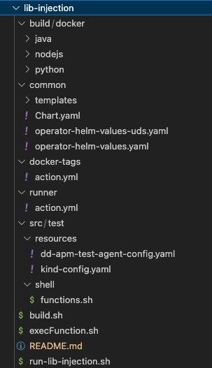
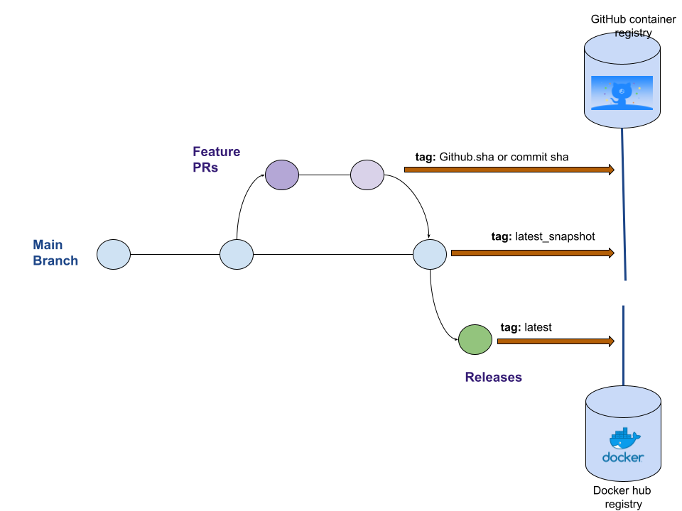

# lib-injection feature

## What is the lib-injection feature?

The lib-injection project is a feature to allow injection of the Datadog library
into a customer's application container without requiring them to modify their
application images.

This feature enables applications written in Java, Node or Python running
in Kubernetes to be automatically instrumented with the corresponding Datadog
APM libraries.

Currently, there are two different ways to have the Datadog library injected
into the application container:

1) Manually via Kubernetes annotations as described here: https://docs.datadoghq.com/tracing/trace_collection/admission_controller/.
2) Automatically with Remote Config via the Datadog UI.

References to "manual" and "auto" in the tests refer to these different
features, respectively. Under the hood the two mechanisms rely on the same logic
to instrument the application.


## How does it work?

The feature works via the Kubernetes Admission Controller which adds special APM
library Docker containers to the deployment. These containers, combined with
environment variables and volume mounts contain everything necessary to install
and instrument the application with the APM library.

## What’s the Datadog Cluster Agent and why?

The Cluster Agent is a different binary (vs the regular Agent), written in Go in the same DataDog/datadog-agent repo and is installed as a Deployment in Kubernetes, not a DaemonSet. It’s an essential component for cluster-level monitoring.

In addition to the local API (Kubelet) leveraged by the Datadog Agent on each node, Kubernetes has a centralized and powerful API called API Server.
The Datadog Cluster Agent provides a streamlined, centralized approach to collecting cluster level monitoring data from the Kubernetes API Server. The Cluster Agent also leverages the Kubernetes API Server for advanced features like the Admission Controller.

Kubernetes admission controllers are plugins that govern and enforce how the cluster is used. They can intercept API requests and may change the request object or deny the request altogether. Read more in A Guide to Kubernetes Admission Controllers and Dynamic Admission Control

The Datadog admission controller is a component of the Datadog Cluster Agent. It leverages the Kubernetes mutatingwebhookconfigurations.admissionregistration.k8s.io API.

# lib-injection feature testing

Lib injection testing is part of the "system-tests" test suite. Although we run it in isolation from the system-tests, they share certain similarities

To test lib-injection/autoinstrumentation feature, we run a Kubernetes cluster with the Datadog Cluster Agent and we check that the instrumentation runs smoothly using different sample applications (weblog) in different languages (currently Java, Python and Node).

The following image represents, in general terms, the necessary and dependent architecture to be able to run lib-injection tests:


As shown in the figure, in order to test the lib-injection utility we need each "tracer" repository to generate its own image that will be used to perform the auto-instrumentation.
The generation of such an image is not the duty of these tests. 

The only image generated by these tests will be that of the sample applications that will be used to run these tests.

## Folders and Files structure

All that we need to execute lib-injection tests is located under lib-injection test folder:



* **Build/docker:** Folder containing the sample applications with the corresponding files that allow us to build and push docker weblog images.
* **Common/templates:** Contains kubernetes yaml files to deploy our sample applications. Yaml files are templates that work with helm utililty (see section "lib-injections tests functions" ).
* **Common:** Contains operator yaml templates. These templates will be used when we are launching tests with the Admission Controller.
    * **Operator-helm-values-uds.yaml:** Template to configure the Admission Controller using UDS.
    * **Operator-helm-values.yaml:** Template to configure the Admission Controller without UDS.
    * **Operator-helm-values-auto.yaml:** Template to configure the Admission Controller for automatic instrumentation.
* **docker-tags:** GitHub custom and shared actions that helps to "tracer repositories" to create appropiate tag names for init images (see section "How to create init images in your tracer repository")
* **runner:** GitHub custom and shared actions that helps to run the tests in GitHub Actions CI. (see section "How to run the lib-injection tests in CI")
* **src/test/resources:** Yaml kubernetes descriptors to create Datadog agent and Cluster agent.
* **src/test/shell/functions.sh:** Contains the "logic" of these tests. We can found functions to manipulate helm templates and create kubernetes cluster environment (see section "lib-injections tests functions" ).
* **build.sh:** Install binaries for kubernetes.
* **execFunction.sh**: Helper to launch the functions that are stored in functions.sh.
* **run-{manual,auto}-lib-injection.sh**: Orchestrates the differents steps to launch the tests for the manual and auto test cases.

## lib-injections tests functions

`functions.sh` contains the "logic" of these tests. 
We can find some environment variables that we need to define previously:

* **TEST_LIBRARY:** Language that we want to test. Possible values: java, python, nodejs
* **WEBLOG_VARIANT:** Sample application that we want to use. We could have more that one application for each language. The sample applications are stored in build/docker folder.
* **DOCKER_REGISTRY_IMAGES_PATH:** Docker Registry with which we are going to operate. In GitHub CI environment we are going to work with GHCR, but if we run tests in local laptop probably we will use Docker Hub registry. 
* **DOCKER_IMAGE_TAG:** Tag for init image we want to tests.
* **DOCKER_IMAGE_WEBLOG_TAG:** Tag for weblog image we want to test.
* **BUILDX_PLATFORMS:** Architectures/Platforms for which we will generate the docker images for the example applications
* **LIBRARY_INJECTION_CONNECTION:** Test with or without UDS.
* **LIBRARY_INJECTION_ADMISSION_CONTROLLER:** Test autoinstrumentation with or without admission controller.

`functions.sh` contains some remarkable functions:

* **ensure-cluster:** It creates a Kubernetes cluster using configuration file: test/resources/kind-config.yaml.
* **deploy-operator:** Deploys Datadog operator in the case that we are using Admission Controller. It uses common/operator-helm-values.yaml or common/operator-helm-values-uds.yaml to configure Admission Controller.
* **deploy-test-agent:** Deploys Datadog Agent in Kubernetes cluster, using configuration file: test/resources/dd-apm-test-agent-config.yaml.
* **deploy-app:** Deploys sample application/weblog in Kubernetes cluster, using template file: lib-injection/build/docker/$TEST_LIBRARY/values-override.yaml.
* **print-debug-info:** prints and log debug information for kubernertes cluster and library injection tests

## How to run the lib-injection tests in CI

To run lib-injection tests in your CI you need:

- Configure environment variables
- Use "runner" shared action

```
  test:
    needs:
      - build-and-publish-init-image
    runs-on: ubuntu-latest
    permissions:
      contents: read
      packages: write
    strategy:
      matrix:
        lib-injection-connection: ['network','uds']
        lib-injection-use-admission-controller: ['', 'use-admission-controller']
        weblog-variant: ['dd-lib-python-init-test-django','dd-lib-python-init-test-django-gunicorn','dd-lib-python-init-test-django-uvicorn']
      fail-fast: false
    env:
      TEST_LIBRARY: python
      WEBLOG_VARIANT: ${{ matrix.weblog-variant }}
      LIBRARY_INJECTION_CONNECTION: ${{ matrix.lib-injection-connection }}
      LIBRARY_INJECTION_ADMISSION_CONTROLLER: ${{ matrix.lib-injection-use-admission-controller }}
      DOCKER_REGISTRY_IMAGES_PATH: ghcr.io/datadog
      DOCKER_IMAGE_TAG: ${{ github.sha }}
    steps:    
      - name: lib-injection test runner
        id: lib-injection-test-runner
        uses: DataDog/system-tests/lib-injection/runner@main
        with:
          docker-registry: ghcr.io
          docker-registry-username: ${{ github.repository_owner }}
          docker-registry-password: ${{ secrets.GITHUB_TOKEN }}
```

## How to run the manual lib-injection tests in Local

You can also run the tests locally, but in this case we will create the docker init image using the corresponding tracer library.

The first step is to login in docker hub, either with Docker Desktop app or with CLI (you may need to generate an access token [here](https://hub.docker.com/settings/security)):
``` docker login --username MY_DOCKERHUB_USERNAME ```

The second step is define the environment variables:

```sh
export TEST_LIBRARY=java
export WEBLOG_VARIANT=dd-lib-java-init-test-app
export DOCKER_REGISTRY_IMAGES_PATH=docker.io/MY_DOCKERHUB_USERNAME
export LIBRARY_INJECTION_CONNECTION=‘network’
export LIBRARY_INJECTION_ADMISSION_CONTROLLER='use-admission-controller'
export BUILDX_PLATFORMS=linux/arm64
```

The next is to download or compile the tracer libray that you want to test. You have to locate binary libary in the system-tests/binaries folder.
When we have the environment ready, we have to execute this logic:

* Build and push the init image

  To use an existing image, you need to push it to your dockerhub account, for example:
```sh
docker pull ghcr.io/datadog/dd-trace-js/dd-lib-js-init:latest_snapshot
docker tag ghcr.io/datadog/dd-trace-js/dd-lib-js-init:latest_snapshot ${DOCKER_REGISTRY_IMAGES_PATH}/dd-lib-js-init:local
docker push ${DOCKER_REGISTRY_IMAGES_PATH}/dd-lib-js-init:local
```

* Build and push the app image
* Create the Kubernetes cluster

```sh
./lib-injection/execFunction.sh build-and-push-init-image
./lib-injection/execFunction.sh build-and-push-test-app-image
./lib-injection/build.sh
```

* Execute the manual tests

  * Make sure that init and app images are public on your dockerhub account.
  * Comment name, tag and repository in `clusterAgent.image` section of `operator-helm-values*.yaml`

```sh
./lib-injection/run-manual-lib-injection.sh
```

* Execute the auto tests

```sh
TEST_CASE=<TestCaseN>  # define the test case
./lib-injection/run-auto-lib-injection.sh
```

## How to debug your kubernetes environment

After running the tests you can always run the following command to export all the information from the kubernetes cluster to the logs folder:

```sh
./lib-injection/execFunction.sh $LIBRARY_INJECTION_ADMISSION_CONTROLLER print-debug-info
```

## How to create init images in your tracer repository

The construction of the images init docker the lib-injection is not the responsibility of the system-test, although for the tests to be launched, we will need the docker images to be correctly tagged in a docker registry, that is why the system-tests offer a shared github action that can be used in the tracer repositories to extract the tags with which the images will be generated.

```
    - name: lib-injection-tags
      id: lib-injection-tags
      uses: DataDog/system-tests/lib-injection/docker-tags@robertomonteromiguel/lib_injection_integration_v2
      with:
        init-image-name: 'dd-lib-python-init'
        main-branch-name: 'robertomonteromiguel-lib_injection_system_tests_integration'
    ...
    - name: Docker Build
      ...    
      with:
        ...
        tags: ${{ steps.lib-injection-tags.outputs.tag-names }}
...
```

In the generation of the labels for the docker init images there are three cases:



> **_NOTE:_**  When we run the lib-injection tests from the system-tests repository we will test the latest release and the latest snapshot of each tracer repository, i.e. we will use the tags latest and latest-snapshot. When we run the lib-injection tests from the repository of a tracer repository, for example dd-trace-java, we will only launch the lib-injection tests for the current build, we will use the github-sha as the init image tag.

Although, as we have mentioned above, it is not the responsibility of the system-tests to generate the init images of the tracer, but we encourage the different teams to use the Github actions plugins for the generation of these images. For example:

```
jobs:

  build-and-publish-init-image:
    runs-on: ubuntu-latest
    steps:
    
    - name: Checkout repository
      uses: actions/checkout@5a4ac9002d0be2fb38bd78e4b4dbde5606d7042f # 2.3.4

    - name: Set up QEMU
      uses: docker/setup-qemu-action@8b122486cedac8393e77aa9734c3528886e4a1a8 # 2.0.0

    - name: Set up Docker Buildx
      id: buildx
      uses: docker/setup-buildx-action@dc7b9719a96d48369863986a06765841d7ea23f6 # 2.0.0

    - name: Set up Docker platforms
      id: buildx-platforms
      run:  |
        BUILDX_PLATFORMS=`docker buildx imagetools inspect --raw busybox:latest | jq -r 'reduce (.manifests[] | [ .platform.os, .platform.architecture, .platform.variant ] | join("/") | sub("\\/$"; "")) as $item (""; . + "," + $item)' | sed 's/,//'`
        echo "$BUILDX_PLATFORMS"
        echo "platforms=$BUILDX_PLATFORMS" >> $GITHUB_OUTPUT

    - name: lib-injection-tags
      id: lib-injection-tags
      uses: DataDog/system-tests/lib-injection/docker-tags@main
      with:
        init-image-name: 'dd-lib-java-init'
        main-branch-name: 'robertomonteromiguel-lib_injection_system_tests_integration'

    - name: Build dd-java-agent.jar
      run:  ./lib-injection/build_java_agent.sh

    - name: Login to Docker
      run: docker login -u publisher -p ${{ secrets.GITHUB_TOKEN }} ghcr.io

    - name: Docker Build
      uses: docker/build-push-action@c56af957549030174b10d6867f20e78cfd7debc5 # 3.2.0
      with:
        push: true
        tags: ${{ steps.lib-injection-tags.outputs.tag-names }}
        platforms: ${{ steps.buildx-platforms.outputs.platforms }}
        context: ./lib-injection
```
